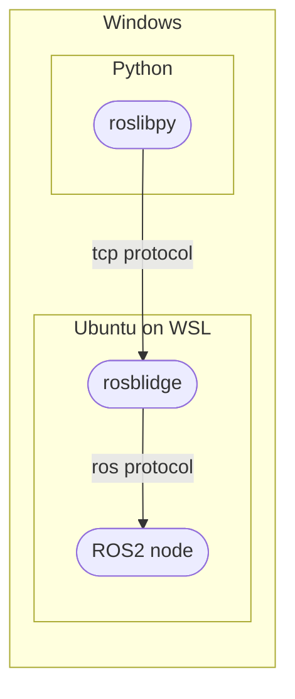

ROSを使ったロボットやその他デバイスは動かしたいけど、Ubuntuは管理したくない
そんなことないでしょうか？

そんなときに便利なのが、rosbridgeです。
通常TCPに基づいて通信するアプリケーションはROSとのコミュニケーションが不可能ですが、
Webソケットを作成してROSと非ROSの間でJSON形式で通信することができるノード(rosbridge)をROS環境上で実行させることで、非ROSとの通信が実現することができます。

今回はそのrosbridgeを利用して、
rosbridgeサーバ(Ubuntu)とroslibpyクライアント(Windows)間でROSとの通信環境を構築してみます。

## やりたいこと
Windows上でクライアントアプリケーションを実行し、
WSLのUbuntu上でrosbridgeとROS2を実行し、通信を行う。

通信イメージは以下のようだと思っています。(下図で知識レベルは察してください)


## 本ページの目標
ROS2ノードのturtlesimをWindowsから制御することを目標としたいと思います。

## 環境
以下の環境で実行しました。
- Windows11
- Ubuntu20.04 on WSL2
- Python:3.8.10

# WSL環境の構築
Windows PCだけで作業を行いたいので、今回はWindows上で構築できるLinux環境WSLを使用します。ここからWSLの環境構築手順を示します。
## WSL2のインストール
WSLのインストールはとても簡単です。
powershellで以下コマンドを実行してください。
```powershell:powershell
wsl --install
```
基本的にはこれだけでインストールできます。
インストール後は、Linuxパスワードの設定が必要です。

:::message
私の時は上記コマンドでUbuntu20.04がインストールされていましたが、今はどうなのかわかりません。
自分が何をインストールしたかはbashで以下コマンドを打ち込んで確認してみてください。
`$ cat /etc/os-release`
:::

ディストリビューション指定してインストールする場合は以下のコマンドを実行してください。
```powershell:powershell
wsl --install -d <DistroName>
```
`<DistroName>`は以下から取得します。
```powershell:powershell
wsl --list --online
```
:::details WSLを最初からやり直すには
- 一度入れたWSLをアンインストールする
Windowsの設定→アプリ→アプリと機能から該当するディストリビューションを選択しアンインストールする
- 同じディストリビューションをまっさらな状態にする
Windowsの設定→アプリ→アプリと機能の該当ディストリビューションから詳細オプションをクリックし、リセットボタンを押す
:::

## リモート接続のためのVScode拡張機能
別にコンソール使うから良い、って人はこの項目読み飛ばしてください。

VSCodeを使っているなら`Remote Development`拡張機能をインストールをするのが便利です。
拡張機能から`remote`とでも打つと検索の上のほうに出てくると思います。
インストール後は左のバーからリモートエクスプローラのタブが出ます(ディスプレイマークの右下にリモートデスクトップのアイコンが重なってるやつ)。
WSL TargetsからインストールしたLinuxディストリビューションを選べば、WSLにログインができます。

ここまでで、WSLにログインすることができるはずです。
ログイン時にはWSLをインストールした際に設定したLinuxのパスワードを聞かれると思いますので打ち込んでログインしてください。

## WSLの初期設定
ここからはWSLでの作業になります。
特にいじらずにログインするとユーザフォルダになると思います。
そのまま以下のコマンドを打ち込んでください。
```bash:bash
sudo apt update
```
上記が済んだら下記も実行してください。

```bash:bash
sudo apt install x11-apps -y 
```
こちらはWindwosのX Window Systemサーバと通信するためのクライアントアプリをインストールしてます。
サーバアプリ側は[Windowsのアプリとしてインストールする手順](#x-window-systemサーバの構築)を後述します。
:::message
素のままのWSLではGUIがありませんので、使用する場合は別途導入する必要があります。
:::

## bashrcに追記
WSLが初期設定のままだとX Window Systemのサーバを見つけれられませんので、以下の設定をbashrcに追記します。
```bash:~/.bashrc
# wslがx serverを見つけられるようにするための設定
export DISPLAY=$(cat /etc/resolv.conf | grep nameserver | awk '{print $2}'):0
```
ちなみに、最後の記述は`resolv.conf`に書いてある`nameserver`のIPアドレスを`DISPLAY`環境変数に設定するよ、ということのようです。
↓こちらのかたの解説がとても参考になりました。
https://qiita.com/baibai25/items/5841b0592727893d960f

:::details RViz, Gazeboの設定
※rviz, gazeboは、今回は使いませんがROSを利用しているなら使用するシーンはあると思いますのでおすすめ設定として記載してます。同様にbashrcに追記してください。

- rvizとx serverの通信設定
`export LIBGL_ALWAYS_INDIRECT=""`
- gazeboとx serverの通信設定
`export GAZEBO_IP=127.0.0.1`
:::

最後にbashrcの設定を適用するために設定の更新をしてください。
```bash:bash
source ~/.bashrc 
```
## X Window Systemサーバの構築
Windowsで、X Window SystemのサーバアプリVcXsrvをインストールします。

👇ダウンロードはこちらから。
https://sourceforge.net/projects/vcxsrv/

👇ここからの手順はこちらのサイトを参考にしています。
https://qiita.com/rkoyama1623/items/de467c6b954a6df638c8

上記サイトのVcXsrvの初期設定手順を引用します。
> 1. 「スタート」からxlaunch.exeを起動。
> 2. multiple windowを選択し、次へ。
> 3. start no client を選択し、次へ.
> 4. Additional parameters for VcXsrv という入力フォームに 「**-ac -nowgl**」と入力し、次へ。
> 5. Save configurationを押下して、設定ファイルをどこかに保存。
> 6. 完了を押下して、VcXsrvを起動。

:::message
手順4の`-nowgl`は設定しないとX Window Systemサーバにrviz、gazeboが映らないはずですので使用する場合は必ず設定しておいてください。
:::
ついでに設定ファイルはWindowsのスタートアップに登録しておきましょう。
- `Windows + R`でファイル名を指定して実行に`shell:startup`と打ち込む
- 開いたフォルダにVcxsrvを起動したときに作られた設定ファイルを配置する

これでWindows起動時にX Windows Systemサーバの設定が適用されます。

## X Window Systemサーバへの表示確認
VcXsrvの設定ができたら、以下で動作確認をしてみましょう。
```bash:bash
xeyes
```

こんな感じでギョロメが出たらOKです。
これでWSLでGUIが有効になりました。

# ROS環境の構築
これまでに構築したWSL上にROS環境を構築します。
## ROS2のインストール
今回は**ROS2**をインストールしていきます。
インストールは方法は公式に従ってください。
https://docs.ros.org/en/foxy/Installation/Ubuntu-Install-Debians.html
Proxy環境下でもなければ、特にはまることもないはずです。

ちなみに私は、`Environment setup`にある下記のROSの環境変数設定のためのコマンドは、毎回打ち込むの面倒なのでbashrcに書き込んでいます。

```bash:bash
source /opt/ros/foxy/setup.bash
```

## ROS2動作確認
ROS2がインストールできたか確認してみましょう。

以下を実行してみてください。
```bash:bash
ros2 run turtlesim turtlesim_node
```
こんな感じでkameがVcXsrvのWindowに映し出されたでしょうか？


ひとまずkameさんに出会えたなら、WSLのROS2環境構築は完了です。

:::details RViz, Gazeboの起動確認
上のbashrcの設定でRVizとGazeboの設定を追記していたなら以下で動作確認可能です。
**RViz**
```bash:bash
rviz2
```
画面が表示されればOKです。

**Gazebo**
ついでにGazeboも表示されるか動作確認します。
GazeboはROS2のデフォルトパッケージに含まれていないようですので、以下からインストールしましょう。
```bash:bash
sudo apt install ros-foxy-gazebo-ros-pkgs
```
インストールできたら、以下のコマンドで画面が表示されるか確認してみてください。

```bash:bash
gazebo
```
:::

## rosbridge-suite
ROSパッケージのrosbridge-suiteのfoxy版をインストールします。

以下を実行して、パッケージをインストールしてください。
```bash:bash
sudo apt install ros-foxy-rosbridge-suite
```
インストール出来たら、
以下のコマンドでrosbridgeサーバを起動します。

```bash:bash
ros2 launch rosbridge_server rosbridge_websocket_launch.xml
```
これにより以下のようなログが出ていたら、rosbridgeサーバが起動しています。
```bash:bash
[rosbridge_websocket-1] [INFO] [1652491717.603733094] [rosbridge_websocket]: Rosbridge WebSocket server started on port 9090
```
これを見ると、9090ポート経由でWebソケットが作成されているようですね。

ここまでで、rosbridgeサーバが立ち上がり、TCPプロトコルで通信ができるようになりました。

次が最後の仕上げです。
rosbridgeサーバ経由でROS2のturtlesimノードに指示してみましょう。

再度turtlesimノードを起動しておきます。
```bash:bash
ros2 run turtlesim turtlesim_node
```

この時点で、rosbridgeが起動しているターミナルと、turtlesimが起動しているターミナルの2つが存在することになります。

あとは、ROS2側とつながるWindow側クライアントを実装していきましょう。

## Windows側ROS通信クライアント
👇このかたのサイトを参考に、クライアント用pythonスクリプトからturtlesimへ指示を出します。(参考に、というかほぼ丸パクリです...)
https://symfoware.blog.fc2.com/blog-entry-2288.html

:::message
初めにも書きましたが、私は最終的にUbuntu側はあまりいじりたくなかったので、Windowsでスクリプト作成してます。
:::

実装の前に、`roslibpy`ライブラリをインストールします。
下記コマンドを実行してください。
```poershell:powershell
pip install roslibpy
```

インストールが出来たら、以下のスクリプトを保存して実行してみてください。
やることはこれだけです。

```py:sample.py
# -*- coding:utf8 -*-
import time
from roslibpy import Message, Ros, Topic
def main():
    
    # roscoreを実行しているサーバーへ接続
    ros_client = Ros('localhost', 9090)
    # Publishするtopicを指定
    publisher = Topic(ros_client, '/turtle1/cmd_vel', 'geometry_msgs/Twist')
    def start_sending():
        while True:
            if not ros_client.is_connected:
                break
            
            # 送信するTwistメッセージの内容
            publisher.publish(Message({
                'linear': {
                    'x': 2.0,
                    'y': 0,
                    'z': 0
                },
                'angular': {
                    'x': 0,
                    'y': 0,
                    'z': 1.8
                }
            }))
            time.sleep(0.1)
        publisher.unadvertise()
    # Publish開始
    ros_client.on_ready(start_sending, run_in_thread=True)
    ros_client.run_forever()
if __name__ == '__main__':
    main()
```

それではスクリプトを実行してみましょう。
以下を実行してみてください。

```powershell:powershell
python sample.py
```
どうですか？
kameがくるくると泳いでる様子が見れたでしょうか？


ちなみに、`rqt`で起動しているノードを確認することができます。
```bash:bash
rqt_graph
```

rosbridgeがturtlesimに対して速度指示を送信していることがわかりますね！
送信メッセージの`linear`や`angular`の値を変えるとkameの軌道が変わると思います。
ぜひ試してみててください👍

## まとめ
Windows上のPythonスクリプトからrosbridgeサーバ経由でROS2のturtlesimノードに指示を出してみました。

今回行ったことは以下です。
- WSL2(Ubuntu20.04)のインストール
- ROS2をWSLにインストール
- rosbrige-suiteをインストール
- クライアント用pythonスクリプトを作成

次はもうちょっとこの環境のカスタマイズ方法を模索していきたいなーと思っています。

最後まで見ていただいたかたありがとうございました😊