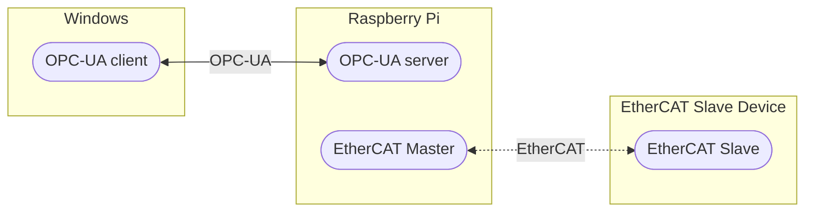

# CODESYSとは？
CODESYSはソフトウェアPLCです。
基本は何かしらの一般的なOSやPLCの上でランタイムを載せて動かす構成のようです。
これが、OPC-UAサーバになり、さらにEtherCAT Masterの役目も果たすため都合が良いです。
今回はRaspberryPiランタイムを使用して、その上にCODESYSプログラムが実行できる環境を構築していくことにします。

日本代理店である[LINXさんのHP](https://linx.jp/product/codesys/)の絵がわかりやすいです。
異なるプラットフォーム上に様々な機能を載せられ、それを統合して開発できることが特徴のようです。

一般的なPCのOS上にもラインタイムを載せればCODESYSが実行できますし、独自プラットフォームへの組み込みも可能との説明書きがありました。

## 構成図
最終的に想定する構成は下図のようになります。


:::message
今回は破線部分のEtherCATは構成しません。次回チャレンジしたいと思います。
:::

## 環境
- Windows11
- CODESYS CODESYS V3.5 SP17 Patch 2
- CODESYS-Control-for-Raspberry-Pi 4.4.0.0
- Raspberry Pi 4(Bullseye)

# OPC-UAサーバ
Raspberry Pi上にOPC-UAサーバを構築します。

ちなみにRaspberry Piはこれを購入しました。
https://www.marutsu.co.jp/pc/i/2222998/
3の時、市販のACアダプタを使用した人が壊れたとか言ってたことがあったので、スターターキットにしました。
Type-Cは最初に双方コミュニケーションしていると思うので、あまり変なことにはならないとは思いますが念のため。
また、最近なかなか手に入らないので[マルツ](https://www.marutsu.co.jp/GoodsListNavi.jsp?perpage=50&page=1&sort_order=expensive_order&display=desc&narrow1Cond=Raspberry%20Pi&category=1100020007&narrow1Cond=Raspberry+Pi&o=1&sort_order=expensive_order)、[秋月](https://akizukidenshi.com/catalog/goods/search.aspx?keyword=RaspberryPi&search.x=0&style=T&search.y=0&sort=spd)、[スイッチサイエンス](https://www.switch-science.com/catalog/list/467/)あたりをネットストーキングするのがおススメです。Amazonはちょっと買う気がしないほどの価格になっています。
Twitterでたまに通知してくれる人いるので、その人フォローしておいても良いかもしれません。
(このかたとか→ https://twitter.com/sozoraemon)
それと、基板単体よりスターターキットやキーボード付き(というかキーボードが本体？)のRaspberryPi400のほうが在庫見つかるパターン多かったです。
Pi400はヒートシンクが優秀とか誰かが検証していた覚えがあったので、キーボードが強制されるのが嫌でなければそれでも良いと思うのですが、少し人気がないように見えます。

## Raspberry Piのセットアップ
最低限のセットアップだけしていきます。

### スターターキットの組み立て
最初、「え？箱開けても、説明書もなにも入ってないけど…」とか思いましたが、商品説明ページの一番下にリンクがありました。
https://www.okdo.com/getstarted/

一応手順通りの絵があるので、ほぼ迷わないはずですが、
途中、FANのピンアサインの項目でFANの赤と黒の電線をピンヘッダに差し込んでる絵がありますが、微妙に絵の差し込んでるピンがずれてて怖かったです。

👇こんな注意書きもあるけど、公式に書いてあるのは注意書き自体の字もずれてて最初のスペル読めないし…
:::message
warning
Ensure that the fan’s leads are connected to the correct pins
:::

せっかく手に入れられたのに壊したら嫌なので、データシート一応見ておきましょう。
https://datasheets.raspberrypi.com/rpi4/raspberry-pi-4-datasheet.pdf

*Figure 3: GPIO Connector Pinout*
2, 6pinはそれぞれ5V, GNDですので電線の色と整合はとれていそうですね。
ただのモータだったら、たとえ逆に配線しても逆に回るだけだと思いますがICなど載っている場合もあるので説明書に従って意図通りに配線していきます。

### Raspberry Pi OSのインストール
最近は公式からSDカード書き込み用のツールが用意されています。
公式からOSを書き込むImagerをインストールしてきましょう。
https://www.raspberrypi.com/software/
特にディストリビューションを気にしないのであれば、2022/05現在ではBullseyeになるはずです。

:::message
ちなみに、Regacy OSを選択するとBusterがインストールされます。
後述しますが、今回は使用するruntimeのver.とディストリビューションを合わせる必要があるため、Bullseyeをインストールしていきます。
:::

こちらの記事が細かく手順を解説してくれているので、Raspberry Pi OSのデスクトップが見えるところまで進めてください。
https://sozorablog.com/raspberrypi_initial_setting/

### 固定IPの設定
毎回IP変わると面倒なので、Raspberry Pi側を固定にしておきましょう。
まずは、Raspberry PiのTerminalで以下のコマンドを実行してアダプタを確認しましょう。
```bash: IP関連確認コマンド
ifconfig
```
`eth0`, `wlan0`があると思います。
私のパソコンLenovo Yoga 7は有線LANインターフェースがないので、無線の設定をしていきます。
無線の場合のアダプタ名は`wlan0`です。

この表は設定例です。
| Device       | IP                   |
| ------------ | -------------------- |
| Raspberry Pi | 192.168.0.120(wlan0) |
| PC           | 192.168.0.xxx        |

左から3Byte目は同じにし、
4Byte目は双方かぶらないようにしてください。
また、Raspberry Piで予約するIPはルーターのDHCP設定範囲外の設定にしましょう。
:::message
私は有線LANのインターフェースがなかったので無線にしましたが、ローカルでやったほうがトラブルは少ないと思います。ローカル接続でやる場合は、ネットワークアダプタの`eth0`を設定してください。
:::

設定後はアダプタをリセットしないと設定が反映されないので、RebootとPingでの開通確認は忘れずに。
```bash: Reboot
reboot
```

```shell: Ping(windows=>Raspberry Pi)
ping 192.168.0.120
```

### 起動中のLED点滅設定
https://cgbeginner.net/raspi-led/
この設定はお好みです。
Raspberry Piの電源OFFがどのタイミングでOFFされているのかディスプレイ接続しない場合よくわからなかったので、私は設定しました(他に何か良い方法があったら教えてください)。
余計に電力食うと思いますが、微々たるものでしょう。
SDカードに入れたシステムファイルを途中で壊してしまうよりマシだと思って設定してます。

:::message alert
警告: あなたはrootアカウントを使用しています。システムに悪影響を与えるかもしれません。
:::
と出ますが、元の記述箇所をさわらずに必要な箇所だけコピペして追記したら大丈夫だと思うのでそのままファイルを上書きしてしまいましょう。

具体的には以下を/boot/config.txtに追記してください。
```bash: /boot/config.txt
dtparam=pwr_led_trigger=heartbeat
```

### VNC、SSHの有効化
リモート接続のための設定です。
SSHはCODESYSとRaspberry Piの通信のために必要ですが、VNCに関しては、
モニター、マウス、キーボートなどRaspberryPi専用のものを用意してて私はこれを使ってRaspberryPiを操作するんです！という人は不要です。
私は毎度RaspberryPi用に配線したりモニタの電源とってきたりが面倒でしたので、リモート接続できるように設定しました。

設定は、
左上のRaspberry Piアイコンから、
`設定`=>`Raspberry Pi の設定`と進みましょう。

インターフェイス タブの中に、`SSH`、`VNC`のボタンがあるのでONにしてください。

ここまででRaspberry Pi本体の設定は終わりです。

## CODEYSのセットアップ
PCにCODESYSをセットアップしていきます。
まずはインストールします。

LINXさんのHPからIDEをダウンロードすることができます。
https://linx.jp/?s=&post_type=download&download_cat=codesys&type_name=&product_name=CODESYS
:::message alert
インストールにそれなりに時間がかかります。厄介なのが、インストーラの進捗バーが全く進まない箇所があるところです(たしかAddon)。インストーラがフリーズしたように見えても広い心で気長に待ちましょう。私は待てずに何度か終了させてしまいました。
:::
インストール時の選択肢は全てデフォルトで問題ないです。

IDEはインストール出来たとして、
Runtimeは4.4.0がLINXさんのダウンロードページにはないので、CODESYS Storeからダウンロードしてください。
https://store.codesys.com/en/codesys-control-for-raspberry-pi-mc-sl.html

[2022/05/22追記]
CODESYS Installerの`Change`=>`Browse`から`CODESYS Control for Raspberry Pi`を選択しても、4.4.0のインストールはできそうでした。


:::message
LINXさんのページのIDEとRuntimeでもできますが、その場合はRaspberry Pi OSをBuster(Regacy OS)まで落としてください。4.2.0だとBullseyeでは正常動作しません。
:::

## Raspberry Pi Runtimeのインストール
まずは全てのアプリから`CODESYS`=>`CODESYS Installer`を実行しましょう。

`Changes`を押してください。


`Install Files`から、Runtime 4.4.0を選択してください。=>OK


ライセンスを確認し、`Continue`を押してください。


`Updating Package Manager...`とCODESYSのパッケージマネージャが更新されます。
(CODESYSを開いていると閉じてくださいとポップアップされるのであらかじめ閉じておきましょう)

インストールされたら`CODESYS Installer`を閉じましょう。

## Raspberry Pi RuntimeをRaspberry Piへインストール
まずはCODESYS IDEを起動します。
`CODESYS`=>`CODESYS V3.5 SP17 Patch2`を実行しましょう。

`ツール`=>`Update Raspberry Pi`を押します。


すると、左下のタブに`Raspberry Pi`というタブが新たに追加されます。


以下のように設定していってください。

Raspberry Piのデフォルトユーザネームとパスワードを使っている場合、
`Username`に`pi`
`Password`に`raspberry`
と入力してください。
`IP Address`に`192.168.0.120`(Scanを押すと、Raspberry Piを探しに行くこともできます)
ここまで設定し、`Install`を押すと、CODESYSがRuntimeをRaspberry Piにインストールしにいきます。
その後ログが流れますが、流れ終わったら画面下のほうの`System`から`System Info`を押してみてください。


`Package Info`にRuntimeのver.が4.4.0になっていることが確認できれば、インストールができています。

## CODESYSプロジェクトの作成

`ファイル`=>`新規プロジェクト`を選択し、任意のフォルダにプロジェクトを作成してください。
`デバイス`と`PLC_PRG`の設定は下記のように設定してください。


プロジェクトが作成されると、下記のように左側のツリーにプロジェクト内に作成されたオブジェクトが表示されるようになります。

ここで、ツリー上の`Device`をダブルクリックして、上の画面を出してください。

一番右の絵に対応するデバイスがRaspberry Piですので、設定したIPを設定します。
初回ログイン時はユーザ名とパスワードの設定が必要だと思いますので、設定してください。
接続しようとしたときにポップアップが出ます。

設定したら、下図のようにログインポップアップが出ますので、設定したものを入れてログインしてください。


## 証明書の発行
`表示`からセキュリティ画面を押してください。

`Information`から`Device`を押すと、右側の画面にCerticicationが出ます。
左と右の画面の間にあるボタンの一番上のボタンを押してください。
するとCertificationが発行されます。
:::message
後述しますが、Certificationを必要としない通信を使用しようとは思います。
ただ、それだとなぜかつながらなかったため、今回は発行しています。
本来は不要だと思います。
:::

## OPC-UAサーバの構築
OPC-UAサーバを構築はこちらの記事を参考にさせていただきました。
http://soup01.com/ja/2020/08/09/codesys-opcuaserver/

`Application`を右クリックし、`オブジェクトの追加`=>`シンボル構成`を選択してください。


設定はデフォルトで特に問題ありませんが、`OPC UA機能をサポート`がチェックされていることを確認してください。


`シンボル構成`のタブが出てきますので、とりあえずビルドボタンを押してみましょう。
すると、下のようにCODESYSで初期から定義されている変数が表示されます。


## PLC_PRGの実装
特に実装ということもないですが、下のように記述してみてください。

上が、変数宣言ウィンドウで、下がプログラミングウィンドウのようです。
処理自体は単純にインクリメントしているだけです。

宣言の仕方がC言語などからすると特殊ですね。
代入演算子も`=`でなく、`:=`です。
```ST:PLC_PRG
VAR
    <変数名>:<データ型>:=<初期値>;
END_VER
```
データ型は`BOOL`, `INT`(1WORD), `DINT`(2WORD)などがあります。
おそらく他にもありますが、あまりまとまっている情報が見つけられませんでした。

## CODESYSプログラムの実行
プログラムが書けたので、実行してみましょう。
実行はRaspberry Pi上に載せたRuntime上で実行されます。
ログインボタンを押してRaspberry Piにログインしてください。


ログインボタンの2つ右にある再生ボタンを押すと、下のように`PLC_PRG`のタブを選択したときの画面に、icountの実行中の値がリアルタイムに表示されます。

Raspberry Pi上でプログラムが実行されていることが確認できました。

ここで`シンボル構成`タブを再度開き、ビルドしなおしてください。

今度は、先ほど追加した`icount`が`PLC_PRG`の中にあるかと思います。
これがOPC-UAで通信するためのデータとなります。

ここまででOPC-UAサーバの準備ができました。

# OPC-UAクライアント
クライアントには[前回の記事](https://zenn.dev/toitoy8/articles/220501_py-opcua)で紹介した[UaExpart](https://www.unified-automation.com/downloads/opc-ua-clients.html)を利用します。

今回はRaspberry Piに接続するので、以下の画面から`Custom Discovery`を選択し`Double click to Add Server...`をダブルクリックしてください。
ポップアップされた画面で、Raspberry PiのURIを設定します。
```
opc.tcp://192.168.0.120:4840
```
すると、URIが表示され左側に`>`があるので押して中身を開いてください。

上のように`None`を選択してください。
`None`は証明書も鍵も不要な暗号化なしの通信方式です。
下側に`Authentication Setting`があるので、**CODEYSからRaspberry Pi Runtimeにログインするときに設定したユーザネームとパスワード**を設定してください。
Raspberry Pi自体のユーザネームとパスワードではありません(私は面倒なのでどちらも一緒にしました)。

URIが追加出来たら、プラグマークが画面上部にあるので押してください。
最初はCertification Errorが出ると思いますが、`Trust`でログインまで進んでください。

左下の画面にデータの階層構造が表示されるので、
`Objects`=>`DeviceSet`=>`CODESYS Control for Raspberry Pi MC SL`=>`Resources`=>`Application`=>`Programs`=>`PLC_PRG`=>`icount`
のところまでいって、`icount`をドラッグアンドドロップで右側の画面まで持って行ってください。

すると、CODESYS側で定義した`icount`がリアルタイムで表示されます。
上のようにCODESYS上の表示と同期していることがわかりますね！

これで、Raspberry Pi上のOPC-UAサーバとWindows上のOPC-UAクライアント間での通信ができました。
お疲れさまでした。

# まとめ
今回はCODESYS上のプログラムで定義した変数をOPC-UAサーバ経由で外部から読んでみました。

今回行ったことは以下です。
- CODESYS IDEのインストール
- CODESYS RuntimeをRaspberry Piにインストール
- Raspberry PiにOPC-UAサーバを構築
- OPC-UAクライアントアプリからRaspberry Pi上のOPC-UAサーバにアクセス

次はEtherCATのSlaveを動作させるための設定を行っていきたいと思います。

見ていただいたかたありがとうございました😊