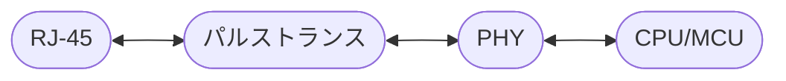

今回の記事は[前回の記事](https://zenn.dev/toitoy8/articles/220519_codesys)の続きとなります。
今回はEtherCAT側をRaspberry Pi上に構成していきます。

:::message
高価+プライベートでの使用用途がないということからSlaveデバイスの購入を断念しましたので、今回はCODEYS上でEtherCATを構成するところまでの内容になります。
(構成というには中途半端な内容ですのでまたリベンジしたいと思います)
もっと手頃に遊べるデバイスがあればよかったのですが…
:::

### 環境
- Windows11
- CODESYS CODESYS V3.5 SP17 Patch 2
- CODESYS-Control-for-Raspberry-Pi 4.4.0.0
- Raspberry Pi 4(Bullseye)

# EtherCATとは？
ドイツのベッコフが開発したオープンな産業用通信規格です。
ETG(EtherCAT Technology Gloup)で仕様や認証に関しての情報が管理されているようです。
ですので、例えばEtherCATの仕様書が見たい場合はETGへの加盟が必要になりますし、EtherCATデバイスを作って販売する前にはETGのコンフォーマンステストツールを使って社内テストに合格することが必須となります。
これに合格することで製品にコンフォーマンステスト済みロゴを使用でき、ETGで定めたテストによって品質を保証されたEtherCATデバイスとしての販売が可能となります。
なお、法人単位ですがETGへの加盟は無料です。

### 構成要素
EtherCATはEtherCATネットワークを制御するマスターと、それに従属して動作するスレーブで構成されます。
また通信はフィールドバス上のプロセスデータ(アナログセンサデータやエンコーダなどのデジタルデータなどの入出力情報が連結されたもの)をIEEE 802.3標準Ethernetフレームに載せてやりとりされます。
よって、マスター側は既存のEthernetの資源を転用することができますので一般的なPCにもついているRJ-45ソケットがあれば、ソフトウェア(ドライバ)のインストールでLANケーブルを通じてスレーブデバイスと通信することができます。
ただし、スレーブの場合は専用のコントローラが必要になります。
例えば、通常のEthernetの場合下記の接続になりますが

EtherCATスレーブの場合は下記のように、専用のスレーブコントローラIC(ESC)と
スレーブ情報が読み書きされるEEPROM(SSI)で構成されます。

>ESC: EtherCAT Slave Controller
SSI: Slave Information Interface

EtherCATスレーブに使用可能なICは以下の記事でまとめてくださっています。
https://qiita.com/nonNoise/items/6f6889fc8b30eb9cec1f
PHY内臓のICが使いやすそうですね。
マイコンがスレーブICにくっついてきて都合が良いか悪いかは、自分の開発環境によるかもしれません。

なお、スレーブデバイスは有志が評価キットを作ってくれているのもあります。
https://www.switch-science.com/catalog/5917/
ただ、Socket通信の制約上、WindowsやMacでは動作できないそうです。
Wiresharkで使用されるパケットキャプチャ(Npcapなど)等の特殊なドライバが必要なようです。

基板としては、ESCの一つであるLAN9252とEEPROMが載っていますので評価目的のスレーブとしては十分ですね。

### 通信方式
また、EtherCAT通信ではハンドシェイクを必要としないためオーバヘッドが少なく高速通信が可能です。
ハンドシェイクを不要にしている理由はその通信方式にあります。
EtherCATの通信方式はマスターからのパケットが各スレーブに順番に渡されていき、折り返してマスターに戻るというものになります。
これを1サイクルとし、全入出力処理を終えます。

### 同期方式
EtherCATの同期方法は3パターンあります。
1. FreeRun
   マスターとは関係なくスレーブのローカルタイマーでトリガーされる。
   マスターの通信フレームとは非同期。
2. SM同期
   マスターからの新しいプロセスデータ受信時にトリガーされる。
   マスターの通信フレームと同期。
3. DC同期
   マスターからの新しいプロセスデータ受信時にトリガーされる。
   各スレーブへの通信遅延をDC(Distributed Clock)により補正する。
   最初のスレーブがマスタークロックとなり行き帰りで遅延を計測し、ジッタを補正する。
   周期的に行われるプロセスデータ通信PDO(Process Data Object)と非周期的に行われるメールボックスデータ通信SDO(Service Data Object)でデータのやり取りがされる。

DC同期方式はEtherCATの特徴的な機能ですね。

EtherCATの通信同期方式に関しては以下の記事が絵つきでとてもわかりやすかったです。
https://www.pulsemotor.com/feature/EtherCAT-EC-AD_02.html

### EtherCAT参考記事

用語でサラッと理解するには以下の記事が参考になりました。
https://www.takagishokai.co.jp/product-search/2018/05/31/133

フィールドバスの歴史から理解するには以下の記事が参考になりました。
https://monoist.itmedia.co.jp/mn/articles/1309/17/news001.html

### CODESYSでのEtherCAT Masterの実装
Masterと接続するSlaveデバイスがないとEtherCATネットワークを構成できないので、Slaveデバイスを探します。
オムロン製センサ通信ユニットはAmazonでも入手することができそうです。=>[Link](https://www.amazon.co.jp/OMRON-%E3%82%AA%E3%83%A0%E3%83%AD%E3%83%B3-%E3%82%BB%E3%83%B3%E3%82%B5%E9%80%9A%E4%BF%A1%E3%83%A6%E3%83%8B%E3%83%83%E3%83%88-EtherCAT-E3NW-ECT/dp/B01N9ER75H/ref=sr_1_1?__mk_ja_JP=%E3%82%AB%E3%82%BF%E3%82%AB%E3%83%8A&crid=CYJE3DOJ0B2K&keywords=ethercat&qid=1653920970&sprefix=ethercat%2Caps%2C564&sr=8-1&th=1)

値段もお手頃…とは言い難いですが、スレーブデバイスの中では安価なほうです。
ただ、プライベート遊ぶにはなぁ…という値段なので今回はCODEYSを使って接続直前までやってみようと思います(それに他の使い道が…)。

なお、`カタログ/マニュアル/CAD/ソフトウェア`=>`ソフトウェア`から会員登録＆ログインすることでスレーブデバイス情報が記載してあるESIファイルを取得することができます。
https://www.fa.omron.co.jp/products/family/3177/download/software.html

まずは、[前回の記事](https://zenn.dev/toitoy8/articles/220519_codesys)を参考にCODESYSプロジェクトを作成してください。

### Masterの追加
ツリーに`Device`という項目があるので右クリックし、`デバイスの追加`を押してください。

`デバイスの追加`ウィンドウから`フィールドバス`=>`EtherCAT`=>`マスター`と進み、`EtherCAT Master`を選択してください。

### Slaveの登録と追加
次にスレーブデバイスをCODESYSに登録します。
メニューバーの`ツール`から`デバイスリポジトリ`を選択してください。

`デバイスリポジトリ`のウィンドウになるので、`インストール`を選択してください。
すると、ファイル参照画面になるので、ファイル種類でESIを選択し、先ほどダウンロードしたE3NW-ECTを選択してください。

これで、スレーブデバイスの登録ができました。

ここで、再度ツリーから`EtherCAT_Master`を右クリックし、`デバイスの追加`を選択します。

出てきた画面から`フィールドバス`=>`EtherCAT`=>`スレーブ`=>`OMRON Corporation`=>`Digital Type Sensor`の中からダウンロードしてきた目的のスレーブデバイスを選択し、`デバイスの追加`を押してください。

ここまでできたら、ツリーは以下のようにMasterとSlaveの親子関係になっているはずです。

### Masterの構成
次にMasterを構成していきます。
ツリーからMasterをダブルクリックすると下図の画面となります。

ブラウズを押して、EtherCAT Slaveを接続するMaster側のNICを選択してください。
今はMasterがRaspberry Piですので、有線ポートのeth0を選択してください。

### Slaveの構成
次にSlaveを構成していきます。
SlaveもMasterと同様にツリーにあるSlaveデバイスをダブルクリックすると、下図の画面が出てきます。

`エキスパート`をチェックすると、スタートアップ、タイムアウト、ウォッチドッグ、エイリアスなどの設定ができるようになります。
`分散クロック`の項目で`DCの選択`を`Free Run`にしておくと、Masterとの同期は考えずにSlaveが動いてくれるので、ひとまず動作させるには`Free Run`に設定しておきます。

`I/Oマッピング`でPDOを確認できます。

### プログラムからPDOへのアクセス
各データには以下のようにアドレスからアクセスできます(Inputモジュールなのでプログラム変数に代入していますが、Outputの場合はアドレスに変数や値を代入すればOKです)。

# まとめ
CODESYSでのEtherCAT Masterの構成方法をご紹介しました。

今回行ったことは以下です。
- CODESYSでのEtherCAT Master/Slaveの構成
- ESIファイルによるEtherCAT Slaveの登録
- プログラムからPDOへのアクセス

見ていただいたかたありがとうございました😊