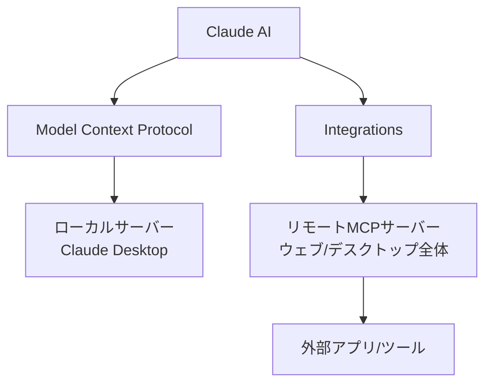
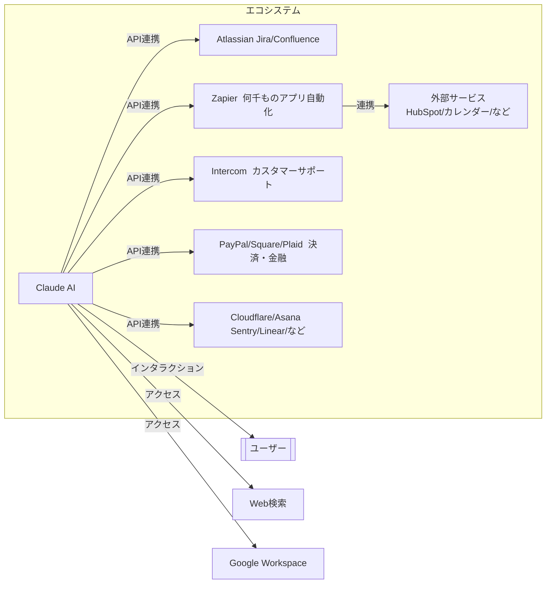
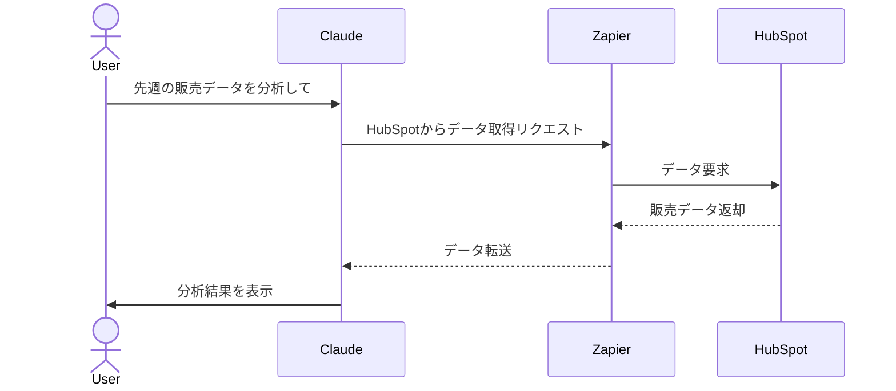
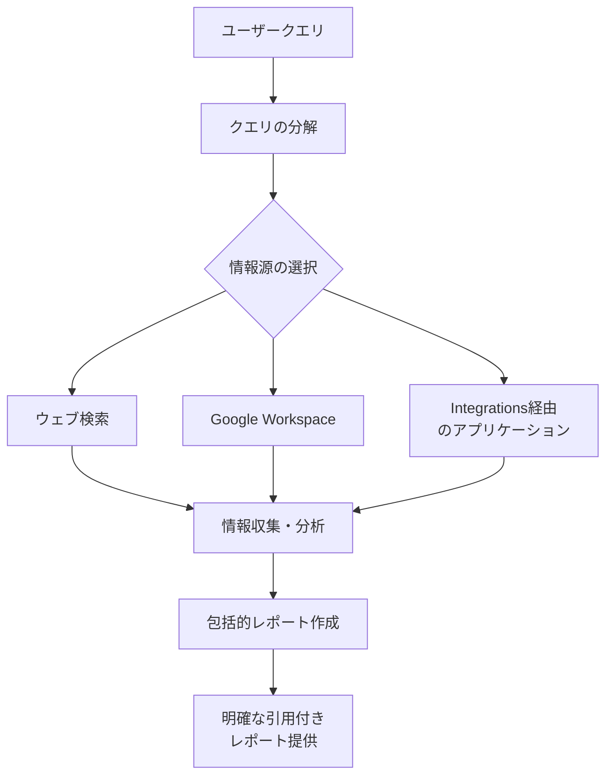
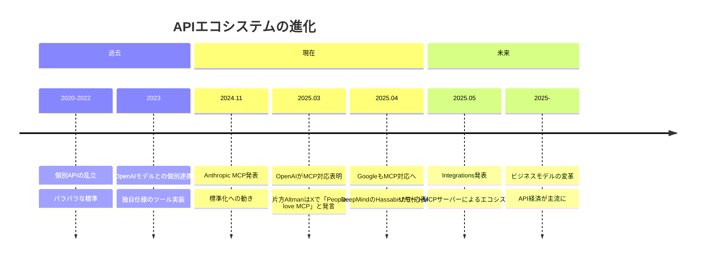
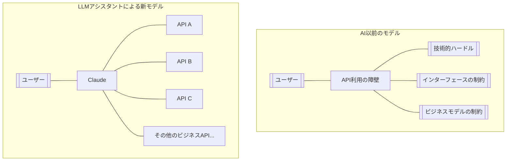

# 【2025年5月1日発表】Anthropicの「Integrations」機能解説 - Claudeがあなたのアプリと連携する新時代

:::message
This article is generated by Claude.
:::

Anthropicから嬉しい発表がありました！ 🎉 

AIアシスタントのClaudeがさらにパワーアップし、外部アプリやツールと連携できる「Integrations」機能と拡張された「Advanced Research」機能が発表されました。この記事では、これらの新機能がもたらす可能性と活用方法について解説します。

## Integrationsとは？ - クラウドに浮かぶClaudeの新たな翼 ✨

Integrationsは、Claudeを外部アプリやツールに接続する新しい方法です。これまでClaudeとの連携は限られていましたが、この機能によってさまざまなサービスとシームレスに連携できるようになります。

### 📋 MCPからIntegrationsへの進化

昨年11月に発表された「Model Context Protocol (MCP)」の拡張版とも言えるのがこのIntegrationsです。MCPはもともとClaude Desktopのローカルサーバーに限定されていましたが、今回のIntegrationsにより、ウェブやデスクトップアプリ全体でリモートMCPサーバーとシームレスに連携できるようになりました。

開発者はClaudeの機能を強化するサーバーを構築・ホスティングできるようになり、ユーザーはこれらのIntegrationsを発見してClaudeに接続できます。つまり、Claudeがあなたのデジタルワークスペースのハブとなり、さまざまなツールを会話を通じて操作できるようになるのです。

## 💡 利用可能なIntegrations - 強力な連携で広がる可能性

現在、以下の10の主要サービス向けのIntegrationsが利用可能です：

- **Atlassian（JiraとConfluence）** - プロジェクト管理と知識ベース
- **Zapier** - 何千ものアプリを接続する自動化プラットフォーム
- **Cloudflare** - ウェブサイトのセキュリティと性能
- **Intercom** - カスタマーメッセージングプラットフォーム
- **Asana** - プロジェクト管理ツール
- **Square** - 決済・販売管理
- **Sentry** - エラー監視プラットフォーム
- **PayPal** - オンライン決済
- **Linear** - ソフトウェア開発のためのイシュートラッカー
- **Plaid** - 金融データアクセスとAPI

さらに、StripeやGitLabなどからも今後提供される予定とのことです。

## 💪 実際の活用例 - Integrationsの威力

### Zapierとの連携 - 何千ものアプリとの接続

Zapierとの統合により、Claudeが何千ものアプリを事前構築されたワークフローを通じて接続できるようになります。例えば：

- HubSpotから自動的に販売データを取得
- カレンダーに基づいて会議の概要を準備

### Atlassianとの連携 - Jira & Confluenceの強化

Jira、Confluenceへのアクセスにより、Claudeはより効果的なプロジェクト管理をサポートします：

- 新製品の構築に関する情報をまとめる
- タスクをより効果的に管理
- 複数のConfluenceページやJira作業項目を一度に要約・作成

### Intercomとの連携 - ユーザーフィードバックの活用

Intercomとの接続により、顧客フィードバック対応のワークフローが効率化されます：

- ユーザーが問題を報告した際に自動でLinearにバグを登録
- Intercomの会話履歴とユーザー属性を使ってパターンを特定
- ユーザーフィードバックからバグ解決までの全ワークフローを1つの会話で管理

## 🔍 Advanced Research - 情報収集能力の飛躍的向上

IntegrationsとともにAnthropicが発表したのが、強化された「Advanced Research」機能です。この機能では、Claudeが複雑な調査リクエストを小さな部分に分解し、それぞれを詳しく調査した後、包括的なレポートにまとめます。

### Advanced Researchのプロセス

1. ユーザーが複雑な質問をする
2. Claudeがリクエストを小さな部分に分解
3. それぞれの部分について詳細に調査
4. 情報を統合して包括的なレポートを作成
5. 明確な引用と出典を提供

ほとんどのレポートは5〜15分で完成しますが、より複雑な調査には最大45分かかることもあります。これは、手動での調査では何時間もかかるような作業を自動化してくれる大きな進化です。

また、Claudeのデータアクセスも拡張されました。Researchは当初ウェブ検索とGoogle Workspaceのサポートで開始されましたが、現在はIntegrationsにより、接続する任意のアプリケーションも検索できるようになりました。

### 情報の透明性

Claudeは情報源から情報を取り込む際、元の資料に直接リンクする明確な引用を提供します。この透明性により、各洞察がどこから得られたのかを正確に知りながら、Claudeの調査結果を自信を持って使用できます。

## 🌐 サービス提供状況と今後の展開

IntegrationsとAdvanced Researchは現在、以下のプランでベータ版として提供されています：

- Claude Max
- Claude Team
- Claude Enterprise

また、近くProプランでも利用可能になる予定です。ウェブ検索は現在、すべてのClaude有料プランで世界中で利用可能となっています。

## 📊 Integrationsが変えるAIエコシステムの未来

IntegrationsとAdvanced Researchの登場は、AIアシスタントの活用方法を大きく変えるターニングポイントになると思います。この新しいエコシステムでは、サービス提供者はAPIを公開してLLMにデータを参照してもらいやすくし、サービスのアクセスポイントを増やし、ユーザーとの接点を拡大します。ホストアプリケーションであるClaudeは、様々なWeb上のAPIの窓口として、横断的に情報を参照し、マルチモーダルに思考した結果をレスポンスするためのハブとなります。

個人的には、以下のような変化が起きると考えています：

1. **情報の分断解消** - 異なるアプリ間でのコンテキスト切り替えが減少
2. **ワークフローの自動化** - AIが複数のタスクを横断的に処理
3. **データ活用の民主化** - 専門知識がなくても複雑なデータ分析が可能に
4. **創造的作業への時間シフト** - 単調なタスクからの解放
5. **サービス提供者の新たな成長機会** - APIを介した新たなユーザー層の開拓

## 💼 APIエコシステムへの参加障壁が大幅に低下 - 新たなビジネス機会の創出

Integrationsの登場は、APIエコシステムへの参加障壁を大幅に下げる画期的な出来事でもあります。特に注目すべきは、開発者が簡単にインテグレーションを作成できる環境が整ってきたことです。

### 🔧 開発者フレンドリーなツールの登場

MCP（Model Context Protocol）を基盤としたIntegrationsの開発は、最近登場したさまざまなツールでさらに容易になっています：

- **FastMCP** - Pythonでシンプルにサーバーを構築できるツール
- **公式SDK** - Python、C#など各種言語向けの公式サポート
- **OpenAPI互換** - 既存APIをスマートに変換する仕組み

これらのツールにより、数十行のコードだけでMCPサーバーを構築し、数分でLLMとの連携を実現できるようになりました。さらに驚くべきことに、OpenAIやGoogleもMCPの対応を発表しており、業界全体での標準化が進んでいます。

### 💸 ビジネスモデルの変革

この技術的進化は、ビジネスモデルにも大きな変革をもたらします：

1. **ビジネスデモクラティゼーション** - 小規模事業でもAPIエコシステムに参加可能に
2. **データプロバイダーの新たな成長** - ニッチデータを提供するプロバイダーが可能性を拡大
3. **アプリケーション層の層分化** - UIレイヤーからデータレイヤーまで明確な役割分担

特に重要なのは、ユーザーがLLMアシスタントを通して様々なAPIデータプロバイダーとのビジネス機会に容易にアクセスできるようになるという点です。以前は技術的なハードルが高く参加できなかったビジネスモデルにもアクセスできるようになり、市場の波及と利用が加速するでしょう。

### 📐 分野別ユースケースの広がり

この新しいエコシステムは、さまざまな分野で革命的な変化をもたらす可能性があります：

- **ヘルスケア** - 医療情報へのアクセスと分析の簡易化
- **フィンテック** - 金融データの統合と分析の民主化
- **教育** - 学習リソースへのアクセスとパーソナライズ化
- **会計/税務** - 複雑な資料の理解と処理の自動化

これらの変化は、技術的な知識や専門性が低いユーザーでも、専門的なツールやデータにアクセスして強力な結果を得られることを意味しています。

## 💳 ビジネスプレイヤーにとっての注目ポイント

ビジネスプレイヤーは、この新しいパラダイムでどのように動くべきでしょうか？

1. **サービス提供者の場合**
   - 自社データをLLMから参照しやすい形でAPI公開
   - MCP/Integrationsへの対応を優先的に実施
   - ユーザーへの新しいアクセスチャネルとして位置づけ

2. **スタートアップの場合**
   - ニッチな分野のAPIやデータプロバイダーとして参入
   - LLMアシスタント経由での新たな利用シナリオを開拓
   - アクセス障壁の低い新しいエコシステムへの早期参入

3. **企業内部での利用**
   - 内部データソースをMCP経由でアクセス可能に
   - 部門間データサイロの解消と横断的分析の実現
   - 専門知識やノウハウの民主化

これらの注目ポイントを適切に捕らえ、新しいAPIエコシステムでの位置づけを確立することが、今後のビジネス成功の鍵となるでしょう。

## まとめ - 新しいAPIエコシステムとビジネスの未来

Anthropicが2025年5月1日に発表したIntegrationsは、単なるAI機能のアップデートではなく、API経済とビジネスモデルの大きな転換点となる可能性を秘めています。

ClaudeAIをはじめとするLLMアシスタントは、デジタルワークスペースのハブとして機能し、様々なWeb上のAPIの窓口として横断的に情報を参照し、マルチモーダルな思考で結果をレスポンスするようになります。これにより、データプロバイダーやサービス提供者は新たなチャネルを通じてユーザーとつながり、ユーザーは単一インターフェースから複数のサービスをより簡単に利用できるようになります。

また、MCPとFastMCPなどの開発者ツールの普及により、APIエコシステムへの参加障壁は大幅に下がり、企業規模や技術力に関わらず、誰でもこのエコシステムに参加して新しいビジネス機会を模索できる時代になりつつあります。

今後この流れが加速することで、AIアシスタントとAPIエコシステムの融合が進み、ビジネスモデルとデータ活用の新しい時代が到来することを期待しています。AIの革新とビジネス革新が一体となる新時代への序章が始まったと言えるでしょう。 🚀

## 参考リソース

- [Anthropic公式発表 - Claude can now connect to your world](https://www.anthropic.com/news/integrations)
- [Model Context Protocol (MCP)の詳細](https://www.anthropic.com/news/model-context-protocol)
- [FastMCP - Pythonで簡単にMCPサーバーを構築](https://github.com/jlowin/fastmcp)
