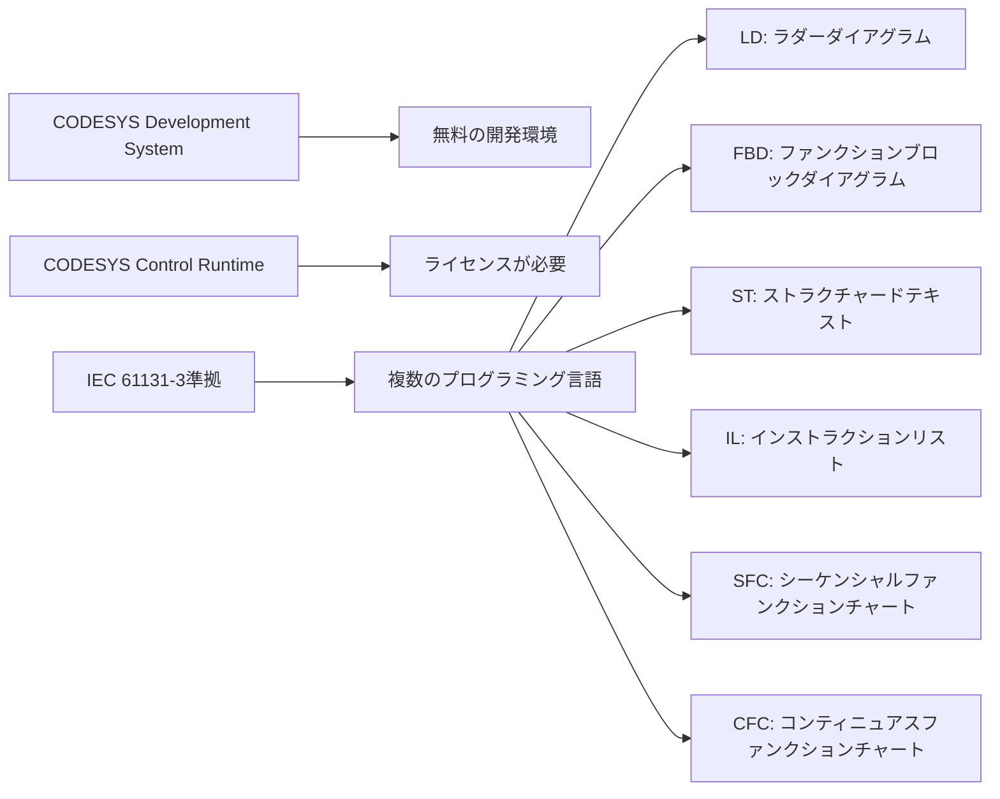
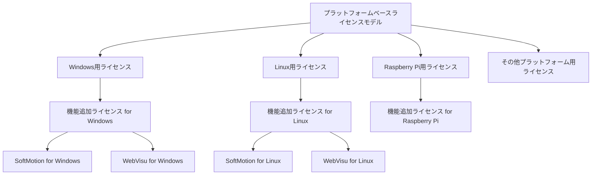
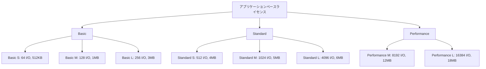
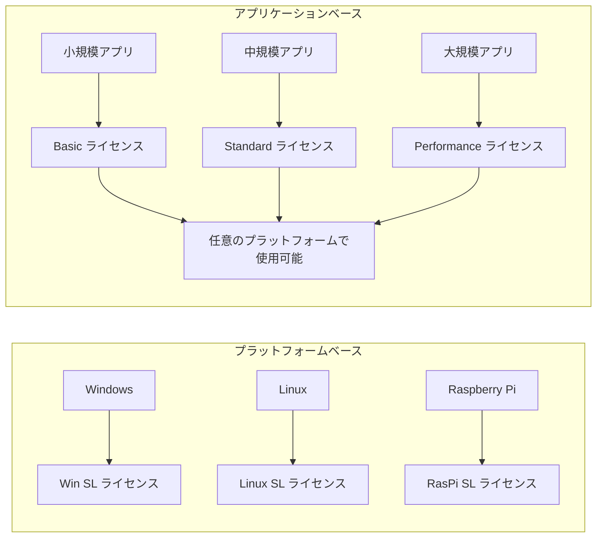

# ソフトウェアPLC Codesysのライセンス形態が変更になった件

:::message
This article is generated by Claude.
:::

みなさん、こんにちは！最近、産業用オートメーションの世界で大きな変化がありました。ソフトウェアPLCの代表格である「CODESYS」のライセンス形態が大きく変わったんです。🤔

私も最近この変更に気づいて、「あれ？以前と違うぞ？」と思ったので、今回はCODESYSのライセンス形態の変更について詳しく調べてみました。以前はプラットフォーム（OS）ごとにライセンスを購入する形でしたが、現在はアプリケーションの規模や必要な機能に応じたライセンス体系に変わっています。この変更点を理解して、自分のプロジェクトに最適なライセンスを選べるようにしましょう！

## CODESYSとは？

まずはCODESYSについて簡単におさらいしておきましょう。CODESYSは国際標準規格IEC 61131-3に準拠したソフトウェアPLCであり、PLC、Motion制御、HMIなどの機能を一つの開発環境で実現できるツールです。世界中で400社以上のOEMメーカーや数千社のエンドユーザーに利用されている実績のあるプラットフォームです。

CODESYSの大きな特徴として、開発環境（CODESYS Development System）自体は無料で利用できる点があります。この開発環境ではIEC 61131-3で定義されている5つのプログラミング言語に加え、CODESYSが独自に拡張したCFC（Continuous Function Chart）も利用可能です。ライセンスが必要になるのは、実際に制御を行うランタイム環境の部分です。

[CODESYSの概要](https://linx.jp/product/codesys/)

## 旧ライセンス形態（プラットフォームベース）

以前のCODESYSのライセンスは「プラットフォームベース」と呼ばれるモデルでした。これはどういうことかというと、使用するハードウェアプラットフォームごとに異なるライセンスを購入する必要があったのです。

例えば：
- CODESYS Control Win SL（Windows用）
- CODESYS Control Linux SL（Linux用）
- CODESYS Control for Raspberry Pi SL（Raspberry Pi用）
- CODESYS Control RTE SL（Windows Real-Time用）

などのように、OSやハードウェアプラットフォームごとに別々のライセンスが存在していました。開発したアプリケーションを異なるプラットフォームで動かしたい場合は、それぞれのプラットフォーム向けのライセンスを別途購入する必要があったのです。

また、SoftMotionなどの追加機能も、プラットフォームごとに別のライセンスとして提供されていました。

この構造では、例えばWindows用に開発したアプリケーションをLinuxで動かしたい場合、Windows用ライセンスに加えてLinux用ライセンスも購入する必要がありました。さらに、SoftMotionなどの追加機能もプラットフォームごとに別のライセンスとして提供されていたため、コストが積み重なる構造になっていました。

## 新ライセンス形態（アプリケーションベース）

2023年末から、CODESYSは「アプリケーションベース」と呼ばれる新しいライセンスモデルに移行しました。この新モデルの最大の特徴は、**ハードウェアに依存しないライセンス**になったということです。つまり、同じアプリケーションを異なるプラットフォームで実行する場合でも、一つのライセンスで対応できるようになりました。

新しいアプリケーションベースのライセンスでは、以下の要素によってライセンスのレベルが決まります：

- I/Oチャンネル数
- フィールドバスネットワークの数と種類
- 視覚化（Visualization）で使用する変数の数
- コードサイズ
- SoftMotionなどの追加機能の使用

ライセンスのメトリクス（制限値）はCODESYS Development Systemのデバイスビューで確認できます。

## ライセンスレベルの詳細

新しいアプリケーションベースのライセンスは、大きく分けて以下の3つのカテゴリに分かれています：

### 1. Basic シリーズ

最も小規模なアプリケーション向けのライセンスです。CANopen、Modbus、PROFIBUS、J1939などの従来型フィールドバスを使用するプロジェクトに適しています。

- **Basic S**: 64 I/Oチャンネル、コードサイズ最大512KB
- **Basic M**: 128 I/Oチャンネル、コードサイズ最大1MB、従来型フィールドバス最大2つ
- **Basic L**: 256 I/Oチャンネル、コードサイズ最大3MB、従来型フィールドバス最大2つ

### 2. Standard シリーズ

中規模のアプリケーション向けのライセンスです。EtherCAT、PROFINET、EtherNet/IPなどのEthernetベースのフィールドバスをサポートしています。

- **Standard S**: 512 I/Oチャンネル、コードサイズ最大4MB
- **Standard M**: 1024 I/Oチャンネル、コードサイズ最大5MB、Ethernetベースフィールドバス1つ
- **Standard L**: 4096 I/Oチャンネル、コードサイズ最大6MB、Ethernetベースフィールドバス2つ

### 3. Performance シリーズ

最も高度なアプリケーション向けのライセンスです。タスクグループを特定のCPUコアに割り当てる機能（マルチコアサポート）により、タスクジッターを大幅に削減できます。

- **Performance M**: 8192 I/Oチャンネル、コードサイズ最大12MB、Ethernetベースフィールドバス4つ
- **Performance L**: 16384 I/Oチャンネル、コードサイズ最大18MB、Ethernetベースフィールドバス8つ

## 追加機能とアドオン

基本ライセンスに加えて、以下のような追加機能をオプションとして購入できます：

### Visualization（視覚化）
HMI機能を利用するためのライセンスで、使用するタグ数によって以下のように分類されます：
- **Visualization S**: 最大128タグ
- **Visualization M**: 最大2048タグ
- **Visualization L**: 最大4096タグ
- **Visualization XL**: 最大8192タグ
- **Visualization XXL**: 無制限

### Communication（通信）
シンボル設定、通信マネージャー、データソースマネージャーを使用するためのライセンスです：
- **Communication S**: 最大512タグ
- **Communication M**: 最大4096タグ
- **Communication XXL**: 無制限

### SoftMotion
モーション制御機能を利用するためのライセンスで、制御可能な軸数によって分類されます：
- **SoftMotion 4+4**: 4実軸＋4仮想軸
- **SoftMotion 8+8**: 8実軸＋8仮想軸
- **SoftMotion 16+16**: 16実軸＋16仮想軸
- **SoftMotion 32+32**: 32実軸＋32仮想軸
- **SoftMotion 48+48**: 48実軸＋48仮想軸
- **SoftMotion 64+64**: 64実軸＋64仮想軸
- **SoftMotion 96+96**: 96実軸＋96仮想軸
- **SoftMotion 128+128**: 128実軸＋128仮想軸

## ライセンス変更の影響とメリット

この新しいライセンスモデルへの移行によって、ユーザーにはいくつかの重要なメリットがあります：

1. **ハードウェア独立性**: 同じライセンスで異なるハードウェアプラットフォームを使用できるようになりました。Windows PCからLinuxベースのエッジデバイスまで、同じライセンスで対応可能です。

2. **柔軟なスケーリング**: アプリケーションの複雑さや規模に応じてライセンスをスケールできます。小規模なプロジェクトでは低コストで始め、必要に応じてアップグレードできます。

3. **コスト最適化**: 実際に使用する機能や規模に応じたライセンスを選択できるため、無駄なコストを抑えられます。

4. **アップグレードの容易さ**: 既存のライセンスから上位ライセンスへのアップグレードが簡単で、元のライセンスのコストが全額クレジットとして適用されます。

### 新旧ライセンスモデルの比較

以下の表は、プラットフォームベースとアプリケーションベースのライセンスモデルの主な違いをまとめたものです：

| 項目 | プラットフォームベース（旧モデル） | アプリケーションベース（新モデル） |
|------|----------------------------------|--------------------------------|
| ライセンス体系 | プラットフォームごとに異なるライセンス | アプリケーションの規模と機能に基づくライセンス |
| 複数プラットフォーム対応 | 各プラットフォーム用のライセンスを個別に購入 | 1つのライセンスであらゆるプラットフォームに対応 |
| スケーラビリティ | 限定的 | 高い（簡単にアップグレード可能） |
| 追加機能ライセンス | プラットフォームごとに別ライセンス | 基本ライセンスに追加する形で統一 |
| 価格構造 | プラットフォーム主体 | 機能と規模主体 |
| バージョン要件 | なし | CODESYS Dev System V3.5.19.10以上 Control SLランタイム V4.9.0.0以上 |
| 更新サポート | 不明 | 5年間の無料更新サポート |

## 旧ライセンスからの移行について

CODESYS公式のFAQによると、プラットフォームベースのライセンスは2023年末までCODESYS Storeで販売されていました。すでに購入済みの旧ライセンスは今後のCODESYS Control SLのすべてのバージョンで引き続き使用できます。

ただし、旧ライセンスと新ライセンスの混在はできないとのことです。例えば「SoftMotion Axes」ライセンスをLinux SLライセンスと組み合わせて使用することはできません。

また、非商用利用向けの「CODESYS Control for Raspberry Pi SL」は例外で、引き続き従来通りCODESYS Storeで提供されるとのことです。

## 必要なバージョン

新しいアプリケーションベースのライセンスを使用するには、以下のバージョン要件を満たす必要があります：

- CODESYS Development System V3.5.19.10以上
- Control SLランタイム V4.9.0.0以上
- Visualization V4.4.0.0以上

## 更新とサポート

新しいアプリケーションベースのライセンスには、5年間の無料ランタイムシステムソフトウェア更新が含まれています。この期間はランタイムライセンスの有効化から開始されます。

更新期間の終了後も、ライセンスを取得したCODESYSランタイムシステムは完全に機能し続けます。期間終了後に新しいCODESYSランタイムシステム環境を使用したい場合は、CODESYS Storeを通じてライセンスを更新できます。

## ライセンス選択のガイドライン

新しいアプリケーションベースのライセンスを選択する際には、以下のポイントを考慮すると良いでしょう：

1. **I/Oチャンネル数**: アプリケーションで使用するI/Oポイントの総数を見積もります。
2. **フィールドバスの種類と数**: 必要なフィールドバス（CANopen、EtherCAT、PROFINET等）の種類と数を決定します。
3. **コードサイズ**: 予想されるアプリケーションの規模と複雑さを考慮します。
4. **追加機能**: SoftMotion、Visualization、Communicationなどの追加機能が必要かどうかを検討します。
5. **将来の拡張性**: 将来的な拡張の可能性を考慮して、少し余裕を持ったライセンスを選択することも検討しましょう。

## まとめ

CODESYSのライセンス形態は、従来のプラットフォームベースからアプリケーションベースへと大きく変化しました。この変更により、ハードウェアに依存しない柔軟なライセンス体系が実現し、ユーザーはプロジェクトの規模や必要な機能に合わせて最適なライセンスを選択できるようになりました。

新しいライセンスモデルの主なメリットは：
- 🔄 ハードウェア独立性によるプラットフォーム間の移行の容易さ
- 📈 アプリケーションの成長に合わせた柔軟なスケーリング
- 💰 実際に使用する機能に応じたコスト最適化
- 🛠️ 将来のプロジェクト拡張への対応のしやすさ

今後新しくCODESYSを導入する場合や、ライセンスの更新を検討している場合は、この新しいライセンスモデルを理解して、自分のプロジェクトに最適なライセンスを選択することが重要です。

みなさんも、ぜひこの新しいライセンスモデルを活用して、より柔軟で効率的なオートメーションシステムの開発に取り組んでください！🚀

## 参考リンク

- [CODESYS Store - Application Based Licenses](https://store.codesys.com/en/licenses.html)
- [CODESYS - Explanation Application-Based Licenses](https://store.codesys.com/en/howto_applicationbasedlicenses)
- [CODESYS - FAQ Application-Based Licenses](https://store.codesys.com/en/faq-applicationbased-licenses)
