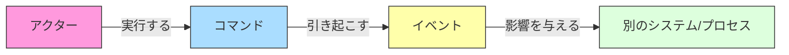
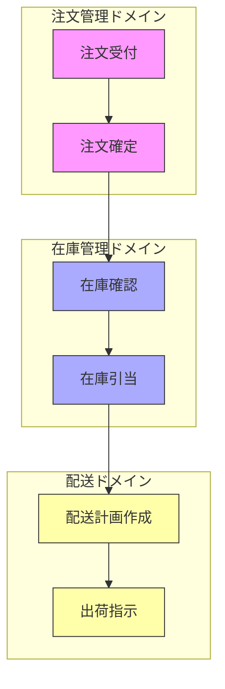
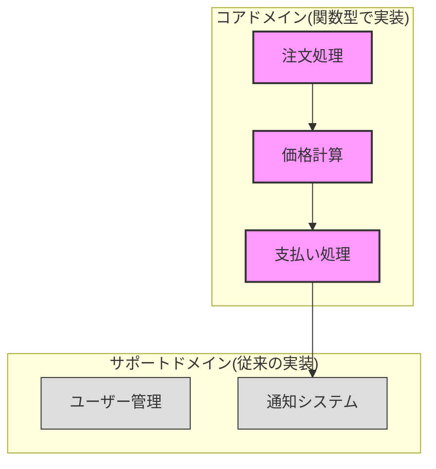
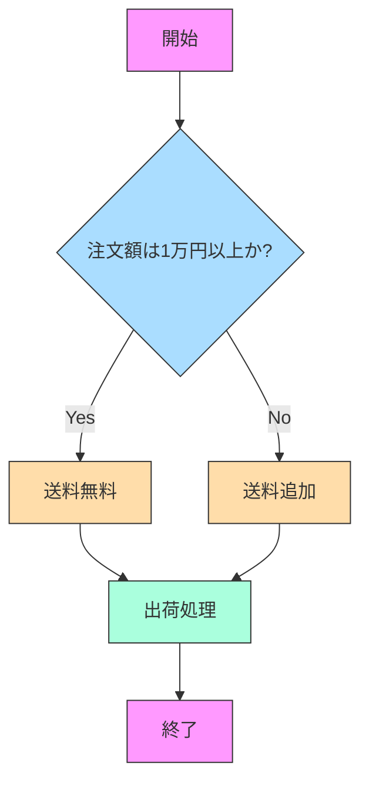
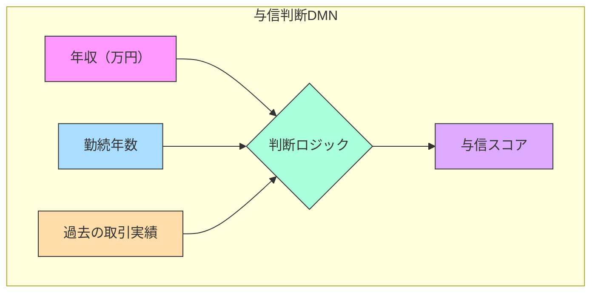
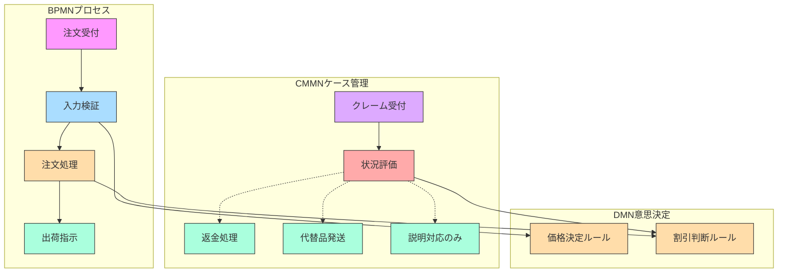
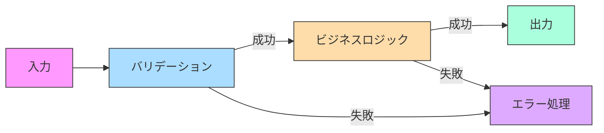
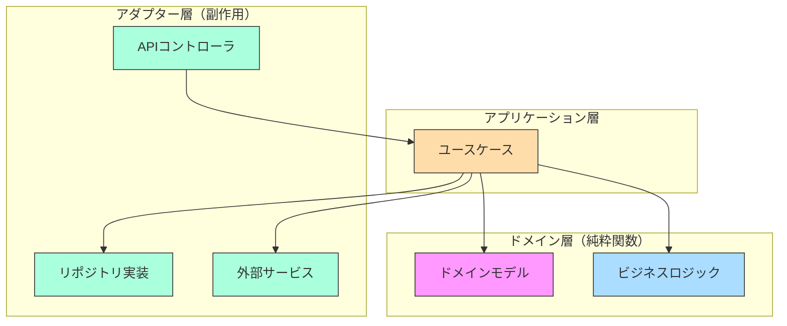

```mermaid
graph LR
    A[UnvalidatedOrder] -->|validateOrder| B[ValidatedOrder]
    B -->|checkInventory| C[InventoryCheckedOrder]
    C -->|calculatePrices| D[PricedOrder]
    D -->|processPayment| E[PaidOrder]
    E -->|createOrder| F[Order]
    style A fill:#f9f,stroke:#333
    style B fill:#adf,stroke:#333
    style C fill:#fda,stroke:#333
    style D fill:#afd,stroke:#333
    style E fill:#daf,stroke:#333
    style F fill:#faa,stroke:#333
```

# ドメイン駆動設計と関数型プログラミングの融合

:::message
This article is generated by Claude.
:::

こんにちは！今回は「Domain Modeling Made Functional」という素晴らしい本から学んだ、ドメイン駆動設計(DDD)と関数型プログラミングを組み合わせるアプローチについてお話しします。ビジネスの複雑さをコードで正確に表現し、しかも保守しやすいシステムを構築するための実践的な方法論です ✨

## やりたいこと

この記事では以下のことを目指します：

- EventStormingを使ってビジネスデータフローを整理する方法
- ドメインバウンダリーを明確に識別する重要性
- ドメイン知識とコードを一致させる具体的な手法
- 関数型プログラミングの型システムを活用したドメインモデリング
- 業務プロセスを関数パイプラインとして表現する方法
- BPMN、CMMN、DMNなどの標準モデリング手法とDDDの組み合わせ
- 最新の関数型DDDのベストプラクティス

## ドメイン駆動設計とは何か？

ドメイン駆動設計（DDD）は、複雑なビジネスドメインに焦点を当てたソフトウェア開発アプローチです。「ドメイン」とは、ビジネスの問題領域のことで、例えば「注文管理」や「在庫管理」などが該当します。

DDDの中心的な考え方は：

1. ビジネス関係者と開発者が共通の言語（ユビキタス言語）を使って会話する
2. ドメインの本質を反映したモデルを作る
3. そのモデルをコードに直接落とし込む

でも、従来のオブジェクト指向によるDDDの実装では、しばしばドメインモデルとコードの間にギャップが生じてしまいます 😓

そこで登場するのが「Domain Modeling Made Functional」のアプローチです！

## EventStormingによるビジネスプロセスの可視化

まず、ビジネスプロセスを理解するための強力なツールとして **EventStorming** があります。これは開発者だけでなく、ドメインエキスパート（ビジネスの専門家）も一緒に参加できるワークショップ形式の手法です。

### EventStormingの基本的な流れ

1. 大きな紙やオンラインボード上に、ビジネスで発生する「イベント」を時系列で付箋に書き出していく
2. それらイベントを引き起こす「コマンド」を特定する  
3. イベントやコマンドに関わる「アクター」（人やシステム）を特定する
4. 関連するデータや制約を追加していく

このプロセスを図で表すとこんな感じになります：



EventStormingの素晴らしいところは、技術的な詳細に入る前に **ビジネスフローの順序性** を明確にできることです。例えば「注文確定」→「在庫確認」→「支払い処理」→「出荷指示」というビジネスフローが見えてくると、自然とドメインの境界も浮かび上がってきます。

## ドメインバウンダリーの識別

EventStormingを行うと、自然に「このイベントとあのイベントは別の文脈だよね」という会話が生まれます。これがドメインバウンダリー（境界）の発見につながります！

例えば以下のような切り分けが見えてくるかもしれません：



ドメインバウンダリーを明確にすることで得られるメリットは大きいです：

- チームの分割が自然にできる
- マイクロサービスの境界が明確になる
- 各ドメイン内部の変更が他のドメインに影響しにくくなる

ドメインバウンダリーの識別は、「この概念はこのコンテキストではこういう意味、別のコンテキストでは別の意味」という **バウンデッドコンテキスト** の発見にもつながります。例えば「商品」という言葉は販売部門と倉庫部門では異なる属性や振る舞いを持つかもしれません。

## ドメイン知識とコードの一致

「Domain Modeling Made Functional」の本質的な価値は、抽出したドメイン知識をコードと一致させる方法を提供していることです。

従来のアプローチでは：
1. ドメインモデルを図やドキュメントで表現
2. それをもとにコードを書く
3. 時間が経つとドキュメントと実装にズレが生じる 😱

一方、この本のアプローチでは：
1. ドメインモデルを **型** として直接表現
2. その型を組み合わせてワークフローを構築
3. コード自体がドキュメントになる 🎉

### 型を使ったドメインモデリング

例えば、「注文」というドメイン概念を考えてみましょう。これをF#（または他の関数型言語）の型で表現すると：

```fsharp
// 値オブジェクト
type OrderId = OrderId of string
type ProductId = ProductId of string
type Quantity = Quantity of int

// 製品アイテム
type OrderItem = {
    ProductId : ProductId
    Quantity : Quantity
}

// 注文そのもの
type Order = {
    OrderId : OrderId
    Items : OrderItem list
    ShippingAddress : Address
    OrderDate : DateTime
}

// 可能な注文状態（代数的データ型）
type OrderStatus = 
    | Draft
    | Placed
    | Paid
    | Shipped
    | Delivered
    | Cancelled
```

このように型定義を読むだけで、ドメインモデルの構造がすぐに理解できますね！

特に素晴らしいのは、代数的データ型（Discriminated Union/代数的直和型）を使った表現です。例えばOrderStatusは「注文は必ずDraft, Placed, Paid...のいずれかの状態である」という **ドメインの制約** を型システムで表現しています。

## 関数型プログラミングによる業務プロセスのモデリング

この本のもう一つのキーポイントは、業務プロセス自体を関数と見なすアプローチです。

例えば「注文プロセス」をF#で表現すると：

```fsharp
// 注文プロセスのワークフロー
type PlaceOrderError = 
    | InvalidOrder
    | ProductOutOfStock
    | PaymentRejected

// Input → (成功 or 失敗) という型
type PlaceOrderWorkflow = 
    UnvalidatedOrder -> Result<Order, PlaceOrderError>

// 実際の実装は小さな関数の組み合わせ
let placeOrder : PlaceOrderWorkflow = 
    fun unvalidatedOrder ->
        unvalidatedOrder
        |> validateOrder                  // 注文を検証
        |> Result.bind checkInventory     // 在庫確認
        |> Result.bind calculatePrices    // 価格計算
        |> Result.bind processPayment     // 支払い処理
        |> Result.map createOrder         // 注文作成
```

このようなアプローチの利点は：

1. ワークフロー全体が一目でわかる 👀
2. 各ステップの入出力が型によって保証される
3. エラー処理が明示的
4. 副作用（データベース操作など）を分離しやすい

## ワークフローパイプラインによる型の接続

「Domain Modeling Made Functional」では、業務プロセスを「データ変換パイプライン」として表現します。各ステップは、あるドメイン型から別のドメイン型への変換として実装されます。



このパイプラインの各変換は **型安全** です。つまりPricedOrderをSkipして、ValidatedOrderからいきなりPaidOrderに変換することはできません。これによりビジネスルールが破られることを防ぎます 🛡️

実際のコードでは、Resultモナドを使ってエラー処理も組み込まれます：

```fsharp
let placeOrder unvalidatedOrder =
    let validatedOrderResult = 
        validateOrder unvalidatedOrder  // Result<ValidatedOrder, ValidationError>
        
    match validatedOrderResult with
    | Error err -> Error err
    | Ok validatedOrder ->
        let inventoryCheckedResult = 
            checkInventory validatedOrder  // Result<InventoryCheckedOrder, InventoryError>
            
        match inventoryCheckedResult with
        | Error err -> Error err
        | Ok inventoryCheckedOrder ->
            // 以下同様に処理が続く...
```

もちろん、上記の冗長なmatchパターンは`Result.bind`などを使ってエレガントに書けます：

```fsharp
let placeOrder unvalidatedOrder =
    validateOrder unvalidatedOrder
    |> Result.bind checkInventory
    |> Result.bind calculatePrices
    // ... 残りの処理
```

## TypeScriptでの実践例

F#は素晴らしい言語ですが、実際のプロジェクトではTypeScriptなどで実装することも多いでしょう。TypeScriptでも同様のアプローチが適用できます！

```typescript
// 値オブジェクト
type OrderId = string & { readonly _brand: unique symbol }
type ProductId = string & { readonly _brand: unique symbol }

// 注文アイテム
interface OrderItem {
  productId: ProductId;
  quantity: number;
}

// 注文状態（代数的データ型）
type OrderStatus = 
  | { kind: 'Draft' }
  | { kind: 'Placed', placedDate: Date }
  | { kind: 'Paid', paymentId: string }
  | { kind: 'Shipped', trackingNumber: string }
  | { kind: 'Delivered', deliveryDate: Date }
  | { kind: 'Cancelled', reason: string };

// ワークフローの関数型
type PlaceOrderError = 
  | { kind: 'InvalidOrder', message: string }
  | { kind: 'ProductOutOfStock', productId: ProductId }
  | { kind: 'PaymentFailed', reason: string };

type Result<T, E> = 
  | { kind: 'Ok', value: T }
  | { kind: 'Error', error: E };

type PlaceOrderWorkflow = 
  (unvalidatedOrder: UnvalidatedOrder) => Result<Order, PlaceOrderError>;
```

TypeScriptでも型を活用することで、ドメインの制約をコードで表現できます！

## 実際のプロジェクトへの適用

このアプローチを実際のプロジェクトで活用する際のポイントをいくつか紹介します：

### 1. 段階的な導入

いきなり全てのドメインを関数型で実装するのではなく、重要なコアドメインから始めるのがおすすめです。例えば：



### 2. チームの学習曲線を考慮する

関数型プログラミングやDDDは学習コストが高いので、チーム全体で基本概念を学ぶ時間を確保しましょう。

### 3. 共通言語の構築

何よりも重要なのは、ビジネス関係者と開発者が同じ言語で会話できるようにすることです。EventStormingや型定義をベースに、用語集（ユビキタス言語）を作成するといいでしょう。

## BPMN、CMMN、DMNを活用した業務モデリング

関数型DDDのアプローチに加えて、業務モデリングの標準的な表記法であるBPMN、CMMN、DMNを組み合わせることで、より包括的な業務モデルを構築できます。これらの標準は互いに補完し合うように設計されています 🧩

### BPMNとは

BPMN（Business Process Model and Notation）は構造化されたプロセスのためのモデリング表記法です。順序が明確で、条件分岐やループなどの制御フローを持つビジネスプロセスを表現するのに適しています。



### CMMNとは

CMMN（Case Management Model and Notation）はケース管理のためのモデリング表記法です。イベント駆動型の業務や例外が多く、実行順序が状況によって変わるような柔軟なプロセスを表現するのに適しています CMMNはBPMNよりも「アジャイル、適応性が高く、柔軟」で、順序が決まっていないアドホックなサブプロセスに適しています。

例えば、顧客からの問い合わせ対応やクレーム処理など、状況に応じて柔軟に対応が変わるケースはCMMNで表現するとわかりやすくなります。

### DMNとは

DMN（Decision Model and Notation）は意思決定ロジックをモデル化するための表記法です。複雑なビジネスルールや判断基準をテーブル形式で表現できます DMNはBPMNやCMMNのプロセスやケースモデルから呼び出すことができる決定モデルを提供します。

例えば、与信判断のルールをDMNで表現すると：



### 3つの標準を組み合わせる意義

これらの標準を組み合わせることで、業務の異なる側面を適切なモデルで表現できます BPMN、CMMN、DMNは互いに補完し合うように設計されており、「プロセス改善標準のトリプルクラウン」と呼ばれることもあります。

- **BPMN**: 構造化されたプロセスフロー
- **CMMN**: イベント駆動型の柔軟なケース処理
- **DMN**: 複雑な意思決定ルール



### DDDとの相乗効果

これらの標準モデリング手法は、DDD（特に戦略的設計）と組み合わせると非常に強力です DDDはビジネスの目的に沿った高品質なソフトウェアモデル設計を作成するアプローチですが、これらのビジネスモデルは別のライフサイクルで管理できるという利点があります。

- **BPMN/CMMN/DMN**: ドメインエキスパートとのコミュニケーションツール
- **EventStorming**: ドメインの発見と境界の識別
- **関数型DDD**: 発見したドメインモデルのコード実装

この組み合わせにより、ビジネスモデルを可視化し、そのモデルを関数型プログラミングで忠実に実装することができます。

## 関数型DDDの最新ベストプラクティス

### Railway Oriented Programming

関数型DDDの実装で注目すべきパターンの一つが「Railway Oriented Programming（鉄道指向プログラミング）」です これはエラー処理のアプローチで、コードを鉄道のレールに沿った一連の関数として分割し、各関数は成功するとレールに沿って進み、失敗すると別のレールに切り替わります。



このパターンは、F#の`Result`型やTypeScriptの判別共用体を使って実装できます。

### 代数的データ型（ADT）によるドメインモデリング

最新の関数型DDDでは、代数的データ型（Algebraic Data Types）を使ってドメインモデルを表現することが推奨されています ドメインモデリングにはADTを使用し、ビジネスルールは純粋関数で処理します。ビジネスモデルは状態遷移として表現でき、ドメインを状態機械としてモデル化できます。

```typescript
// 顧客登録プロセスの状態を表現する代数的データ型
type Registration = 
  | { kind: 'New', email: string }
  | { kind: 'Pending', userId: string, email: string }
  | { kind: 'Verified', userId: string, email: string, verifiedAt: Date }
  | { kind: 'Rejected', reason: string };

// 状態遷移を表す関数
const submitEmail = (email: string): Registration => ({
  kind: 'New',
  email
});

const processSubmission = (reg: Registration): Registration => {
  if (reg.kind !== 'New') throw new Error('Invalid state');
  
  return {
    kind: 'Pending',
    userId: generateUserId(),
    email: reg.email
  };
};
```

### 不変データと純粋関数

関数型DDDのコアプリンシパルの一つは、データの不変性と関数の純粋性です 純粋関数は副作用がなく、テストが非常に簡単で、モックが不要です。これは「純粋な」コードと不純な/状態を持つコードを分離することで実現します。

```typescript
// 不変データ構造
type Order = Readonly<{
  id: OrderId;
  items: ReadonlyArray<OrderItem>;
  total: Money;
}>;

// 純粋関数 - 入力を変更せず、新しい値を返す
const addItem = (order: Order, item: OrderItem): Order => ({
  ...order,
  items: [...order.items, item],
  total: addMoney(order.total, item.price)
});
```

### ヘキサゴナルアーキテクチャとの親和性

関数型DDDは、ヘキサゴナルアーキテクチャ（ポートとアダプター）との親和性が高いです 関数型プログラミングとDDDの組み合わせは、サービス指向アーキテクチャやヘキサゴナルアーキテクチャに自然につながります。



このアーキテクチャでは、ドメイン層を純粋関数で実装し、副作用（データベースやAPI呼び出し）をアダプター層に押し出すことで、テスト容易性と保守性を高めています。

## まとめ

「Domain Modeling Made Functional」のアプローチをまとめると：

1. **EventStorming** でビジネスプロセスの流れを視覚化
2. **ドメインバウンダリー** を明確に識別
3. ドメイン概念を **型** で表現
4. ビジネスプロセスを **関数パイプライン** として実装
5. 型システムでドメインルールを強制
6. **BPMN/CMMN/DMN** で業務モデルを標準化
7. **Railway Oriented Programming** でエラー処理をエレガントに

このアプローチの一番の魅力は、「コード = ドメインモデル」という点です。コードを読むだけでドメインのルールや制約がわかり、変更が必要になっても、どこをどう変更すべきかが明確です。

ドメイン駆動設計と関数型プログラミングの組み合わせは、複雑なビジネスロジックを持つシステムの開発に特に有効です。さらに、BPMN、CMMN、DMNといった標準モデリング手法を取り入れることで、ドメインエキスパートとのコミュニケーションがより円滑になります。

この記事が皆さんのプロジェクトの参考になれば幸いです 🚀

## 参考リソース

- [Domain Modeling Made Functional - Scott Wlaschin著](https://pragprog.com/titles/swdddf/domain-modeling-made-functional/)
- [F# for Fun and Profit](https://fsharpforfunandprofit.com/)
- [Example Code Repository](https://github.com/swlaschin/DomainModelingMadeFunctional)
- [EventStorming - Alberto Brandolini著](https://www.eventstorming.com/)
- [Zennで公開されている関連記事](https://zenn.dev/labbase/articles/b1c513c32fe15e)
- [BPMN、CMMN、DMNの公式仕様 - OMG](https://www.omg.org/)
- [FunctionalDDD GitHub](https://xavierjohn.github.io/FunctionalDDD/)
