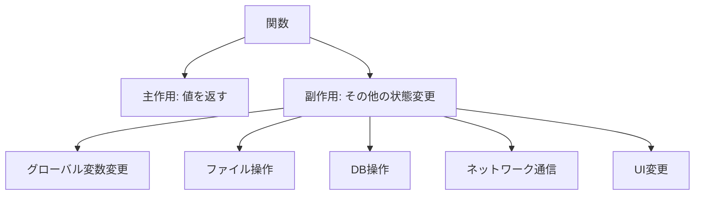
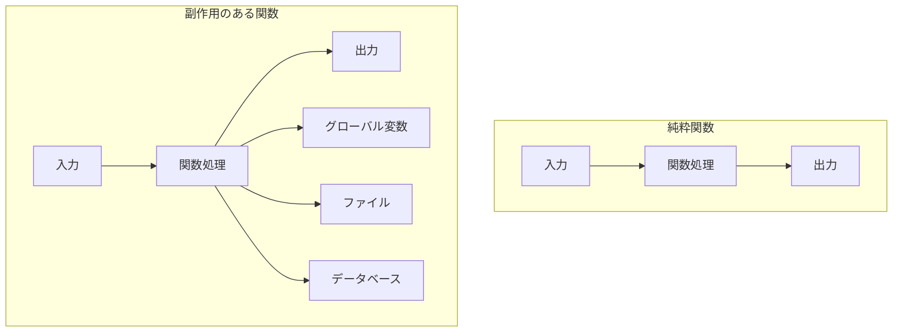
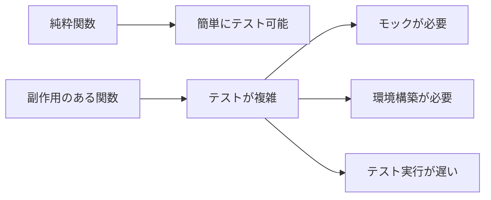
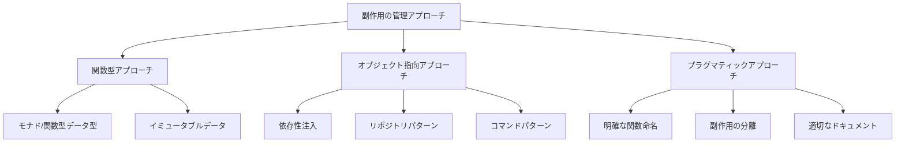
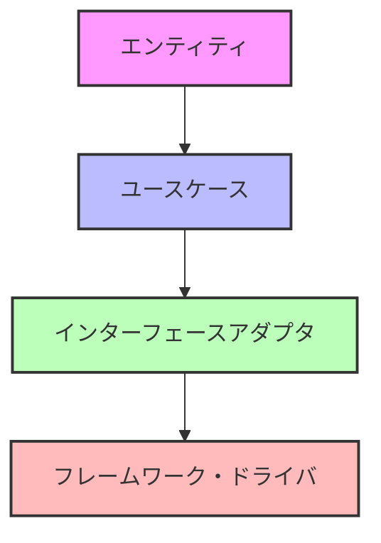
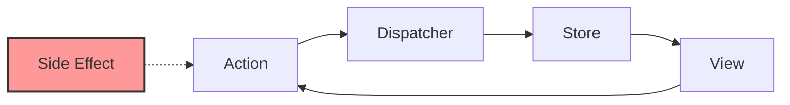
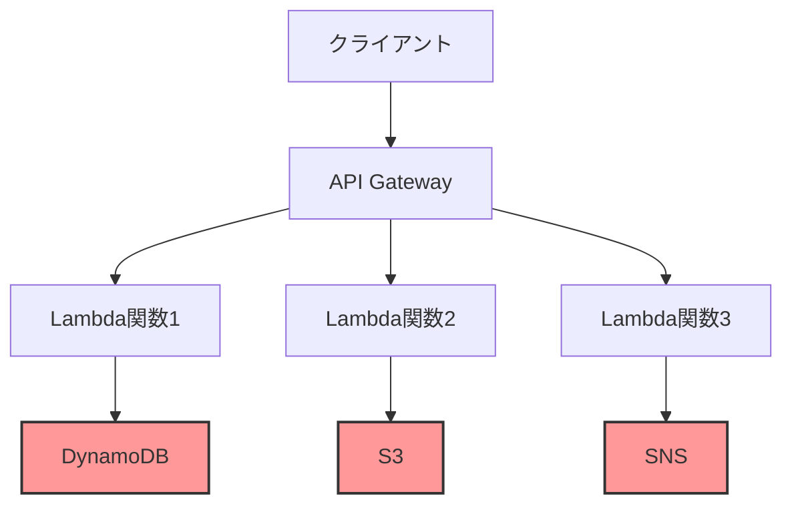

# プログラマなら知っておくべき「関数の副作用」の正体と付き合い方

:::message
This article is generated by Claude.
:::

みなさん、プログラミングをしていると必ず出会う「副作用（side effect）」という言葉。🤔 でも、なぜプログラミングの世界では「副作用」なんて言葉を使うのでしょうか？薬の副作用のように「悪いもの」なのでしょうか？

この記事では、プログラミングにおける「副作用」の概念、由来、そして現代のソフトウェア開発における扱い方までを、様々な視点から解説していきます。関数型プログラミングの愛好家から実務派のエンジニアまで、異なる立場からの意見も交えながら、バランスの取れた理解を目指しましょう！

## そもそも「副作用」とは何か？

プログラミングにおける「副作用」とは、**関数が戻り値を返す以外の動作でプログラムの状態を変更すること**を指します。例えば：

- グローバル変数の変更
- データベースへの書き込み
- ファイルの読み書き
- コンソールへの出力
- ネットワーク通信

これらはすべて「副作用」と呼ばれます。でも、なぜこれが「副」作用なのでしょうか？

### 「副作用」という用語の由来

実は「副作用」という用語は英語の "side effect" を直訳したものです。関数の「本来の目的（主作用）」は値を計算して返すことであり、それ以外の効果や影響は「副次的な作用」というわけです。



:::message alert
「副作用」は必ずしも「悪影響」という意味ではありません！薬の副作用のような否定的なニュアンスとは異なります。単に「主目的以外の効果」という意味です。
:::

## 純粋関数 vs 副作用のある関数

関数型プログラミングでは、関数を「純粋関数（pure function）」と「副作用のある関数」に分類することがよくあります。

### 純粋関数の特徴

1. **同じ入力には常に同じ出力**: 何度実行しても結果が変わりません
2. **副作用がない**: プログラムの他の部分に影響を与えません
3. **外部状態に依存しない**: 関数の外の状態を参照しません

```javascript
// 純粋関数の例
function add(a, b) {
  return a + b;
}

function calculateTax(amount, taxRate) {
  return amount * taxRate;
}
```

### 副作用のある関数の例

```javascript
// 副作用のある関数
let total = 0;

function addToTotal(value) {
  total += value; // グローバル変数を変更 -> 副作用
  return total;
}

function saveToDatabase(data) {
  database.save(data); // DB操作 -> 副作用
  return true;
}
```

### 視覚的な比較



## 副作用を巡る「宗教戦争」😇 vs 😈

プログラミングコミュニティでは、副作用の扱いについて様々な意見があります。ちょっとしたジョークを交えて紹介してみましょう。

### 関数型純粋主義者の主張 😇

「副作用は悪！純粋関数こそが至高！」

```typescript
// 純粋関数型アプローチ
type User = {
  id: number;
  name: string;
  age: number;
};

function incrementAge(user: User): User {
  // 元のオブジェクトは変更せず、新しいオブジェクトを返す
  return { ...user, age: user.age + 1 };
}

// 使用例
const user1 = { id: 1, name: "田中", age: 30 };
const user2 = incrementAge(user1);
// user1は変更されていない！
```

### 実務派エンジニアの反論 😈

「現実のプログラミングは副作用だらけやろ！」

```typescript
// 実務的なアプローチ
class UserService {
  async updateUserAge(userId: number): Promise<void> {
    // データベースから取得
    const user = await database.users.findById(userId);
    
    // 年齢を更新
    user.age += 1;
    
    // データベースに保存
    await database.users.save(user);
    
    // ログに記録
    logger.info(`User ${userId} age updated to ${user.age}`);
  }
}
```

### 中間派の提案 🤝

「副作用は管理すれば問題ない」

```typescript
// 副作用を明示的に管理するアプローチ
// IOはモナド的な処理を表現する型
type IO<A> = () => A;

// 純粋な計算部分
function incrementAge(age: number): number {
  return age + 1;
}

// 副作用を持つ部分を分離
function updateUserInDB(userId: number, newAge: number): IO<Promise<void>> {
  return async () => {
    await database.users.update(userId, { age: newAge });
    logger.info(`User ${userId} age updated to ${newAge}`);
  };
}

// 使用例
async function updateUserAge(userId: number): Promise<void> {
  const user = await database.users.findById(userId);
  const newAge = incrementAge(user.age);
  await updateUserInDB(userId, newAge)();
}
```

## 様々な言語・フレームワークにおける副作用の扱い

各言語やフレームワークは、副作用の管理に独自のアプローチを持っています。

### Haskell: モナドによる副作用の明示的管理

Haskellでは、IOモナドなどを使って副作用を型システムレベルで管理します。

```haskell
-- 純粋関数
increment :: Int -> Int
increment x = x + 1

-- 副作用を持つ関数
printAndIncrement :: Int -> IO Int
printAndIncrement x = do
  putStrLn $ "Incrementing " ++ show x
  return (x + 1)
```

### React: useEffectでの副作用管理

Reactでは、`useEffect`フックを使って副作用を管理します。

```jsx
function UserProfile({ userId }) {
  const [user, setUser] = useState(null);
  
  // 副作用を明示的に管理
  useEffect(() => {
    // 非同期処理（副作用）
    async function fetchUser() {
      const response = await fetch(`/api/users/${userId}`);
      const userData = await response.json();
      setUser(userData);
    }
    
    fetchUser();
    
    // クリーンアップ関数（副作用の後処理）
    return () => {
      // リソースの解放など
    };
  }, [userId]); // 依存配列で副作用のトリガーを制御
  
  // ...
}
```

### Python: コンテキストマネージャーでの管理

Pythonでは、`with`文を使って副作用（特にリソース管理）を制御します。

```python
# ファイル操作（副作用）の管理
with open('data.txt', 'r') as file:
    content = file.read()
    # ファイルは自動的にクローズされる
```

## 副作用とテスタビリティ

副作用は、テストを難しくする要因の一つです。🧪



### テストしやすい設計

副作用を含む関数をテストしやすくするには、以下のような設計が効果的です：

1. **依存性の注入（DI）**
2. **レイヤー分離**
3. **副作用の分離**

```typescript
// テストしやすい設計例
interface DatabaseService {
  saveUser(user: User): Promise<void>;
}

class UserManager {
  constructor(private db: DatabaseService) {}
  
  async createUser(name: string, age: number): Promise<User> {
    // ビジネスロジック（純粋関数的な部分）
    const user = {
      id: this.generateId(),
      name,
      age,
      createdAt: new Date()
    };
    
    // 副作用を依存注入で管理
    await this.db.saveUser(user);
    
    return user;
  }
  
  private generateId(): number {
    return Math.floor(Math.random() * 1000000);
  }
}

// テストコード
it('should create a user', async () => {
  // モックの作成
  const mockDB: DatabaseService = {
    saveUser: jest.fn().mockResolvedValue(undefined)
  };
  
  const manager = new UserManager(mockDB);
  const user = await manager.createUser('山田', 25);
  
  expect(user.name).toBe('山田');
  expect(user.age).toBe(25);
  expect(mockDB.saveUser).toHaveBeenCalledWith(user);
});
```

## 副作用とパフォーマンス

副作用は、パフォーマンスにも影響を与えます。⚡

### 純粋関数のメリット

- **メモ化（キャッシュ）が可能**
- **並列処理が容易**
- **コンパイラによる最適化が可能**

```javascript
// メモ化の例
const memoizedCalculate = memoize((x, y) => {
  console.log('Calculating...'); // 実際の計算は初回のみ実行
  return heavyCalculation(x, y);
});

memoizedCalculate(5, 3); // "Calculating..." が出力され、計算実行
memoizedCalculate(5, 3); // 出力なし、キャッシュから即座に結果取得
```

## 実践：副作用との付き合い方

では、実際のプロジェクトでは副作用とどう付き合えばよいのでしょうか？🤔

### ベストプラクティス

1. **副作用を最小限に抑える**
2. **副作用を明示的にする**
3. **適切な設計パターンを使用する**
4. **チーム内で一貫したアプローチを採用する**

### 具体的なアプローチ



### 命名で副作用を示す例

```typescript
// 副作用の有無をメソッド名で明示
function getUser(id: number): User { /* ... */ } // 純粋関数
function fetchUser(id: number): Promise<User> { /* ... */ } // 副作用あり（API通信）
function saveUser(user: User): Promise<void> { /* ... */ } // 明らかな副作用
```

## 現代のアーキテクチャと副作用管理

現代のソフトウェアアーキテクチャでは、副作用の管理に様々なアプローチがあります。

### クリーンアーキテクチャ



クリーンアーキテクチャでは、ビジネスロジック（内側の層）を純粋に保ち、副作用は外側の層に押し出します。

### Flux/Reduxアーキテクチャ



Flux/Reduxでは、副作用をミドルウェア（例：redux-saga, redux-thunk）で管理します。

### サーバーレスと副作用

サーバーレスアーキテクチャでは、各関数が独立しているため、副作用の管理がより重要になります。



## まとめ：バランスが大切

副作用に関する様々な視点を見てきましたが、重要なのは**バランス**です。

- **純粋関数のメリット**を理解し活用する
- **副作用の必要性**も認識する
- **適切な設計とパターン**で副作用を管理する
- **チームの文脈**に合わせた選択をする

結局のところ、副作用は「悪」ではなく「管理すべきもの」なのです。適切に管理された副作用は、明確で予測可能で、テスト可能なコードにつながります。

:::message
個人的には、副作用そのものを避けるのではなく、副作用を明示的にして適切に管理することが重要だと考えています。ドメインやプロジェクトの性質に合わせて、バランスの取れたアプローチを選択していくのが良いのではないでしょうか。
:::

皆さんは副作用とどのように付き合っていますか？コメント欄で共有していただければ嬉しいです！🙌