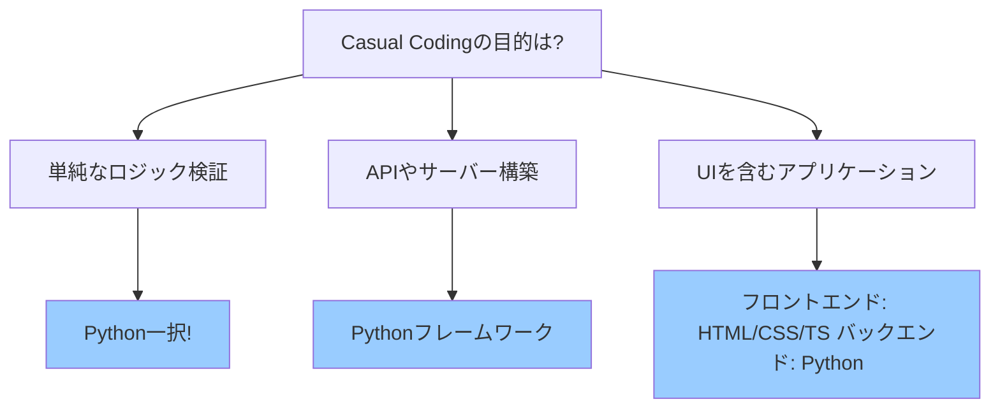
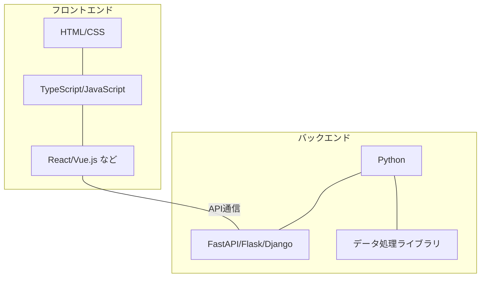
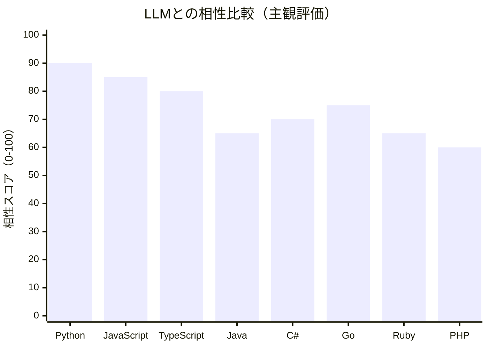

# LLMを使った個人的Casual Codingのベストプラクティス

:::message
This article is generated by Claude.
:::

## はじめに 🚀

みなさん、こんにちは！最近、LLM（Large Language Model）を使ったコーディングが普及してきましたね。ChatGPT、Claude、GitHub Copilotなどのツールを使えば、コードの生成や問題解決が驚くほど効率的になります。

でも、 **「LLMと一緒にコーディングするなら、どんな言語やツールを選ぶべき？」** という疑問を持ったことはありませんか？

この記事では、LLMの力を最大限に活かした「Casual Coding」（カジュアルなコーディング）のためのテックスタック選びについて、実践的なベストプラクティスをご紹介します。アイデアを素早く形にしたい、プロトタイプを手軽に作りたい、そんなときに役立つ情報をお届けします！

## Casual Codingとは？ 🤔

「Casual Coding」とは、ここでは「気軽に、迅速に、アイデアを形にするためのコーディング」を指します。本格的な製品開発というよりも、以下のようなケースを想定しています：

- アイデアの実現可能性を素早く検証したい
- 自分用のツールやスクリプトを作りたい
- 概念実証（PoC）を短時間で作成したい
- 新しいAPIやライブラリを試してみたい

このようなケースでは、「本番環境に耐えうる堅牢なコード」よりも「素早く動くものを作る」ことが優先されます。そこでLLMの力を借りることで、開発効率を大幅に向上させることができるのです。

## LLMとの相性を考慮したテックスタック選び 📊

LLMとコーディングする際のテックスタック選びは、通常の開発とは少し異なる観点が必要です。LLMが得意とする言語やフレームワークを選ぶことで、より質の高いコード生成やサポートを受けられます。

テックスタック選びの基本的な考え方を、目的別に図解してみましょう：



それでは、各ケース別に詳しく見ていきましょう！

## ロジック検証なら Python 一択 🐍

ロジック検証や簡単なスクリプトの作成なら、**Pythonが圧倒的におすすめ**です。その理由はいくつかあります：

1. **インタプリタ言語の手軽さ**
   - コンパイル不要でコードをすぐに実行できる
   - ランタイムさえ導入すれば、すぐに開発を始められる

2. **豊富なライブラリエコシステム**
   - `numpy`, `pandas`, `matplotlib`などの強力なライブラリが充実
   - ほぼすべての用途に対応するパッケージが存在する

3. **LLMとの相性の良さ**
   - LLMの学習データにPythonコードが豊富に含まれている
   - シンプルな文法で、生成されたコードが理解しやすい

### 実際のLLM活用例

#### LLMへのプロンプト例

```
CSVファイルを読み込んで、各列の基本統計量を計算し、欠損値があれば埋めるPythonコードを書いてください。数値型の列は平均値、文字列の列は最頻値で欠損値を埋めてください。
```

#### LLMからの応答

```python
import pandas as pd
import numpy as np

# CSVファイルを読み込む
df = pd.read_csv('data.csv')

# 基本統計量を計算
print(df.describe())

# 欠損値の確認
print(f"欠損値の数: \n{df.isnull().sum()}")

# 欠損値を埋める (数値は平均値、文字列は最頻値で)
for column in df.columns:
    if df[column].dtype == np.number:
        df[column].fillna(df[column].mean(), inplace=True)
    else:
        df[column].fillna(df[column].mode()[0], inplace=True)

print("欠損値を埋めた後のデータ先頭5行:")
print(df.head())
```

#### さらなる対話例

```
このコードを改良して、欠損値の処理について以下の機能を追加してください：
1. 欠損値の割合が50%を超える列は削除する
2. 処理前後で欠損値の数がどう変化したかを示すグラフを表示する
```

#### LLMからの応答

```python
import pandas as pd
import numpy as np
import matplotlib.pyplot as plt
import seaborn as sns

# CSVファイルを読み込む
df = pd.read_csv('data.csv')

# 欠損値の数を取得 (処理前)
missing_before = df.isnull().sum()
print(f"処理前の欠損値の数:\n{missing_before}")

# 欠損値の割合を計算
missing_percentage = (missing_before / len(df)) * 100

# 欠損値の割合が50%を超える列を削除
cols_to_drop = missing_percentage[missing_percentage > 50].index.tolist()
if cols_to_drop:
    print(f"欠損値の割合が50%を超える列を削除します: {cols_to_drop}")
    df = df.drop(columns=cols_to_drop)

# 残りの欠損値を埋める (数値は平均値、文字列は最頻値で)
for column in df.columns:
    if df[column].dtype == np.number:
        df[column].fillna(df[column].mean(), inplace=True)
    else:
        df[column].fillna(df[column].mode()[0] if not df[column].mode().empty else "unknown", inplace=True)

# 欠損値の数を取得 (処理後)
missing_after = df.isnull().sum()
print(f"処理後の欠損値の数:\n{missing_after}")

# 処理前後の欠損値の変化をグラフで表示
plt.figure(figsize=(12, 6))

# 処理前の欠損値グラフ
plt.subplot(1, 2, 1)
sns.heatmap(df.isnull().transpose(), cmap='viridis', cbar=False)
plt.title('処理前の欠損値')

# 処理後の欠損値グラフ
plt.subplot(1, 2, 2)
sns.heatmap(df.isnull().transpose(), cmap='viridis', cbar=False)
plt.title('処理後の欠損値')

plt.tight_layout()
plt.show()

print("欠損値を埋めた後のデータ先頭5行:")
print(df.head())
```

:::message alert
Pythonはインタプリタ言語ですが、大規模なデータ処理やパフォーマンスが重要な場合は、より専門的な最適化が必要になることがあります。Casual Codingの範囲を超える場合は、別の選択肢も検討しましょう。
:::

## サーバーロジックの構築も Python が便利 🚀

APIサーバーやバックエンドロジックを構築する場合も、Pythonは非常に効率的な選択肢です。特に以下の理由から、LLMとの相性も抜群です：

1. **簡潔なAPI構築**
   - FastAPI, Flask, Djangoなどのフレームワークで迅速にAPI構築が可能
   - 少ないコード量で機能的なエンドポイントを作成できる

2. **開発速度の速さ**
   - 型宣言なしでも動作する柔軟性（必要に応じてtype hintsも使える）
   - ホットリロードで開発サイクルが迅速

3. **LLMによるコード生成の質**
   - Webフレームワークのコード例が豊富にトレーニングデータに含まれている

### 実際のLLM活用例

#### LLMへのプロンプト例

```
FastAPIを使って、シンプルなREST APIを構築するコードを書いてください。
アイテム（id, name, description, price）の作成と読み取りができるAPIエンドポイントが必要です。
```

#### LLMからの応答

```python
from fastapi import FastAPI, HTTPException
from pydantic import BaseModel
from typing import List, Optional
import uvicorn

app = FastAPI(title="Simple API")

# データモデル
class Item(BaseModel):
    id: Optional[int] = None
    name: str
    description: str = ""
    price: float

# インメモリデータベース
items_db = []
counter = 0

@app.post("/items/", response_model=Item)
def create_item(item: Item):
    global counter
    counter += 1
    item.id = counter
    items_db.append(item)
    return item

@app.get("/items/", response_model=List[Item])
def read_items():
    return items_db

@app.get("/items/{item_id}", response_model=Item)
def read_item(item_id: int):
    for item in items_db:
        if item.id == item_id:
            return item
    raise HTTPException(status_code=404, detail="Item not found")

if __name__ == "__main__":
    uvicorn.run(app, host="0.0.0.0", port=8000)
```

このコードだけで、作成・読み取り機能を持つREST APIの基本形ができあがります。さらに、FastAPIは自動的にSwagger UIによるAPIドキュメントも生成してくれるため、APIのテストも容易です。

Pythonフレームワークの開発速度を比較してみましょう：

```mermaid
gantt
    title APIサーバー構築の比較（Casual Coding）
    dateFormat  HH:mm
    axisFormat %H:%M
    
    section Python (FastAPI)
    環境構築            :a1, 00:00, 10m
    基本APIの実装       :a2, after a1, 20m
    テスト             :a3, after a2, 10m
    
    section JavaScript (Express)
    環境構築            :b1, 00:00, 15m
    基本APIの実装       :b2, after b1, 25m
    テスト             :b3, after b2, 15m
    
    section Java (Spring Boot)
    環境構築            :c1, 00:00, 30m
    基本APIの実装       :c2, after c1, 40m
    テスト             :c3, after c2, 20m
```



このように、特にCasual Codingの文脈では、Pythonの環境構築の手軽さとコード量の少なさが大きなアドバンテージになります。

## フルスタック開発のベストプラクティス 🌐

UIを含むアプリケーションを開発する場合は、フロントエンドとバックエンドの技術選択が必要になります。LLMを活用したCasual Codingにおけるベストプラクティスは以下の通りです：

### フロントエンド
- HTML, CSS
- TypeScript（または JavaScript）
- 必要に応じて React などのフレームワーク

### バックエンド
- Python（FastAPI, Flask, Django など）

この組み合わせが優れている理由は以下の通りです：

1. **フロントエンドはWeb標準技術**
   - HTML/CSS/JSはWeb開発の基本でLLMの得意分野
   - TypeScriptの型安全性はLLMによるコード生成の精度を向上させる

2. **バックエンドはPythonで統一**
   - JavaScript/TypeScriptでバックエンドを構築する（Node.js）という選択肢もありますが、複雑な処理やデータ分析を行う場合はPythonの方が有利
   - Pythonのエコシステム（numpy, pandas, scikit-learn等）をそのまま活用できる

3. **開発効率の最大化**
   - LLMはWebフロントエンドとPythonバックエンドの組み合わせに関する知識が豊富
   - 両者の接続パターンのサンプルコードも多く学習している

一般的なアーキテクチャは以下のようになります：



### 開発言語を分けることのトレードオフ

フロントエンドとバックエンドで異なる言語を使用すると、確かに言語間のコンテキストスイッチが発生し、開発体験が低下する可能性があります。しかし、LLMを活用することで、このデメリットを最小限に抑えられます：

**メリット：**
- 各領域に最適な言語・ツールを選択できる
- フロントエンドはTypeScriptの型安全性の恩恵を受けられる
- バックエンドはPythonの豊富なエコシステムを活用できる

**デメリット：**
- 異なる言語間でのコンテキストスイッチが必要
- APIインターフェース設計が必要

:::message
フロントエンドとバックエンドを同じ言語で統一するアプローチ（JavaScript/TypeScriptでフルスタック）も選択肢の一つです。特に単純なCRUDアプリケーションなら有効ですが、データ処理や機械学習要素を含む場合はPythonバックエンドの方が有利です。
:::

## なぜこのテックスタックがLLMと相性が良いのか 🔍

前述のテックスタックがLLMと相性が良い理由を、もう少し掘り下げてみましょう：

1. **コードの豊富さ**
   - LLMのトレーニングデータにはPythonやWebフロントエンドのコードが豊富に含まれている
   - 一般的なパターンやベストプラクティスを学習している可能性が高い

2. **コードの再現性**
   - PythonやTypeScript/JavaScriptは文法的に一貫性があり、LLMが正確なコードを生成しやすい
   - エラーが発生しにくい（特にPythonのシンプルな文法）

3. **ドキュメントの充実**
   - これらの言語・フレームワークのドキュメントは充実しており、LLMの学習データにも含まれている
   - 問題解決のためのリソースが豊富

4. **開発効率の最大化**
   - シンプルな環境構築、少ないボイラープレートコード
   - 迅速なプロトタイピングが可能

Python, JavaScript/TypeScriptを含む主要言語のLLM相性を比較してみましょう：



## プロジェクト規模によるテックスタック選択 📈

プロジェクトの規模や目的によって、最適なテックスタック選択は異なります。以下の表で整理してみましょう：

| プロジェクト規模 | 推奨テックスタック | 理由 |
|-----------------|------------------|------|
| 単純なスクリプト | Python | 設定不要でサッと書いて実行できる |
| データ処理・分析 | Python + 専門ライブラリ | numpy, pandas, matplotlib等の強力なエコシステム |
| APIサーバー | Python + FastAPI/Flask | 少ないコードで機能的なAPIを構築可能 |
| 小規模Webアプリ | フロント: HTML/CSS/TS<br>バック: Python + FastAPI | バランスの良い開発効率と機能性 |
| 大規模アプリケーション | プロジェクト要件に応じて選択 | 本番運用を考慮した技術選定が必要 |

:::message
Casual Codingが進化して本格的なプロダクト開発に移行する場合は、パフォーマンス、スケーラビリティ、保守性などの観点から改めてテックスタックを見直す必要があることを忘れないでください。
:::

## 実践例：フルスタックアプリケーションの構築 💻

ここでは、LLMを活用してフルスタックアプリケーションを素早く構築する例を紹介します。例として「シンプルなTodoアプリ」を考えてみましょう。

実際のLLMとの対話シーンを再現しながら、コードを作成していく過程を見ていきます。

### 1. バックエンド（Python + FastAPI）

#### LLMへのプロンプト例

```
TodoリストアプリのバックエンドをPython + FastAPIで作成してください。
以下の機能が必要です：
- Todoアイテムの作成（テキスト、完了状態）
- Todoリストの取得
- Todoアイテムの更新（完了状態の切り替え）
- Todoアイテムの削除

インメモリのデータストアを使用し、フロントエンドからのCORS対応も含めてください。
```

#### LLMからの応答

```python
# main.py
from fastapi import FastAPI, HTTPException
from pydantic import BaseModel
from typing import List, Optional
from fastapi.middleware.cors import CORSMiddleware
import uvicorn

app = FastAPI()

# CORS設定
app.add_middleware(
    CORSMiddleware,
    allow_origins=["*"],  # 本番環境では適切に制限すること
    allow_credentials=True,
    allow_methods=["*"],
    allow_headers=["*"],
)

# データモデル
class TodoItem(BaseModel):
    id: Optional[int] = None
    text: str
    completed: bool = False

# インメモリデータベース
todos = []
counter = 0

@app.post("/todos/", response_model=TodoItem)
def create_todo(todo: TodoItem):
    global counter
    counter += 1
    todo.id = counter
    todos.append(todo)
    return todo

@app.get("/todos/", response_model=List[TodoItem])
def read_todos():
    return todos

@app.put("/todos/{todo_id}", response_model=TodoItem)
def update_todo(todo_id: int, updated_todo: TodoItem):
    for i, todo in enumerate(todos):
        if todo.id == todo_id:
            updated_todo.id = todo_id
            todos[i] = updated_todo
            return updated_todo
    raise HTTPException(status_code=404, detail="Todo not found")

@app.delete("/todos/{todo_id}")
def delete_todo(todo_id: int):
    for i, todo in enumerate(todos):
        if todo.id == todo_id:
            del todos[i]
            return {"message": "Todo deleted successfully"}
    raise HTTPException(status_code=404, detail="Todo not found")

if __name__ == "__main__":
    uvicorn.run(app, host="0.0.0.0", port=8000)
```

#### LLMとの対話の続き

ここで私が追加で質問します：

```
ユニットテストも追加したいのですが、簡単なテストコードも書いてもらえますか？
```

#### LLMからの応答

```python
# test_main.py
from fastapi.testclient import TestClient
from main import app

client = TestClient(app)

def test_create_todo():
    response = client.post(
        "/todos/",
        json={"text": "テスト用Todo"}
    )
    assert response.status_code == 200
    data = response.json()
    assert data["text"] == "テスト用Todo"
    assert data["completed"] == False
    assert "id" in data

def test_read_todos():
    # まずTodoを作成
    client.post(
        "/todos/",
        json={"text": "テスト用Todo"}
    )
    
    # Todoリストを取得
    response = client.get("/todos/")
    assert response.status_code == 200
    data = response.json()
    assert len(data) > 0

def test_update_todo():
    # まずTodoを作成
    create_response = client.post(
        "/todos/",
        json={"text": "更新テスト用"}
    )
    todo_id = create_response.json()["id"]
    
    # Todoを更新
    response = client.put(
        f"/todos/{todo_id}",
        json={"text": "更新テスト用", "completed": True}
    )
    assert response.status_code == 200
    data = response.json()
    assert data["completed"] == True

def test_delete_todo():
    # まずTodoを作成
    create_response = client.post(
        "/todos/",
        json={"text": "削除テスト用"}
    )
    todo_id = create_response.json()["id"]
    
    # Todoを削除
    response = client.delete(f"/todos/{todo_id}")
    assert response.status_code == 200
    
    # 削除確認
    todos_response = client.get("/todos/")
    todos = todos_response.json()
    for todo in todos:
        assert todo["id"] != todo_id
```

### 2. フロントエンド（HTML + CSS + TypeScript）

#### LLMへのプロンプト例

```
バックエンドAPIと連携するシンプルなTodoアプリのフロントエンドを作成してください。
HTML, CSS, TypeScriptを使用し、以下の機能が必要です：

- 新しいTodoの追加フォーム
- Todoリストの表示
- 各Todoの完了状態の切り替え
- Todoの削除

APIエンドポイントは以下の通りです：
- GET /todos/ - Todoリスト取得
- POST /todos/ - 新規Todo作成
- PUT /todos/{id} - Todo更新
- DELETE /todos/{id} - Todo削除

APIサーバーは http://localhost:8000 で動作します。
```

#### LLMからの応答

```typescript
// index.ts
interface Todo {
  id: number;
  text: string;
  completed: boolean;
}

// API URL
const API_URL = 'http://localhost:8000';

// DOM要素
const todoForm = document.getElementById('todo-form') as HTMLFormElement;
const todoInput = document.getElementById('todo-input') as HTMLInputElement;
const todoList = document.getElementById('todo-list') as HTMLUListElement;

// Todoリストを取得して表示
async function fetchTodos() {
  try {
    const response = await fetch(`${API_URL}/todos/`);
    const todos: Todo[] = await response.json();
    
    todoList.innerHTML = '';
    todos.forEach(todo => {
      const li = document.createElement('li');
      li.className = todo.completed ? 'completed' : '';
      li.innerHTML = `
        <span class="todo-text">${todo.text}</span>
        <div class="todo-actions">
          <button class="toggle-btn">${todo.completed ? '✓' : '○'}</button>
          <button class="delete-btn">🗑️</button>
        </div>
      `;
      
      // 完了状態の切り替え
      const toggleBtn = li.querySelector('.toggle-btn') as HTMLButtonElement;
      toggleBtn.addEventListener('click', () => toggleTodo(todo.id, !todo.completed));
      
      // 削除
      const deleteBtn = li.querySelector('.delete-btn') as HTMLButtonElement;
      deleteBtn.addEventListener('click', () => deleteTodo(todo.id));
      
      todoList.appendChild(li);
    });
  } catch (error) {
    console.error('Error fetching todos:', error);
  }
}

// 新しいTodoを追加
async function addTodo(text: string) {
  try {
    const response = await fetch(`${API_URL}/todos/`, {
      method: 'POST',
      headers: {
        'Content-Type': 'application/json',
      },
      body: JSON.stringify({ text }),
    });
    
    if (response.ok) {
      todoInput.value = '';
      await fetchTodos();
    }
  } catch (error) {
    console.error('Error adding todo:', error);
  }
}

// Todoの完了状態を切り替え
async function toggleTodo(id: number, completed: boolean) {
  try {
    // 現在のTodoを取得
    const response = await fetch(`${API_URL}/todos/`);
    const todos: Todo[] = await response.json();
    const todo = todos.find(t => t.id === id);
    
    if (todo) {
      // 更新したTodoを送信
      await fetch(`${API_URL}/todos/${id}`, {
        method: 'PUT',
        headers: {
          'Content-Type': 'application/json',
        },
        body: JSON.stringify({
          ...todo,
          completed,
        }),
      });
      
      await fetchTodos();
    }
  } catch (error) {
    console.error('Error toggling todo:', error);
  }
}

// Todoを削除
async function deleteTodo(id: number) {
  try {
    await fetch(`${API_URL}/todos/${id}`, {
      method: 'DELETE',
    });
    
    await fetchTodos();
  } catch (error) {
    console.error('Error deleting todo:', error);
  }
}

// フォーム送信イベント
todoForm.addEventListener('submit', async (e) => {
  e.preventDefault();
  const text = todoInput.value.trim();
  if (text) {
    await addTodo(text);
  }
});

// 初期表示
document.addEventListener('DOMContentLoaded', fetchTodos);
```

```html
<!-- index.html -->
<!DOCTYPE html>
<html lang="ja">
<head>
  <meta charset="UTF-8">
  <meta name="viewport" content="width=device-width, initial-scale=1.0">
  <title>LLM活用 TodoApp</title>
  <link rel="stylesheet" href="styles.css">
</head>
<body>
  <div class="container">
    <h1>🧠 LLM活用 TodoApp</h1>
    <form id="todo-form">
      <input type="text" id="todo-input" placeholder="新しいタスクを入力..." required>
      <button type="submit">追加</button>
    </form>
    <ul id="todo-list"></ul>
  </div>
  
  <script src="dist/index.js"></script>
</body>
</html>
```

#### LLMとの対話の続き

```
CSSも追加してUIを整えたいのですが、シンプルでモダンなスタイルを作ってもらえますか？
```

#### LLMからの応答

```css
/* styles.css */
* {
  box-sizing: border-box;
  margin: 0;
  padding: 0;
  font-family: 'Roboto', 'Segoe UI', Tahoma, Geneva, Verdana, sans-serif;
}

body {
  background-color: #f5f5f5;
  color: #333;
  line-height: 1.6;
}

.container {
  max-width: 600px;
  margin: 40px auto;
  padding: 20px;
  background: white;
  border-radius: 10px;
  box-shadow: 0 5px 15px rgba(0, 0, 0, 0.1);
}

h1 {
  text-align: center;
  margin-bottom: 20px;
  color: #2c3e50;
}

#todo-form {
  display: flex;
  margin-bottom: 20px;
}

#todo-input {
  flex: 1;
  padding: 10px 15px;
  border: 1px solid #ddd;
  border-radius: 4px 0 0 4px;
  font-size: 16px;
}

#todo-form button {
  padding: 10px 15px;
  background: #3498db;
  color: white;
  border: none;
  border-radius: 0 4px 4px 0;
  cursor: pointer;
  font-size: 16px;
  transition: background 0.3s;
}

#todo-form button:hover {
  background: #2980b9;
}

#todo-list {
  list-style: none;
}

#todo-list li {
  display: flex;
  justify-content: space-between;
  align-items: center;
  padding: 12px 15px;
  background: white;
  border-left: 3px solid #3498db;
  margin-bottom: 10px;
  border-radius: 3px;
  box-shadow: 0 2px 5px rgba(0, 0, 0, 0.05);
  transition: all 0.3s;
}

#todo-list li.completed {
  border-left-color: #2ecc71;
  opacity: 0.7;
}

#todo-list li.completed .todo-text {
  text-decoration: line-through;
  color: #7f8c8d;
}

.todo-text {
  flex: 1;
  word-break: break-word;
}

.todo-actions {
  display: flex;
  gap: 5px;
}

.toggle-btn, .delete-btn {
  background: none;
  border: none;
  cursor: pointer;
  font-size: 18px;
  opacity: 0.7;
  transition: opacity 0.3s;
}

.toggle-btn:hover, .delete-btn:hover {
  opacity: 1;
}

.toggle-btn {
  color: #2ecc71;
}

.delete-btn {
  color: #e74c3c;
}
```

### 3. コードの作成と実行の流れ

実際の開発フローは以下のようになります：

1. **バックエンドの設定**
   ```bash
   pip install fastapi uvicorn
   python main.py
   ```

2. **フロントエンドの設定**
   ```bash
   npm init -y
   npm install typescript ts-node --save-dev
   npx tsc --init
   npx tsc index.ts --outDir dist
   ```

3. **ブラウザでアクセス**
   - `http://localhost:8000` でAPIにアクセス
   - `index.html` をブラウザで開く

このように、LLMの支援を受けながら、短時間でフロントエンドとバックエンドの連携するアプリケーションを構築できます。

## LLMへの効果的なプロンプト例 🔍

ここまで見てきたように、LLMを活用したCasual Codingでは、効果的なプロンプトの書き方がとても重要です。以下に、よく使えるプロンプトパターンをいくつか紹介します。

### 1. 機能リスト指定パターン

```
[アプリケーション/機能名]を[使用技術]で作成してください。
以下の機能が必要です：
- [機能1の説明]
- [機能2の説明]
- [機能3の説明]
...
```

### 2. エラー解決パターン

```
以下のコードを実行したときに[エラーメッセージ]が表示されました。
解決方法を教えてください。

[エラーが発生しているコード]
```

### 3. リファクタリングパターン

```
以下のコードをより効率的/読みやすく/最新の書き方にリファクタリングしてください。
特に[具体的な懸念点]に注目してください。

[リファクタリングしたいコード]
```

### 4. 段階的開発パターン

```
[プロジェクト名]の開発を手伝ってください。

ステップ1: まず[コンポーネント1]を実装します。[具体的な要件]

コードができたら、ステップ2に進みます。
```

### 5. コード説明パターン

```
以下のコードが何をしているのか、初心者にもわかるように説明してください。
特に[難しい部分]について詳しく説明してほしいです。

[説明してほしいコード]
```

実際の例として、先ほどのTodoアプリの機能を拡張する場合のプロンプトを見てみましょう：

```
先ほど作成したTodoアプリに「締切日」機能を追加したいです。
以下の変更が必要です：

1. TodoItemモデルに「deadline」(日付型)フィールドを追加
2. 新規Todo作成時に締切日を指定できるようにフォームを拡張
3. Todoリスト表示時に締切日を表示
4. 締切日が近いものを色付けして強調表示

バックエンド(FastAPI)とフロントエンド(TypeScript)の両方のコードを更新してください。
```

LLMにコードを生成してもらう際は、具体的な要件や期待する出力を明確に伝えることで、より適切なコードが得られます。また、段階的に指示を出していくことで、複雑な開発も着実に進めることができます。

## まとめ：LLMとCasual Codingの未来 🔮

LLMを活用したCasual Codingのベストプラクティスをまとめると：

1. **単純なロジック検証なら Python 一択**
   - インタプリタ言語として即座に実行可能
   - ランタイムさえ導入すれば迅速に実現可能性検証ができる

2. **サーバーロジックもPythonがおすすめ**
   - FastAPI、Flaskなどで API構築が容易
   - 開発速度の速さが魅力

3. **UIを含むアプリケーションなら**
   - フロントエンド: HTML, CSS, TypeScript/JavaScript
   - バックエンド: Python フレームワーク
   - この組み合わせが開発効率とLLMとの相性の両面で優位

ただし、重要なのは**プロジェクトの目的や規模に応じて**最適なテックスタックを選択することです。Casual Codingから本格的な開発に移行する際には、改めて技術選定を見直すことも検討しましょう。

LLMとの協業は、開発のあり方を大きく変えつつあります。特にPythonのようなシンプルな言語は、LLMによるコード生成の精度が高く、Casual Codingとの相性が抜群です。今後、LLMの能力がさらに向上するにつれ、より複雑なアプリケーション開発もますます効率化されていくでしょう。

皆さんも、このベストプラクティスを参考に、LLMと一緒に効率的なCasual Codingを楽しんでみてください！

## 参考リソース 📚

- [Python公式ドキュメント](https://www.python.org/doc/)
- [FastAPI公式ドキュメント](https://fastapi.tiangolo.com/)
- [TypeScript公式ドキュメント](https://www.typescriptlang.org/docs/)
- [GitHub Copilotドキュメント](https://docs.github.com/en/copilot)
