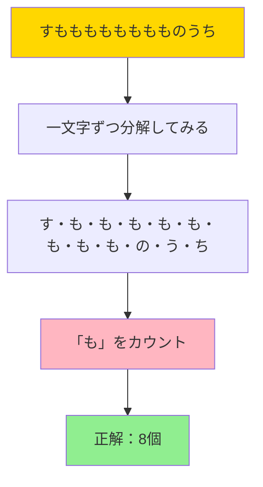
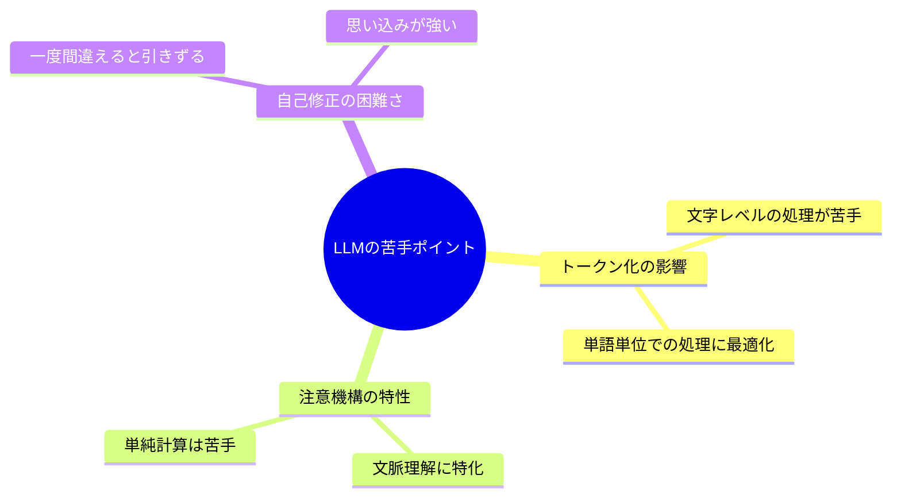
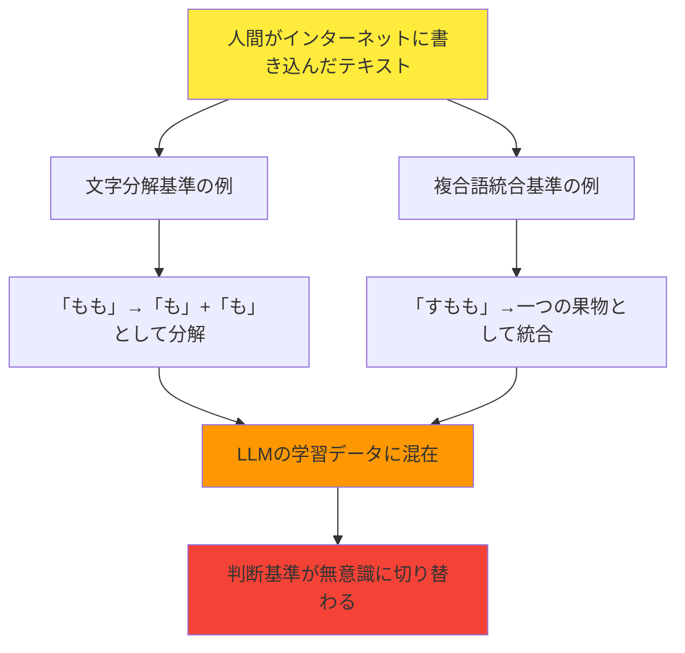
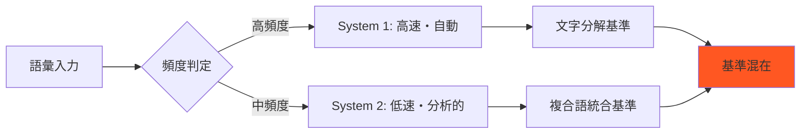

# Claudeが「も」を数えられない！？衝撃の実験結果

皆さん、こんにちは！今日は久しぶりに面白い実験をしてみたので、その結果をシェアしたいと思います 🎉

## きっかけは一つのブログ記事

趣味でClaudeのプロンプトを作っていたところ、こんなブログ記事を見つけました：
https://note.com/aokikenichi/n/nd7bda53885c4

そこに書かれていたのが、この問題でした：

**「すもももももももものうち」の中に「も」は何個ある？**

「え、これ難問なの？」と思ったのですが...記事を読んでいくと、これがLLMにとっては超難問らしいんです 😱

「本当かな…？」という疑問が湧いてきて、早速Claude(3.7-sonnet)で実験してみることにしました。

## まずは正解を確認してみよう

実験する前に、人間の私たちで正解を確認してみましょう！



実際に数えてみると：

| 位置 | 文字 | 「も」？ |  
|------|------|----------|
| 1 | す | ❌ |
| 2 | も | ✅ |
| 3 | も | ✅ |
| 4 | も | ✅ |
| 5 | も | ✅ |
| 6 | も | ✅ |
| 7 | も | ✅ |
| 8 | も | ✅ |
| 9 | も | ✅ |
| 10 | の | ❌ |
| 11 | う | ❌ |
| 12 | ち | ❌ |

**正解は8個**ですね！人間には簡単すぎる問題です 🙂

## いざ、Claude先生に挑戦してもらう！

今回の実験では、私がGSNモデルを使った論証プロンプトを仕込んでいます。複雑な問題として論証してもらうためのインストラクションのつもりで実験で入れています。  
(もともとそのモデルのテストケースとしてこの問題を解かせてみようと思ったのですが、意外に難問で...😅)

### 第1ラウンド：軽い気持ちで質問

```
「すもももももももものうち」の中に「も」は何個ある？
```

結果は...

**Claude：「7個です！」**

あれ？正解は8個なのに...😅

しかも思考過程を見ると、めちゃくちゃ真面目に思考しているんです。(しかし自信満々で間違えてるのがかわいい)

:::details Claudeの真面目すぎる回答（一部抜粋）
```
フェーズ1: 入力と問題理解
G1: 「すもももももももものうち」の中に「も」が何個あるかを算出する
...
SN1.2: 文字列「すもももももももものうち」における「も」の出現回数：
合計：7個の「も」
```
:::

「なんで7個になるの？」と思って確認したら、どうやら文字を分解する過程で1個減らしちゃってるみたいなんです 😂

### 第2ラウンド：指摘してみる

```
ひらがなを文字単位で分解したときに文字数が減ってる！
あなたの思考過程で何が起こっていますか？
```

Claude：「すみません、確かに説明が不十分でした...（長々と説明）...やっぱり7個です」

うーん、まだ納得してもらえない... 🤔(というか説明の問題ではない)

### 第3ラウンド：具体的に指摘

```
元の文から「すもももももももものうち」を
文字単位でセパレータを入れると
す/も/も/も/も/も/も/も/も/の/う/ち
さらに、一文字ごとにインデックスを付けると
1.す/2.も/3.も/4.も/5.も/6.も/7.も/8.も/9.も/10.の/11.う/12.ち
```

Claude：「おっしゃる通りです！9個ありますね！」

...いや、それも違うよ〜😅 
今度は多すぎるし！

この時点で「**も～！！！**」という気分でした 😭

### 最終決戦：表で決着をつける

もう少し視点を変えて、図形的に解かせてみようと思いました:

```
表を使って論証してみてください。
一つのセルに一文字ごとに入れて、最上段のカラムにはインデックスをつけてください。
最下段のカラムには判定した論理を入れてください。
最後にそれぞれの論理の数をカウントし、和が最上段のカラムの最大値と合致するか検証した上で、
論理として真となる個数を算出してください。
```

そしたら...

| インデックス | 1 | 2 | 3 | 4 | 5 | 6 | 7 | 8 | 9 | 10 | 11 | 12 |
|------------|---|---|---|---|---|---|---|---|---|----|----|-----|
| 文字        | す | も | も | も | も | も | も | も | も | の | う | ち |
| 判定        | NO | YES | YES | YES | YES | YES | YES | YES | YES | NO | NO | NO |

Claude：「8個です！整合性も確認できました！」

**キター！！！** 🎉🎆🎊

## Claudeの2度も可愛い思考過程

実は一番面白かったのは、Claudeの思考過程でした。なんと**2回も**困惑してるんです！

### 1回目の「あれ？」
:::details 思考過程からの引用（3rd Transaction）
「あれ、8個？先ほどは9個と言いましたが、再度確認すると8個になります。もう一度注意深く数えてみます。」
:::

### 2回目の「あれ？」
:::details 思考過程からの引用（4th Transaction）
「あれ、8個になってしまいました。もう一度注意深く確認してみます。」
:::

**2度も「あれ？」って言ってる！** 😂

まるで計算問題で途中で混乱している学生みたいで、とても微笑ましかったです。自分で自分の答えに困惑している様子が可愛すぎます。

## なぜLLMは文字カウントが苦手なのか？

この実験を通して分かったことをまとめてみます：

### LLMの苦手ポイント
同様の問題を解かせたときの"難問"としてしまう理由を調べてみました:  



### 認知科学から見たLLMの間違いパターン

実は、この実験後にClaudeに「なぜ間違えたのか？」とさらに思考させてみたところ、面白い分析結果が得られました。

どうやら人間の認知にも存在する**「文字分解基準」と「複合語統合基準」**の混在が、学習データに残っていて、それがClaudeの判断にも影響している可能性があるようです：



#### 認知負荷による処理の切り替え

| 語彙 | 文字数 | 認知負荷 | 処理方法 | 結果 |
|-----|-------|---------|---------|------|
| も | 1文字 | 極小 | 直接認識 | 文字分解 |
| もも | 2文字 | 小 | パターン認識 | 文字分解 |
| すもも | 3文字 | 中 | 意味先行処理 | **複合語統合** |

**面白いのは**、語彙の複雑性によって人間の脳が自動的に処理方法を切り替えていて、それがClaudeの学習データにも反映されている可能性があることです 🧠

#### 二重プロセス理論の影響



### 効果的だったアプローチ

1. **表形式での構造化** 📊
   - 情報を視覚的に整理
   - 一つ一つの判定を明確化

2. **整合性チェックの組み込み** ✅
   - 「合計が元の文字数と一致するか確認して」
   - ダブルチェック機能が重要

3. **段階的なアプローチ** 🪜
   - 問題を細かく分解
   - 各ステップを明確に指示

## 実用的な教訓

この実験から得られた実用的な教訓：

:::message alert
**LLM(Claude)に単純な計算や文字カウントをさせる時は要注意！**
- 表形式で構造化する
- 検証ステップを組み込む
- 複数回確認させる
- 人間の認知バイアスがデータに混入している可能性を考慮する
:::

今回のようなケースで、何かの個数を数えさせたい時は、以下のテンプレートをプロンプトに含めてみるのも手だと感じました：

```
表を作って、以下の形式で回答してください：
| 項目 | 値 | 判定 |
各行の判定結果をカウントし、
合計が期待値と一致するか確認してください。
```

## 感想とまとめ

今回の実験、めちゃくちゃ面白かったです！ 😄(知人に思考過程見せたら爆笑してました(笑))

AIって、人間には難しい複雑な推論はスラスラできるのに、人間には簡単な「文字を数える」みたいな作業で躓くんですね。しかも、その間違い方が人間の認知的なクセと似ているところがあるのも興味深い発見でした。

でも、たしかに日本語の"文字""数"ってよく考えたら難しくない？って思いました。だって、ひらがな、カタカナ、漢字がありますもんね。

セマンティックの塊のことなのか、数画の筆のなぞりの近しい集合なのか真面目に考えてみたら自分でも同定難しいな～と思ったので、最終的に認知の問題だよって言われたらなるほどと思いました。

特にClaudeが2回も「あれ？」って困惑している様子は、まるで人間が計算間違いに気づいて「あれ？おかしいな？」って首をかしげているみたいで、とても愛らしかったです 🥰


皆さんも、ご利用されているLLMで試してみてください！きっと予想外の反応が見られて楽しいと思います 🎪

次はもっと複雑な問題でLLMを困らせてみようかな... 😈

---

**最後に**
この記事は個人的な実験に基づく主観的な内容です。LLMの能力は日々進化しているので、将来的にはこんな問題も簡単に解けるようになるかもしれませんね！

人間の認知的なクセがAIの学習データに混入している可能性についても、まだ仮説の段階ですが、とても興味深い研究領域だと思います 🔬
