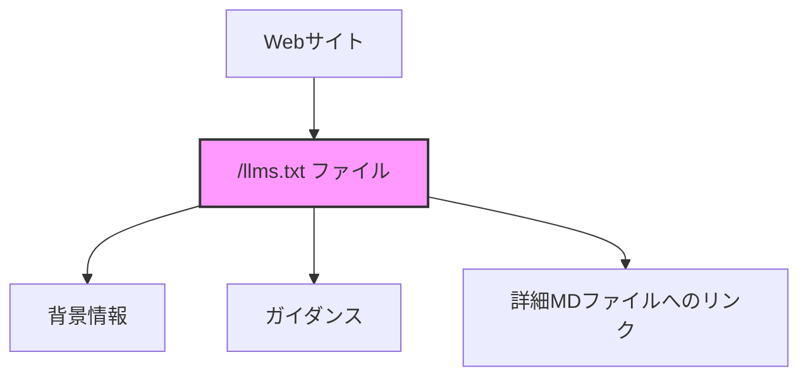
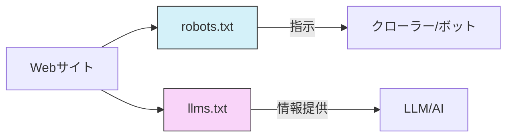

# Web時代のLLM対応 - /llms.txtファイル規格で変わるAIとの情報連携

:::message
This article is generated by Claude.
:::

## LLMsとWebサイトの課題 🤔

大規模言語モデル（LLM）は日々進化し、多くのWebサイトやアプリケーションと連携するようになってきました。しかし、AIがWebサイトの情報を扱う際には大きな課題があります。それは、**コンテキストウィンドウのサイズが限られている**ことと、**複雑なHTML構造からの情報抽出が難しい**という点です。

例えば、ドキュメントサイトにアクセスした時、人間であれば必要な情報をすぐに見つけることができるかもしれませんが、AIにとっては膨大なHTMLのノイズから本質的な情報を取り出すのは容易ではありません。ナビゲーション要素、広告、JavaScriptなど、実際のコンテンツ以外の要素が多すぎるのです。

これは特に開発環境やAPIドキュメントなど、技術的な情報を扱う場面で顕著な問題となっています。

## /llms.txt規格とは何か？ 📋

このような課題を解決するために提案されているのが「**/llms.txt**」規格です。これはWebサイトのルートディレクトリに配置されるマークダウンファイルで、LLMがサイトを理解するために必要な情報を簡潔に提供します。



### 基本構造 🏗️

/llms.txtファイルは以下の要素から構成されています：

1. **H1見出し** - プロジェクトまたはサイトの名前（必須要素）
2. **ブロッククォート** - プロジェクトの短い概要
3. **詳細情報** - プロジェクトについての追加情報（見出しなし）
4. **ファイルリスト** - H2見出しで区切られた、より詳細な情報へのURLリスト
   - 各リストはマークダウンのハイパーリンク形式で記載
   - オプションとして詳細情報を追加可能

### 想定される形式

```markdown
# プロジェクト名
> プロジェクトの簡潔な説明

プロジェクトの詳細情報...

## セクション名
- [リンクタイトル](https://リンクURL): オプションの詳細

## Optional
- [リンクタイトル](https://リンクURL)
```

特筆すべきは「**Optional**」というセクション名には特別な意味があり、このセクション内のURLはより短いコンテキストが必要な場合にスキップできる補足情報であることを示します。

## マークダウン拡張子によるページ提供 📝

/llms.txt規格は単なるインデックスファイルだけではありません。重要なのは、Webサイト上の各ページに対して、同じURLに「**.md**」を追加することで、そのページのマークダウン版を提供することも推奨している点です。

:::message alert
例: 通常のHTMLページ
https://example.com/tutorials/guide.html

マークダウン版
https://example.com/tutorials/guide.html.md
:::

これにより、LLMは人間向けのリッチなWebページではなく、構造化された純粋なコンテンツにアクセスすることができます。ファイル名がない場合（ディレクトリ直下のindex.htmlなど）は、「**index.html.md**」を追加することになります。

## 実際の利用例 💡

FastHTMLプロジェクトは、この/llms.txt規格を採用しています。以下はその例です：

```markdown
# FastHTML
> FastHTMLは、Starlette、Uvicorn、HTMX、fastcoreの「FT」を統合して、サーバーレンダリングのハイパーメディアアプリケーションを作成するためのPythonライブラリです。

重要な注意点:
- APIの一部はFastAPIにインスパイアされていますが、FastAPI構文との互換性はなく、APIサービスの作成を対象としていません
- FastHTMLはJS-nativeのWebコンポーネントとバニラJSライブラリと互換性がありますが、React、Vue、Svelteとは互換性がありません

## ドキュメント
- [FastHTML クイックスタート](https://answerdotai.github.io/fasthtml/tutorials/quickstart_for_web_devs.html.md): FastHTMLの多くの機能の簡単な概要
- [HTMX リファレンス](https://raw.githubusercontent.com/path/reference.md): すべてのHTMX属性、CSSクラス、ヘッダー、イベント、拡張機能、jsライブラリメソッド、設定オプションの簡単な説明

## 例
- [Todoリストアプリケーション](https://raw.githubusercontent.com/path/adv_app.py): FastHTMLとHTMXパターンの慣用的な使用法を示す完全なCRUDアプリの詳細な説明

## Optional
- [Starlette完全ドキュメント](https://gist.githubusercontent.com/path/starlette-sml.md): FastHTML開発に役立つStarletteドキュメントのサブセット
```

このような規格に従うことで、LLMはWebサイトの構造や目的をより効率的に理解し、ユーザーの質問に対して適切な回答を提供できるようになります。

## 既存の標準との共存 🔄

/llms.txt規格は、既存のWeb標準と共存するように設計されています：

### robots.txtとの違い

**robots.txt**は主に検索エンジンのクローラーに対して、サイトのどの部分にアクセスしても良いかを指示するものです。一方、**/llms.txt**はユーザーが明示的に情報を要求した時（例：チャットボットでの質問時）に使用されることが想定されています。



### sitemap.xmlとの違い

**sitemap.xml**はサイト上のすべてのインデックス可能な人間向け情報のリストですが、以下の点で/llms.txtとは異なります：

- LLM向けのページバージョンがリストされていないことが多い
- 理解に役立つ可能性のある外部サイトへのURLを含まない
- 多くの場合、LLMのコンテキストウィンドウに収まらないほど大量の情報が含まれている

## 活用シーン 🚀

/llms.txt規格は、以下のような様々な用途で活用できます：

1. **ソフトウェアドキュメント** - 開発者がAPIやライブラリの使い方を理解するのを支援
2. **企業構造の概説** - 企業のサービスや組織構造に関する情報提供
3. **複雑な法律文書の分解** - 関係者向けに法的文書を分かりやすく説明
4. **Eコマース** - 製品情報やポリシーの説明
5. **教育機関** - コース情報やリソースへの迅速なアクセス提供

特に技術文書では、nbdevを使用したプロジェクトはすべてのページの.mdバージョンをデフォルトで作成するようになり、Answer.AIやfast.aiのソフトウェアプロジェクトでこの機能が活用されています。

## 規格実装のヒント ✅

効果的な/llms.txtファイルを作成するためのガイドラインには以下のようなものがあります：

- 簡潔で明確な言語を使用する
- リソースにリンクする際には、簡潔で有益な説明を含める
- あいまいな用語や説明のないジャーゴンを避ける
- ツールを実行して/llms.txtファイルをLLMコンテキストファイルに展開し、複数の言語モデルでテストする

### 利用可能なツール

この規格を取り入れるためのツールもいくつか用意されています：

- **llms_txt2ctx** - /llms.txtファイルを解析してLLMコンテキストを生成するCLIとPythonモジュール
- **JavaScript実装** - JavaScriptでの実装例
- **vite-plugin-llms** - llms.txt仕様に従ってマークダウンファイルを提供するViteプラグイン

## まとめ 📝

/llms.txt規格は、WebサイトとAI間のコミュニケーションをより効率的にする可能性を秘めています。特に技術ドキュメントや複雑な情報構造を持つサイトでは、AIがより正確に情報を理解し、ユーザーに提供できるようになるでしょう。

この規格はまだ発展途上であり、コミュニティの意見を取り入れながら進化していくことが期待されています。[GitHubリポジトリ](https://github.com/AnswerDotAI/llms-txt)では非公式の概要がホストされており、バージョン管理と公開討論が可能です。また、実装経験の共有やベストプラクティスの議論のための[コミュニティDiscordチャンネル](https://discord.gg/aJPygMvPEN)も用意されています。

Web開発者やAI開発者の方々は、この新しい規格に注目し、自分たちのプロジェクトでどのように活用できるか検討してみる価値があるのではないでしょうか。個人的には、特にAPIドキュメントなどでこの規格が広く採用されると、LLMを活用した開発がさらに効率化されると考えています。

## 参考リンク 🔗

- [llms.txt公式サイト](https://llmstxt.org/)
- [FastHTML docs llms.txt例](https://answerdotai.github.io/fasthtml/llms.txt)
- [GitHub リポジトリ](https://github.com/AnswerDotAI/llms-txt)
