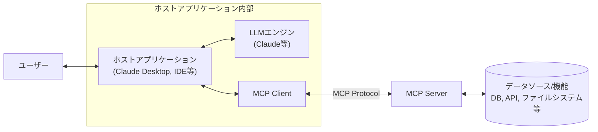
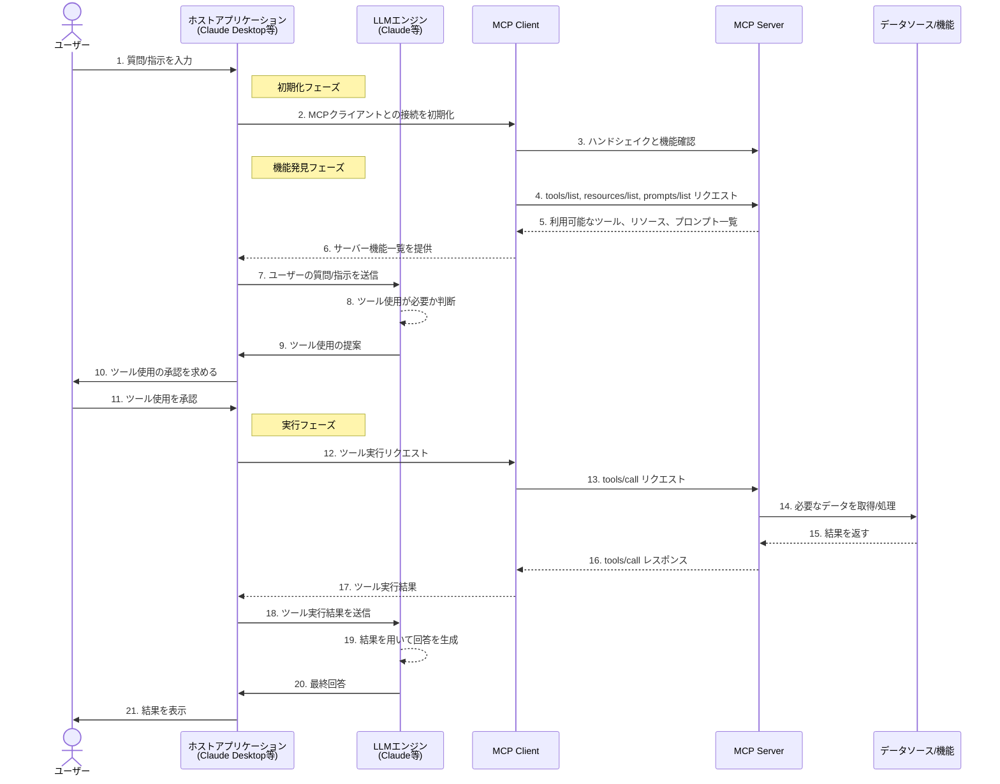
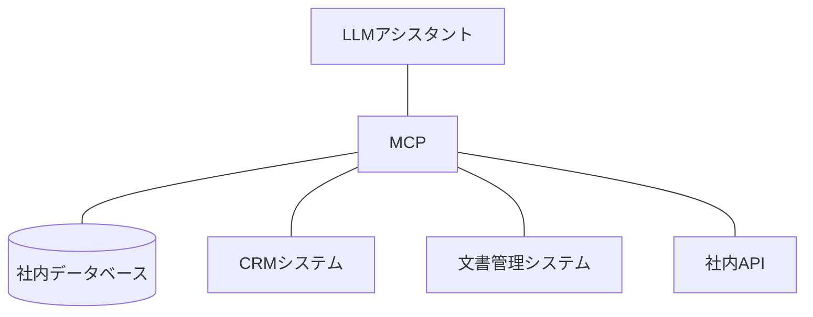
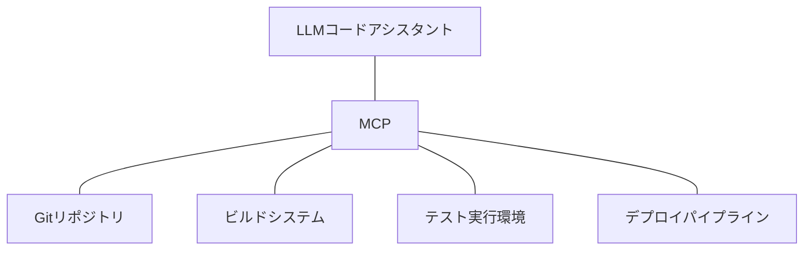

# LLMをパワーアップ！Model Context Protocol (MCP)で実現する高機能AI連携アーキテクチャ入門

:::message
This article is generated by Claude.
:::

最近のAIアプリケーション開発において、LLM（大規模言語モデル）と外部システムを連携させる仕組みが重要になってきています。皆さんは「MCPって何？🤔」と思われるかもしれませんね。

**Model Context Protocol（MCP）** は、Anthropicが2024年11月に発表した、LLMと外部リソースを効率的に連携させるためのオープンスタンダードプロトコルです。「AI統合のためのUSBのようなもの」とも表現されており、この記事では、MCPの基本概念から実装まで、図解を交えながら分かりやすく解説していきます。

## MCPとは？基本概念と構成要素 🧩

Model Context Protocol（MCP）は、LLMアプリケーションと外部データソースやツールをシームレスに統合するためのオープンスタンダードプロトコルです。このプロトコルは、JSON-RPC 2.0をベースにしたプレゼンテーション層のデータ表現形式を採用しています。

MCPは主に以下の要素から構成されています：

1. **ホストアプリケーション**: LLMを実行し、ユーザーとのインターフェースを提供するアプリ（例：Claude Desktop）
2. **LLMエンジン**: Claude、GPTなどの大規模言語モデル
3. **MCP Client**: ホストアプリケーション側で動作し、MCP Serverとの通信を担当
4. **MCP Server**: 外部リソースへのアクセスを提供するサーバー（JSONとして定義されたツール一覧を提供）
5. **データソース/機能**: データベース、API、ファイルシステムなど、MCP Serverが接続する外部リソース

これらの要素がどのように連携するかを図解してみましょう：



このアーキテクチャにより、LLMは単体では不可能だった様々な機能（データベースへのアクセス、ファイル操作、専用APIの利用など）を実行できるようになります。つまり、AIの能力を大幅に拡張できるわけです！💪

## MCP通信の流れ：実際の動作シーケンス例 🔄

MCPを使ったアプリケーションの典型的な動作フローは、初期化、機能発見、コンテキスト提供、実行の各フェーズから構成されます。実際のユーザーの入力からLLMの回答まで、以下のシーケンス図でプロセスを確認してみましょう：



このシーケンス図は、MCPを利用したシステムの全体の流れを示しています。注目すべき重要なポイントがいくつかあります：

1. **初期化と機能発見** - クライアントとサーバーは最初に接続し、利用可能な機能（ツール、リソース、プロンプト）を交換します

2. **ユーザー承認モデル** - LLMがツールの使用を判断した後、ユーザーの承認を得る仕組みが組み込まれています

3. **ツール実行と結果の利用** - ツールから得た結果をLLMに返して最終的な回答を生成します

特に注目すべき点は、LLMが自律的に「ツールの使用が必要か」を判断する点です。これにより、ユーザーは複雑な指示をしなくても、AIが適切なタイミングで外部リソースを活用できるようになります。また、セキュリティ的な配慮から、ツールの実行は常にユーザーの明示的な承認が必要となっています。

## MCPの主要コンポーネント詳細 🔍

### 1. ホストアプリケーション

ホストアプリケーションは、ユーザーとLLMの橋渡し役を担い、接続を初期化する役割があります。代表的な例としては：

- Claude Desktop（Anthropicの公式クライアント）
- VS CodeなどのIDE拡張（Sourcegraphのコードアシスタント「Cody」など）
- Webアプリケーション（Claude Web UIなど）
- カスタムアプリケーション

ホストアプリケーションの主な役割は：
- ユーザーインターフェースの提供
- LLMエンジンとの通信
- MCP Clientの管理
- サーバーの機能発見
- ツール使用の承認フロー提供

### 2. MCP Client

MCP Clientはホストアプリケーション内部で動作し、以下の役割を担います：

- MCPプロトコルを用いたServer通信（JSON-RPC 2.0ベース）
- サーバーとのハンドシェイクによる機能交換
- ツール呼び出しのリクエスト・レスポンス処理
- エラーハンドリング
- 認証・認可処理（OAuth 2.1フレームワークを使用）

### 3. MCP Server

MCP Serverは外部リソースへのゲートウェイとして機能し、以下の3つの主要なプリミティブをサポートします：

- **Tools**（モデル制御）: LLMが自動的に呼び出すことを想定した実行可能な関数。外部システムとの相互作用や計算の実行などが可能
- **Resources**（アプリケーション制御）: クライアントが読み取ってLLMとのやり取りのコンテキストとして使用できるデータやコンテンツ。テキストやバイナリデータを含む
- **Prompts**（ユーザー制御）: 再利用可能なプロンプトテンプレートやワークフロー。サーバーが定義し、クライアントがユーザーやLLMに簡単に表示できる

これらのプリミティブはそれぞれ異なる制御モデルを持ちます。ToolsはLLMが判断して使用、Resourcesはアプリケーションが制御、Promptsはユーザーが明示的に選択するという考え方です。

MCP Serverの主な役割は：
- 利用可能なツール、リソース、プロンプトの一覧の提供
- ツール呼び出しのリクエスト処理
- リソースへのアクセス提供
- プロンプトテンプレートの提供
- 外部リソースへのアクセス制御
- 結果のフォーマット変換
- セキュリティ制御

です。

### 4. MCPプロトコル

MCPプロトコルは、ClientとServer間の通信規約で、JSON-RPC 2.0に基づいたメッセージ交換を行います。クライアント側は「Roots」と「Sampling」という2つのプリミティブをサポートします：

- **Roots**: クライアント側のファイルシステムへのアクセスポイント
- **Sampling**: クライアント側のLLMに「補完」や「生成」をリクエストする機能

主なAPIエンドポイントとしては：

- `tools/list` - 利用可能なツール一覧の取得
- `tools/call` - 特定ツールの呼び出し
- `tools/status` - 非同期処理のステータス確認

などがあります。

:::message alert
MCPプロトコルはセキュリティを考慮して設計されていますが、実装時には適切な認証・認可メカニズムを組み込むことが重要です！
:::

## MCPの利点と適用シナリオ 🚀

MCPアーキテクチャを採用することで得られる主な利点は：

1. **標準化** - M×N問題の解決（M個のAIアプリと、N個のツール/システムの連携を効率化）
2. **拡張性** - LLMに新しい機能を柔軟に追加できる
3. **分離性** - ビジネスロジックとAIを分離できる
4. **セキュリティ** - アクセス制御を一元管理できる
5. **再利用性** - ツールを複数のLLMアプリケーションで共有できる

適用シナリオとしては：

### 企業内AI活用


### 開発支援ツール


## MCP実装のポイント 🔧

MCPに基づくシステムを実装する際のポイントをいくつか紹介します：

### MCP Serverの実装例（TypeScript）

```typescript
// TypeScript MCPサーバーの実装例
import { Server } from "@modelcontextprotocol/sdk/server";
import { 
  ListToolsRequestSchema, 
  CallToolRequestSchema,
  ListResourcesRequestSchema,
  ReadResourceRequestSchema
} from "@modelcontextprotocol/sdk/types";

// サーバーインスタンスの作成
const server = new Server(
  { name: "my-mcp-server", version: "1.0.0" },
  { 
    capabilities: { 
      tools: {},
      resources: {} 
    } 
  }
);

// 利用可能なツール一覧の定義
const TOOLS = [
  {
    name: "database_query",
    description: "データベースクエリーを実行します",
    parameters: {
      type: "object",
      properties: {
        query: { type: "string", description: "SQLクエリー文字列" },
        database: { type: "string", description: "データベース名" }
      },
      required: ["query", "database"]
    }
  },
  {
    name: "file_read",
    description: "ファイルを読み込みます",
    parameters: {
      type: "object",
      properties: {
        path: { type: "string", description: "ファイルパス" }
      },
      required: ["path"]
    }
  }
];

// ツール一覧取得ハンドラー
server.setRequestHandler(ListToolsRequestSchema, async () => {
  return { tools: TOOLS };
});

// ツール呼び出しハンドラー
server.setRequestHandler(CallToolRequestSchema, async (request) => {
  const { name, parameters } = request.params;
  
  try {
    switch (name) {
      case "database_query": {
        // データベースクエリの実行ロジック
        const result = await executeDatabaseQuery(parameters.query, parameters.database);
        return {
          content: [{ type: "text", text: JSON.stringify(result) }],
          isError: false
        };
      }
      
      case "file_read": {
        // ファイル読み込みロジック
        const content = await readFile(parameters.path);
        return {
          content: [{ type: "text", text: content }],
          isError: false
        };
      }
      
      default:
        return {
          content: [{ type: "text", text: `ツール '${name}' が見つかりません` }],
          isError: true
        };
    }
  } catch (error) {
    return {
      content: [{ type: "text", text: `エラー: ${error.message}` }],
      isError: true
    };
  }
});

// 利用可能なリソース一覧
// リソース一覧取得ハンドラー
server.setRequestHandler(ListResourcesRequestSchema, async () => {
  return {
    resources: [
      {
        uri: "docs://user-guide.md",
        name: "ユーザーガイド",
        description: "システムの使い方ガイド",
        mimeType: "text/markdown"
      }
    ]
  };
});

// リソース読み込みハンドラー
server.setRequestHandler(ReadResourceRequestSchema, async (request) => {
  const { uri } = request.params;
  
  if (uri === "docs://user-guide.md") {
    return {
      contents: [
        {
          uri: "docs://user-guide.md",
          mimeType: "text/markdown",
          text: "# ユーザーガイド\n\nこれはシステムの使い方ガイドです..."
        }
      ]
    };
  }
  
  throw new Error(`リソース '${uri}' が見つかりません`);
});

// サーバーの起動
server.listen(3000).then(() => {
  console.log("MCP Server running on port 3000");
});
```

### MCP Clientの実装例（Python）

```python
# Python MCPクライアントの実装例
import asyncio
from mcp.client import ClientSession

async def main():
    # MCPサーバーとの接続パラメータ
    server_params = {
        "command": "node",
        "args": ["path/to/server.js"],
        "name": "example-server"
    }
    
    # LLMからのサンプリングリクエストのハンドラー
    async def handle_sampling_message(message):
        print(f"サンプリングリクエストを受信: {message}")
        # 実際の実装では、LLM APIを呼び出して結果を返す
        return {
            "text": "これはサンプリングレスポンスの例です",
            "model": "example-model",
            "stopReason": "endTurn"
        }
    
    from mcp.client.stdio import stdio_client
    
    # MCPサーバーとの接続を確立
    async with stdio_client(server_params) as (read, write):
        # セッションを作成
        async with ClientSession(
            read, write, sampling_callback=handle_sampling_message
        ) as session:
            # 接続を初期化
            await session.initialize()
            
            # 利用可能なツール一覧を取得
            tools = await session.list_tools()
            print(f"利用可能なツール: {tools}")
            
            # ツールを呼び出す
            result = await session.call_tool(
                "database_query", 
                arguments={
                    "query": "SELECT * FROM users LIMIT 10",
                    "database": "main"
                }
            )
            print(f"ツール実行結果: {result}")
            
            # 利用可能なリソース一覧を取得
            resources = await session.list_resources()
            print(f"利用可能なリソース: {resources}")
            
            # リソースを読み込む
            if resources.get("resources"):
                resource_uri = resources["resources"][0]["uri"]
                content, mime_type = await session.read_resource(resource_uri)
                print(f"リソース内容: {content[:100]}...")

# 非同期関数の実行
if __name__ == "__main__":
    asyncio.run(main())
```

:::details MCPのセキュリティ考慮事項
MCPを実装する際は、以下のセキュリティ対策を検討すべきです：

1. **認証**: JWT、OAuth2などの標準的な認証機構の導入
2. **アクセス制御**: 細粒度のアクセス制御によるツール呼び出し制限
3. **入力検証**: すべてのパラメータに対する厳格な検証
4. **レート制限**: DoS攻撃防止のためのリクエスト制限
5. **監査ログ**: ツール呼び出しの詳細な記録
6. **サンドボックス化**: 危険な操作の隔離
:::

## MCPの発展と将来性 🔮

MCPは比較的新しいアーキテクチャパターンですが、今後のAI統合アプリケーション開発において重要な役割を果たすことが予想されます。

今後期待される発展方向としては：

1. **標準化** - MCPプロトコルの業界標準化
2. **ツールマーケットプレイス** - 再利用可能なMCPツールの共有エコシステム
3. **マルチモーダル対応** - 画像・音声などへの拡張
4. **連合学習との統合** - プライバシーを保護しながらのモデル強化

## まとめ：MCPでLLMアプリを次のレベルへ 🎯

MCPアーキテクチャは、LLMの能力を拡張し、実用的なAIアプリケーションを構築するための強力なパターンです。主な特徴をおさらいしましょう：

- LLMと外部リソースを効率的に連携
- 柔軟な拡張性と高い再利用性
- セキュリティと分離性の確保
- シンプルなプロトコルでの実装

MCPを活用することで、単なるチャットボットを超えた、実際のビジネス価値を生み出すAIアプリケーションの開発が可能になります。ぜひ皆さんのプロジェクトにもMCPの考え方を取り入れてみてください！

## 参考リソース 📚

### 公式MCPリソース
- [Model Context Protocol (MCP) - Anthropic](https://docs.anthropic.com/en/docs/agents-and-tools/mcp)
- [Model Context Protocol ドキュメント](https://modelcontextprotocol.io)
- [Model Context Protocol - GitHub](https://github.com/modelcontextprotocol)
- [MCP Specification](https://github.com/modelcontextprotocol/spec)

### SDK & クライアント/サーバー実装
- [MCP Python SDK](https://github.com/modelcontextprotocol/python-sdk)
- [MCP TypeScript SDK](https://github.com/modelcontextprotocol/typescript-sdk)
- [MCP Java SDK](https://github.com/modelcontextprotocol/java-sdk)
- [MCP C# SDK](https://github.com/modelcontextprotocol/csharp-sdk)
- [MCP Kotlin SDK](https://github.com/modelcontextprotocol/kotlin-sdk)

### サンプル実装
- [MCP Example Servers](https://github.com/modelcontextprotocol/example-servers) - Anthropicの公式サンプルサーバー実装
- [MCP Inspector](https://github.com/modelcontextprotocol/inspector) - MCPサーバーのテストとデバッグ用ツール

### 関連ドキュメント
- [Anthropic Claude Documentation](https://docs.anthropic.com/)
- [Claude Desktop](https://docs.anthropic.com/en/docs/claude-desktop) - 公式MCPクライアント実装


