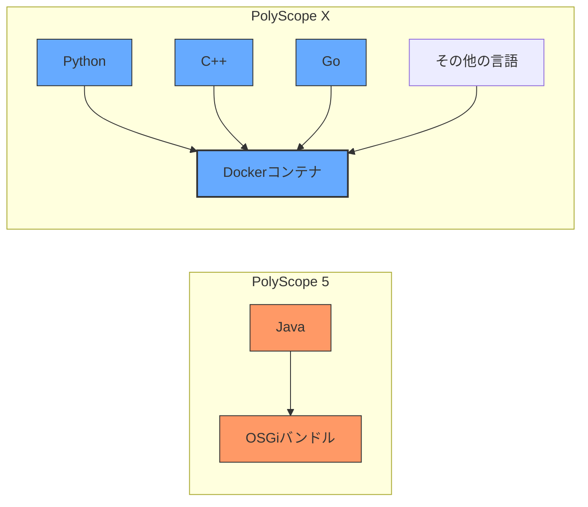
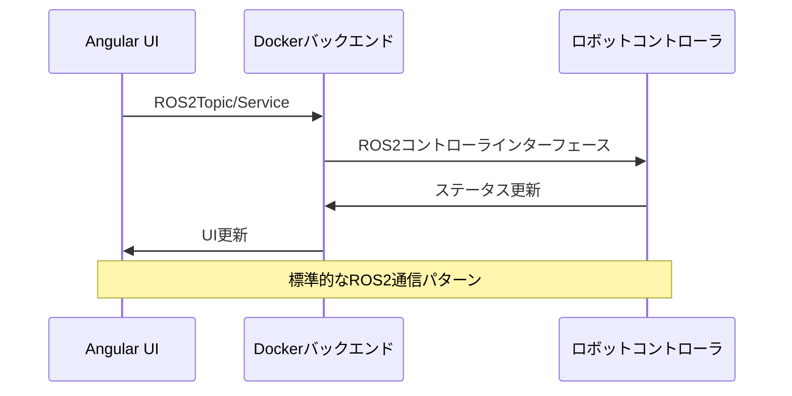
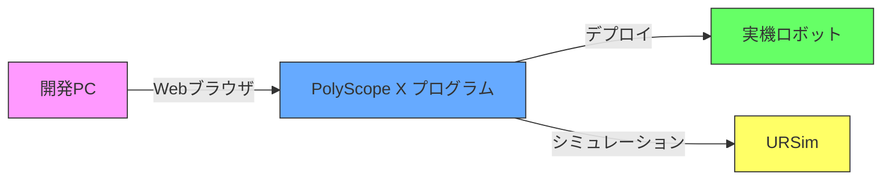
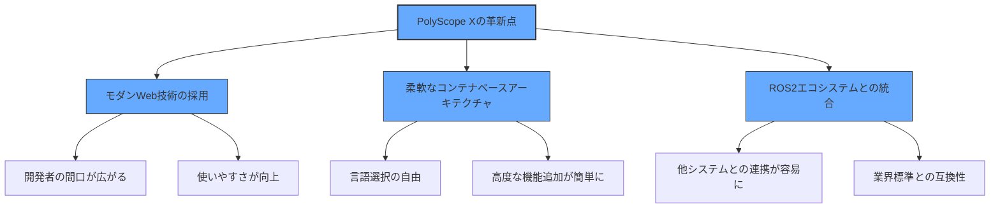

# Universal RobotのGUIツール：PolyScope 5からPolyScope Xへの進化
:::message
This article is generated by Claude.
:::

## やりたいこと：URの新しいポリスコープを知ろう！ 🌟

みなさん、こんにちは！最近、産業用ロボットの世界で大きな変化があったのをご存知でしょうか？そう、Universal Robots（UR）が新しいグラフィカルユーザーインターフェース「PolyScope X」をリリースしたんです！

私はこれまでURのコボット（協働ロボット）を使ってきましたが、この新しいPolyScope Xについて詳しく調べてみたくなりました。旧バージョンのPolyScope 5と比べて、何がどう変わったのか気になりますよね？特に開発者にとって、この変更がどんなインパクトを持つのか。

:::message alert
単なるUIの刷新じゃないんです！アーキテクチャから根本的に変わってるんですよ！ 🚀
:::

特に目を引いたのは、JavaベースのOSGiからWebベースの技術とDockerコンテナ、さらにROS2を採用した新アーキテクチャへの移行です。これってすごいですよね。この記事では、この技術的革新について図表も交えながら、わかりやすく解説していきたいと思います。

## PolyScope Xって何がすごいの？ 🔍

PolyScope Xは、URが開発したコボット向けの新しいオペレーティングシステムです。2024年末に正式リリースされて、従来のPolyScope 5からガラッと変わっているんです。

:::details PolyScope Xの名前の由来
面白いことに、URは次のバージョンを「PolyScope 6」とはせずに、「PolyScope X」という名前にしました。これは単なるバージョンアップではなく、完全な作り直しを示しているんですね。「X」は「eXtended（拡張）」とか「eXpandable（拡張可能）」、「neXt generation（次世代）」の意味かもしれません。URの開発チーム、ちょっと遊び心があるのかも？😊
:::

PolyScope Xの特徴は、直感的で使いやすいUIを持ちながら、ロボットプログラミングをより多くの人が手軽にできるようにしていること。基本的な操作感は維持しつつ、裏側のシステムを根本から変えて、コーディングをもっとシンプルにしているんです。

## ハードウェアも新しくなったよ：CB5.6コントローラ 💻

PolyScope Xへの移行に伴って、ハードウェアも新しくなりました。新しいCB5.6コントローラの登場です。これまでのCB5.5やCB5.2とは全く違うプラットフォームになっているんですよ。

CB5.5からの進化点はこんな感じです：
- 処理能力がアップ！サクサク動く ⚡
- メモリがたっぷり増量 💾
- ストレージも拡張 📊
- 省エネなエネルギー管理システム 🔋

:::message alert
ちょっと注意が必要なのは、PolyScope XコントローラからPolyScope 5コントローラへのダウングレードはできないことと、古いコントローラのSDカードを新しいコントローラで使い回せないこと。これだけでも、かなり根本から変わったことがわかりますね。
:::

## 開発フレームワークがガラッと変わった！ 🏗️

PolyScope Xでは開発フレームワークが根本から変わりました。URCap（Universal Robots Capability）開発者にとっては、これまでとは全く違うアプローチになります。

```mermaid
flowchart TD
    subgraph "PolyScope 5"
        P5_UI["UI: Java Swing"] --> P5_Logic["Logic: Java"] 
        P5_Logic --> P5_Bundle["OSGi Bundle"] 
        P5_Bundle --> P5_Robot["Robot Control"] 
    end
    
    subgraph "PolyScope X"
        PX_UI["UI: Angular/TypeScript"] --> PX_Backend["Backend: 好きな言語OK"]
        PX_Backend --> PX_Docker["Docker Container"]
        PX_Docker --> PX_ROS2["ROS2 通信"]
        PX_ROS2 --> PX_Robot["Robot Control"]
    end
    
    style P5_UI fill:#f96,stroke:#333
    style PX_UI fill:#6af,stroke:#333
    style P5_Bundle fill:#f96,stroke:#333
    style PX_Docker fill:#6af,stroke:#333
    style PX_ROS2 fill:#6af,stroke:#333,stroke-width:2px
```



### フロントエンド開発がモダンになった！ ✨

URCapsのフロントエンド開発は別次元に進化しました：

- **旧：Java Swingベース** → **新：WebベースのAngular/TypeScript**

これって開発者には嬉しい変更ですよね！古くて複雑なJava Swingから、モダンなWebベースのUIへの移行で、画面の柔軟性と表現力が格段に向上しました。どれくらい違うか、コードで見てみましょう：

#### コード比較：Java Swing vs Angular

**PolyScope 5 (Java Swing):**

```java:NodeView.java
public class MyNodeView implements SwingProgramNodeView<MyNodeContribution> {
    private final JPanel panel;
    private final JLabel label;
    private final JButton button;

    public MyNodeView() {
        panel = new JPanel();
        panel.setLayout(new BoxLayout(panel, BoxLayout.Y_AXIS));
        
        label = new JLabel("Click the button");
        button = new JButton("Press me");
        
        panel.add(label);
        panel.add(button);
    }

    @Override
    public void buildUI(JPanel jPanel, MyNodeContribution contribution) {
        jPanel.add(panel);
        button.addActionListener(e -> contribution.onButtonPress());
    }
}
```

**PolyScope X (Angular/TypeScript):**

```typescript:my-program-node.component.ts
@Component({
  selector: 'my-program-node',
  template: `
    <div class="container">
      <ur-label>{{ 'Click the button' | translate }}</ur-label>
      <ur-button (click)="onButtonPress()">{{ 'Press me' | translate }}</ur-button>
    </div>
  `,
  styleUrls: ['./my-program-node.component.scss']
})
export class MyProgramNodeComponent implements OnInit {
  constructor(private programNode: ProgramNodeService) {}
  
  onButtonPress(): void {
    // Handle button press logic
    this.programNode.executeAction('buttonPressed');
  }
}
```

:::message
この変更で、こんな良いことがありました：

1. **Web開発者が参入しやすくなった** - 現代のWeb技術なので参入障壁が下がった 👨‍💻👩‍💻
2. **コードが読みやすくなった** - テンプレートとコンポーネント指向で整理しやすい 📝
3. **見た目がオシャレに** - SCSSでスタイリングが自由自在 🎨
4. **多言語対応が簡単に** - 翻訳が組み込みでサポートされている 🌐
:::

### バックエンド開発も自由度アップ！ 🔓

バックエンド開発の変更は、さらにすごいんです：

- **旧：Java OSGiバンドル** → **新：Dockerコンテナ**



PolyScope 5では、バックエンドをJavaとOSGiフレームワークで開発するしかありませんでした。でもPolyScope Xなら、Dockerコンテナの中で**好きな言語やフレームワークを使える**んです！これって超便利ですよね。

:::details 実際どう便利なの？
例えば、PythonやC++で作った既存のコードやライブラリを、わざわざJavaに書き直したりOSGiバンドルにラップする複雑な作業は必要なくなりました。たとえばOpenCVを使った画像処理や、PyTorchで作った機械学習モデルをそのままDockerコンテナの中で動かして、ROS2インターフェースで通信するだけでOK。これで開発時間がグッと短縮できて、もっと高度な機能を実装しやすくなりましたね。
:::

### ROS2で通信が標準化された 🔄



PolyScope Xでは、ROS2（Robot Operating System 2）が標準的な通信インターフェースになりました。これはロボット工学の世界で最も広く使われている通信フレームワークで、URのエコシステムと広大なROSコミュニティをつなぐ架け橋になるんです。

:::details ROS2ってなに？
ROS2（Robot Operating System 2）は、ロボット開発のためのオープンソースミドルウェアプラットフォームです。従来のROS1と比べて、産業用途に適した堅牢性と信頼性の向上、リアルタイム性能の改善、セキュリティ強化などが図られています。また、DDS（Data Distribution Service）を採用することで、分散システム間の通信の効率化と信頼性向上を実現しています。URがPolyScope XでROS2を採用したのは、産業用ロボットと研究コミュニティの橋渡しになる重要な決断だと思います。
:::

## PolyScope Xの主な特徴と改善点 ✅

PolyScope Xは見た目が変わっただけでなく、ロボットプログラミングの基本的なアプローチも変わっています。主な特徴と改善点を見てみましょう：

### 1. Progressive Disclosure 📊

PolyScope Xは「Progressive Disclosure（段階的開示）」という原則を取り入れています。これは、最初は基本的な機能だけを見せて、必要に応じて複雑な機能を段階的に表示する手法です。初心者でも迷わず使えるようになっていて、学習曲線がゆるやかになりました。

### 2. オフラインプログラミング 💻

PolyScope Xは、ブラウザを持つどんなデバイスからでも使えるように設計されています。つまり、実際のロボットに接続しなくても、プログラムの開発やテストができるんです。



### 3. プログラムのエクスポート・インポート 📤📥

PolyScope Xでは、プログラム間でのデータ移行が簡単になりました。アプリケーションとプログラムデータをまとめて単一のファイルとしてエクスポートして、別のロボットにインポートできます。これはとても便利ですね！

### 4. オペレータ画面 👨‍🏭

オペレータ画面は、作業者自身が切り替えられるように設計されています。画面の複雑さを減らし、オペレータが複数の作業セルを管理しやすくなっています。

### 5. 複数コピペ機能 ✂️📋

新しいクリップボード機能で、複数のノードを一度にコピー・カットして後で貼り付けられるようになりました。これでプログラム開発の効率がグッと上がりますね。

### 6. モジュールと関数 🧩

:::message
機能を再利用することでプログラミング時間を短縮したり、テンプレートプログラムを作ってデプロイメント時間を短くできます。関数は他の関数を呼び出せるので、プログラムツリーがスッキリして、読みやすく保守しやすくなりました。これ、個人的にかなり気に入っているポイントです！
:::

### 7. Smart Skills 🧠

「Smart Skills」を使うと、ロボットの位置決めが簡単かつ正確になりました。UR+開発者によるAPIを通じて完全に共有可能で、PolyScope Xのどこからでもドロワーを通じてアクセスできます。便利ですね〜。

### 8. ワールド中心のビュー 🌐

新しい「World-Centric View」のフレームに相対的にウェイポイントを教えることで、ウェイポイントの再教示にかかる時間が短縮できます。フレームや他のウェイポイントへの相対変換を簡単に採用できるので、ハードコードされたウェイポイントの使用を減らせます。

## PolyScope XでのURCap開発はどう変わる？ 🛠️

PolyScope XでのURCap開発は、従来のPolyScope 5と比べてかなり変わりました。開発者の視点からの主な変更点を見ていきましょう。

### 開発環境と言語 🔧

PolyScope X URCap開発では、次の技術スタックが推奨されています：

- フロントエンド：Angular、TypeScript、HTML、CSS
- バックエンド：好きな言語（Python、C++など）をDockerコンテナ内で実行
- 通信：ROS2ベースの標準インターフェース

SDKには、URCapプロジェクトを素早く作るためのジェネレータやサンプルプロジェクトが含まれています。また、DevContainerを使ったIDEでの開発もサポートされていて、とても便利です。

### URCap開発の基本構造 📐

PolyScope X URCapプロジェクトの基本構造はこんな感じです：

```
myurcap/
├── frontend/
│   ├── src/
│   │   ├── app/
│   │   │   ├── app.module.ts
│   │   │   ├── components/
│   │   │   │   └── my-component/
│   │   │   │       ├── my-component.component.ts
│   │   │   │       ├── my-component.component.html
│   │   │   │       └── my-component.component.scss
│   │   │   └── services/
│   │   └── assets/
│   └── package.json
├── backend/
│   ├── Dockerfile
│   └── src/
│       └── main.py (他の言語でもOK)
└── urcap.yaml
```

PolyScope X URCapのパッケージングは`.urcapx`拡張子を持つZIPファイルとして行われ、実機やシミュレータ（URSim）にインストールできます。

### URCap開発の実例 💡

:::details 「LightUp」URCapの開発例
例として、「LightUp」という単純なURCapの開発プロセスを紹介します。このURCapは、指定したデジタル出力を一定時間オンにする機能を提供します。

開発手順はこんな感じです：

1. URCapプロジェクトの作成（ジェネレータを使用）
2. ベンダー名とURCap名の定義
3. プログラムノードの実装（Angularコンポーネント）
4. URScriptコードの生成
5. ビルドとインストール

```typescript:lightup-node.component.ts
@Component({
  selector: 'lightup-program-node',
  template: `
    <div class="container">
      <ur-select-box
        [label]="'Digital Output' | translate"
        [options]="digitalOutputs"
        [(ngModel)]="selectedOutput">
      </ur-select-box>
      <ur-number-input
        [label]="'Duration (seconds)' | translate"
        [(ngModel)]="duration"
        [min]="0.1"
        [max]="10"
        [step]="0.1">
      </ur-number-input>
    </div>
  `
})
export class LightUpNodeComponent implements OnInit {
  digitalOutputs = [
    { value: 0, label: 'DO0' },
    { value: 1, label: 'DO1' },
    // ...
  ];
  selectedOutput = 0;
  duration = 1.0;
  
  constructor(private programNode: ProgramNodeService) {}
  
  ngOnInit(): void {
    // スクリプト生成を登録
    this.programNode.onGenerateScript(() => {
      return `
        # デジタル出力をオン
        set_digital_out(${this.selectedOutput}, True)
        # 指定時間待機
        sleep(${this.duration})
        # デジタル出力をオフ
        set_digital_out(${this.selectedOutput}, False)
      `;
    });
  }
}
```

これ、意外と簡単そうですね！私も試してみたくなります。
:::

もっと複雑な例としては、ROS2ドライバと連携する「External Control URCap」があります。これは、ROSやROS2ドライバを使ってロボットを外部から制御するためのURCapです。これってかなり可能性を広げてくれますね。

## PolyScope 5からPolyScope Xへの移行はどうする？ 🔄

既存のPolyScope 5アプリケーションからPolyScope Xへの移行を考えている開発者にとって、以下のポイントが重要になります：

### 再利用できるもの ♻️

既存のURCapsのうち、PythonやC++で書かれたバックエンドプロセスは、Dockerコンテナに移植すれば再利用できる可能性があります。ここは朗報ですね！

### 再実装が必要なもの 🔨

JavaとSwingで実装されていたUIコンポーネントは、AngularやTypeScriptを使って再実装する必要があります。ここは大変ですが、結果的に良いUIが作れると思います。

:::message alert
移行作業は単純なポーティングではなく、新しいアーキテクチャに合わせた再設計が必要かもしれません。特にUI部分は完全な書き換えが必要になりますね。でも、それだけの価値はあると思います！
:::

### 通信プロトコルの変更 📡

OSGiバンドル間の通信から、ROS2ベースの通信に変更されています。これにより、複数のURCaps間の連携がもっとスムーズになりました。

### 移行のメリット 📈

移行のメリットには以下があります：

- モダンな技術スタックで開発効率アップ！ ⚡
- バックエンド開発の自由度が高い 🔓
- 標準化された通信インターフェース 🔄
- UIの表現力が向上 🎨

## 将来どうなるの？ 🔭

PolyScope Xは、URの将来ビジョンを示す重要なマイルストーンです。今後こんな方向に発展しそうです：

1. **クラウド連携** ☁️: もっと強化されたクラウド機能が来そう
2. **AI統合** 🧠: 機械学習を使ったプログラミング支援が実現するかも
3. **エコシステムの拡大** 🌱: より多くのUR+パートナーとの連携
4. **ROS2エコシステムとの連携強化** 🔄: 産業ロボットとROSコミュニティの架け橋に

:::details AI統合の可能性
PolyScope XのモダンなWeb技術とコンテナベースのアーキテクチャは、AIの統合にぴったりのプラットフォームです。考えられる応用例はこんな感じ：

- **自動経路計画**: 障害物を避けながら最適な動作経路を自動生成してくれる
- **ビジョンベースのピッキング**: 深層学習モデルを使った高度な物体認識と把持計画
- **プログラム自動生成**: 「箱を取って置いて」みたいな自然言語指示からURScriptコードを自動生成
- **予測メンテナンス**: センサーデータから故障を予測して事前に知らせてくれる

想像するだけでワクワクしますね！
:::

## まとめ：PolyScope Xで広がる新たな可能性 🚀



PolyScope Xへの移行は、URが掲げている「ロボット技術の民主化」というビジョンの大きな一歩だと思います。古い技術から最新のクラウドネイティブなアーキテクチャへの移行は、本当に重要な意味を持ちますね。

開発者にとってのメリットはたくさんあります：

- **最新技術を使える** 🛠️ - Angular、TypeScript、Docker、ROS2といった現代的なツールやフレームワークが使えます
- **柔軟に拡張できる** 🔄 - 既存コードを再利用したり、新機能を柔軟に追加できます
- **コミュニティの知見を活用** 👥 - Web開発者やROSコミュニティの膨大な知識を活用できます

バックエンドでは、PythonやC++などの強力な言語をそのまま使えるので、画像処理や機械学習、リアルタイム制御などの複雑な機能も実装しやすくなりました。フロントエンドでは、モダンなWeb技術で、レスポンシブでカッコいいUIが作れます。

この変化は、ロボット工学と現代ソフトウェア工学の世界をつなぐ架け橋になると思います。PolyScope Xは単なるアップデートじゃなくて、協働ロボットの開発と利用における新時代の幕開けなんですね！ 🎉

私も早速、PolyScope Xを使ったURCap開発に挑戦してみようと思います。みなさんも、ぜひこの新しい波に乗ってみてくださいね！

## 参考資料 📚

@[card](https://www.universal-robots.com/products/polyscope-x/)
@[card](https://www.universal-robots.com/developer/ur-cap/polyscope-x-urcap/)
@[card](https://github.com/UniversalRobots)
@[card](https://docs.universal-robots.com/PolyScopeX_SDK_Documentation/)

## 脚注

[^1]: PolyScope XはURのe-SeriesおよびCB5.6コントローラを搭載したモデルでのみサポートされています。
[^2]: ROS2 Humbleディストリビューションがベースとして使用されています。
