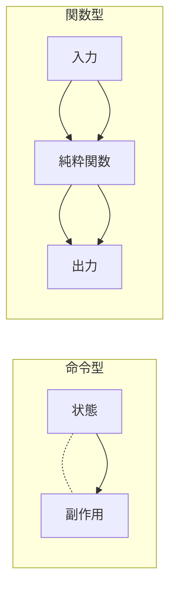
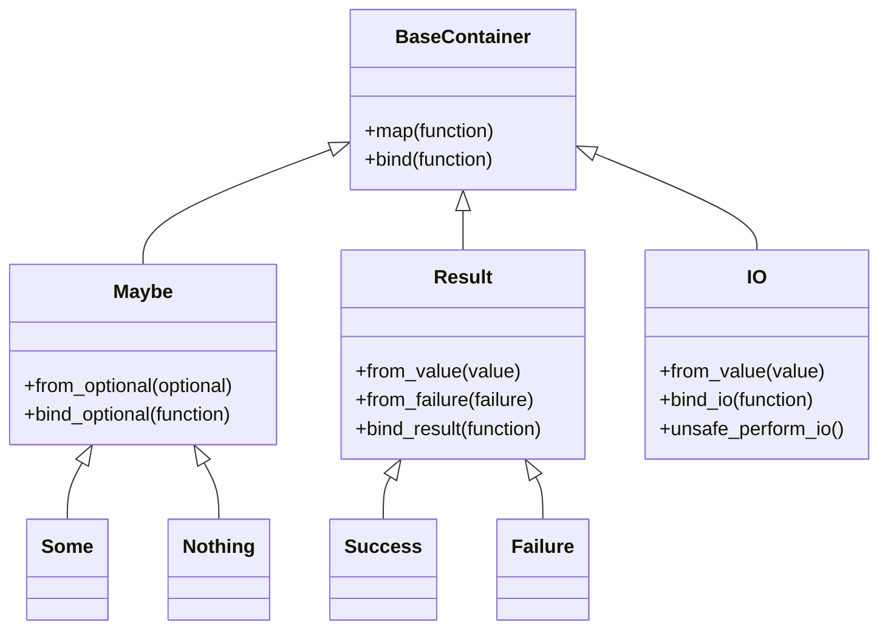
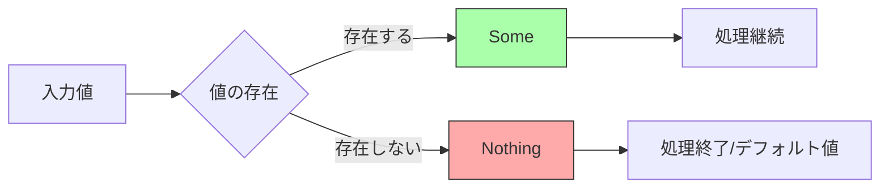
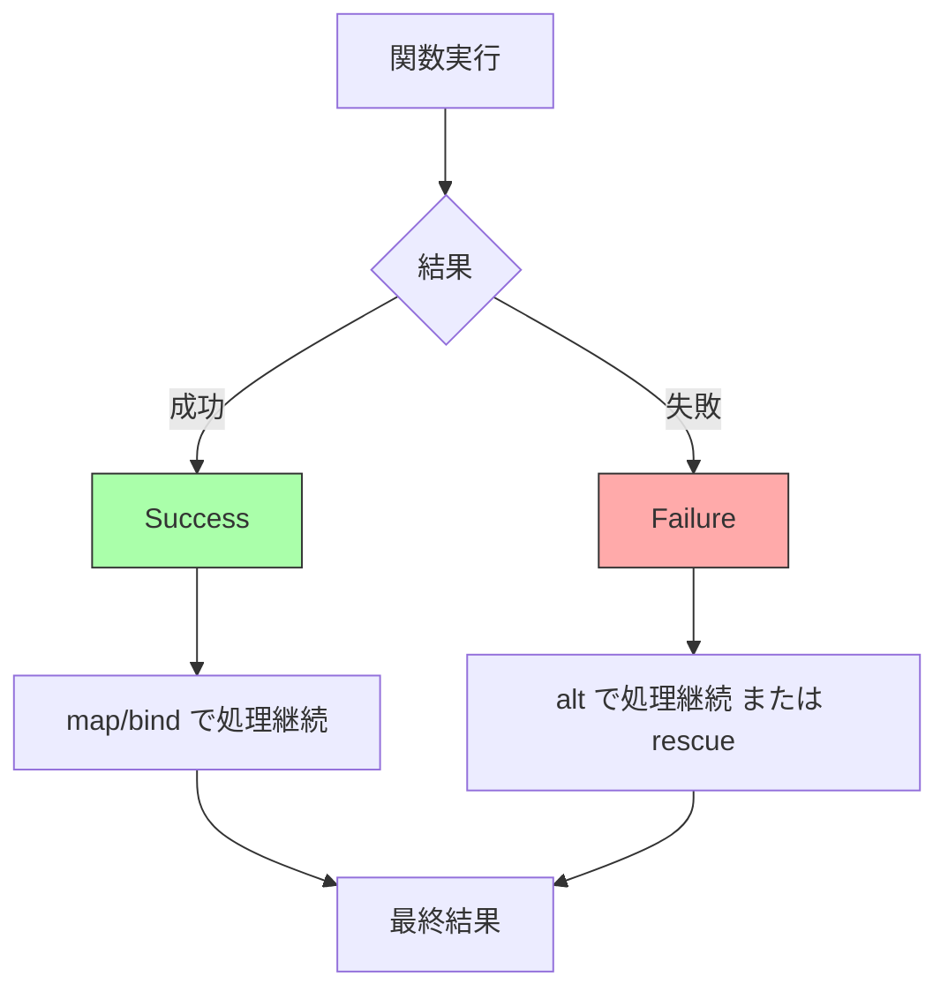
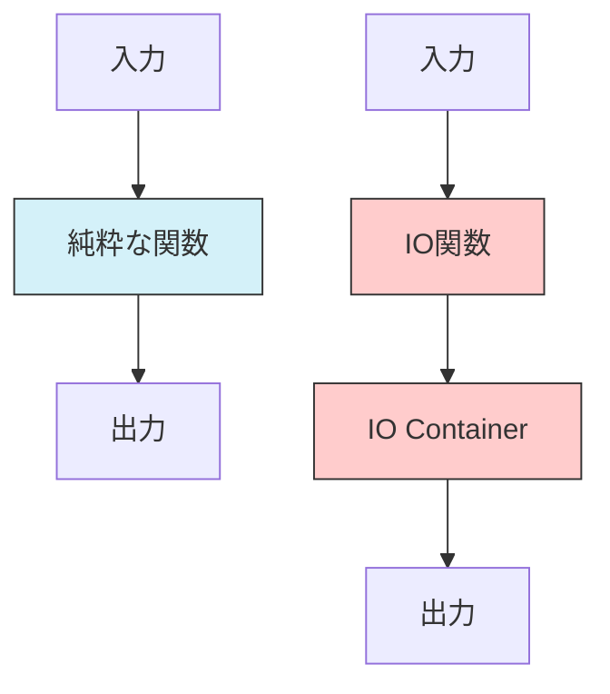
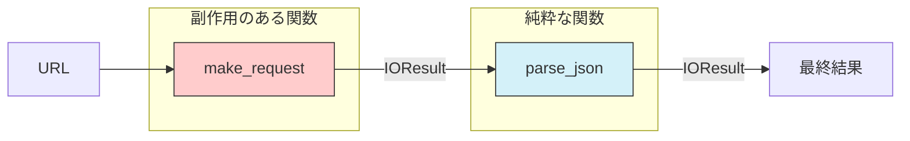
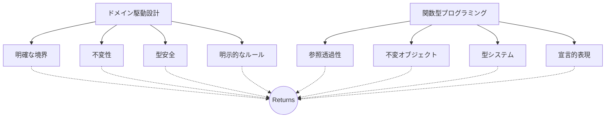
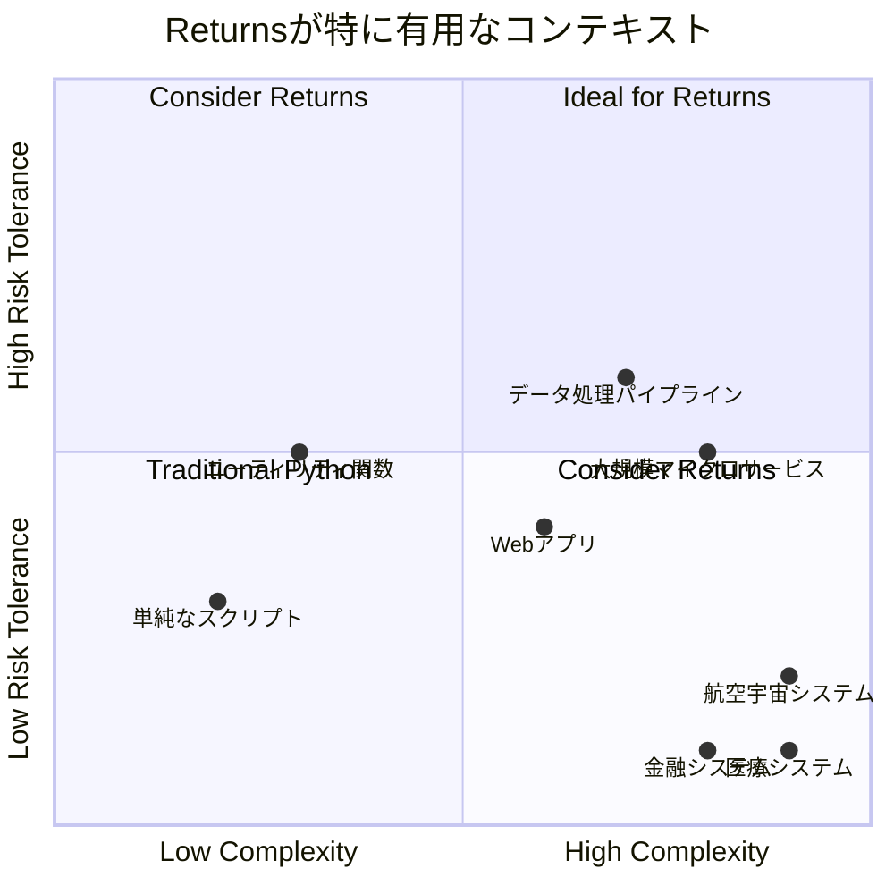

# Returnsで関数型の恩恵をPythonに - エラー処理と合成の美学

:::message
This article is generated by Claude.
:::

## はじめに - やりたいこと 💡

皆さんは、Pythonコードを書いていて「もう少し安全にコードを書きたい」「Noneチェックがあちこちに散らばって読みにくい」「例外処理がプログラムの流れを分かりにくくする」といった悩みを感じたことはありませんか？ 🤔

私はPythonが大好きなのですが、時々次のような点で少し不便さを感じることがあります：

- 🚫 Noneの扱いが煩雑になりがち
- ⚠️ 例外処理が暗黙的で予測しづらい
- 🧲 関数合成がやや書きにくい
- 🔒 型安全性を保ちながら関数型プログラミングのテクニックを使いたい

今回紹介する「Returns」ライブラリは、Pythonに関数型プログラミングの恩恵をもたらす素晴らしいツールです。このライブラリを使うと、より明示的で型安全なコードを書くことができ、ドメイン駆動設計（DDD）との相性も抜群です！✨

## 背景 - 関数型プログラミングとその利点 🌐

まず、関数型プログラミングの考え方について少し触れておきましょう。関数型プログラミングは次のような特徴を持っています：

- **純粋関数（Pure Functions）**: 同じ入力に対して常に同じ出力を返し、副作用を持たない関数
- **不変性（Immutability）**: データを変更するのではなく、新しい値を生成する
- **関数合成（Function Composition）**: 小さな関数を組み合わせて複雑な処理を構築する
- **高階関数（Higher-Order Functions）**: 関数を引数や戻り値として扱う

関数型プログラミングの利点は多岐にわたりますが、特に：

- テストが容易（副作用がないため）
- 並行処理が安全（状態の変更がないため）
- コードの予測可能性が高い（参照透過性があるため）
- バグが発生しにくい



しかし、Pythonはもともとマルチパラダイムのプログラミング言語であり、関数型よりもオブジェクト指向や命令型のスタイルが一般的です。ここで「Returns」の出番です！

## Returnsとは？ 💻

**Returns**は、Pythonに関数型プログラミングのパターンをもたらすライブラリです。特に「コンテナ型（Container Types）」という概念を使って、値をラップし、型安全な方法で関数を合成できるようにします。

主な特徴としては：

- 型安全性（Type Safety）: mypy との統合により、静的型チェックが可能
- 明示的なエラー処理: 例外ではなく、結果を返す
- 関数合成: `.map`, `.bind` などのメソッドによる関数チェーン
- コンテナ型: `Maybe`, `Result`, `IO` などの様々なコンテナ



まずはインストールから始めましょう：

```bash
pip install returns
```

## Returnsの基本的なコンテナ型 📦

Returnsは、いくつかの基本的なコンテナ型を提供しています。特に重要なものをご紹介します：

### 1. Maybe - Noneとの戦い

`Maybe`は、値が存在するかもしれないし、しないかもしれない状況を表現するためのコンテナです。これを使うことで、`None`チェックのコードを美しく書くことができます。



```python
from returns.maybe import Maybe, Some, Nothing

# 従来のコード
def get_discount(user):
    if user is not None:
        balance = user.get_balance()
        if balance is not None:
            credit = balance.credit_amount()
            if credit is not None and credit > 0:
                return choose_discount(credit)
    return None

# Returnsを使ったコード
def get_discount_returns(user):
    return Maybe.from_optional(user).bind_optional(
        lambda real_user: real_user.get_balance()
    ).bind_optional(
        lambda balance: balance.credit_amount()
    ).bind_optional(
        lambda credit: choose_discount(credit) if credit > 0 else None
    )
```

これにより、「階段状」になってしまいがちなNoneチェックが、整然とした一連の処理に変わります。

### 2. Result - 例外をさようなら

`Result`は、操作が成功するか失敗するかを表現するためのコンテナです。例外を投げる代わりに、Success または Failure の値を返します。



```python
from returns.result import Result, Success, Failure, safe

# 従来のコード
def divide(a, b):
    try:
        return a / b
    except ZeroDivisionError:
        return "Division by zero"

# Returnsを使ったコード
@safe
def divide_returns(a, b):
    return a / b  # ZeroDivisionErrorが発生すると自動的にFailureに変換される
```

`@safe`デコレータを使うと、関数内で発生する例外は自動的に`Failure`に変換されます。これにより、例外処理が明示的になり、コードの流れが予測しやすくなります。

:::message alert
重要なポイント：`@safe`デコレータは`Exception`のサブクラスのみをキャッチし、`BaseException`のサブクラス（`KeyboardInterrupt`や`SystemExit`など）はキャッチしません。これはプログラムの実行制御に関わる例外は適切に処理するためです。
:::

### 3. IO - 副作用を制御する

`IO`は、副作用（ファイル操作、ネットワーク通信など）を持つ操作を明示的にマークするためのコンテナです。

```python
from returns.io import IO, IOResult, impure

# 副作用を持つ関数
@impure
def get_user_input():
    return input("Enter your name: ")

# 失敗する可能性のあるIO操作
def read_file(path) -> IOResult[str, Exception]:
    try:
        with open(path, 'r') as file:
            return IOResult.from_value(file.read())
    except Exception as e:
        return IOResult.from_failure(e)
```

`IO`を使うことで、どの関数が副作用を持つのかが明示的になり、プログラムの純粋な部分と不純な部分を分離できます。



## 実践例: 関数型アプローチによるAPIクライアント 🌐

ここで、実際のユースケースとして、APIクライアントを実装してみましょう。



```python
import requests
from returns.result import Result, Success, Failure, safe
from returns.io import IOResult, impure_safe
from returns.pipeline import flow
from typing import Dict, Any

# 従来のアプローチ
def fetch_user_traditional(user_id):
    try:
        response = requests.get(f"https://api.example.com/users/{user_id}")
        response.raise_for_status()
        return response.json()
    except (requests.RequestException, ValueError) as e:
        print(f"Error: {e}")
        return None

# Returnsを使ったアプローチ
@impure_safe
def make_request(url: str) -> requests.Response:
    response = requests.get(url)
    response.raise_for_status()
    return response

@safe
def parse_json(response: requests.Response) -> Dict[str, Any]:
    return response.json()

def fetch_user_returns(user_id: int) -> IOResult[Dict[str, Any], Exception]:
    return flow(
        f"https://api.example.com/users/{user_id}",
        make_request,
        lambda result: result.bind(parse_json)
    )

# 使い方
user_result = fetch_user_returns(123)
# 成功した場合の処理
user_result.map(
    lambda user: print(f"User name: {user['name']}")
)
# 失敗した場合の処理
user_result.alt(
    lambda error: print(f"Failed to fetch user: {error}")
)
```

このアプローチの利点：

1. **明示的なエラー処理**: 例外がどこで発生するかが明確
2. **関数の分離**: 純粋な関数（`parse_json`）と不純な関数（`make_request`）が明確に分離
3. **合成可能**: 各関数は小さく、テストしやすく、組み合わせ可能
4. **型安全**: 全体を通して型情報が保持される

:::details 従来のアプローチとReturnsアプローチの比較
従来のアプローチでは、エラー処理は主に例外処理（try-except）に依存しています。問題点としては：

1. エラーが発生した場合、コードの流れが中断される
2. エラーが発生する可能性のある箇所が明示的でない
3. エラー処理が後付けになりがち

一方、Returnsアプローチでは：

1. エラーも値として扱われるため、コードの流れが明確
2. 型システムによってエラー処理が強制される
3. 純粋な関数と不純な関数が明確に分離される
:::

## DDDとの相性 🖊️

Returns ライブラリは、ドメイン駆動設計（DDD）との相性も非常に良いです。DDDでは、ドメインの概念を正確に表現し、ビジネスルールをコードに反映させることが重要です。



特に次のような点で相性が良いです：

### 1. 値オブジェクト（Value Objects） 🔊

値オブジェクトは、属性値によって同一性が定義される不変のオブジェクトです。Returnsのコンテナは本質的に不変であり、値オブジェクトのパターンと相性が良いです。

```python
from dataclasses import dataclass
from returns.maybe import Maybe
from typing import Optional

@dataclass(frozen=True)
class Email:
    value: str
    
    @classmethod
    def create(cls, value: str) -> Maybe['Email']:
        if '@' in value and '.' in value:
            return Maybe.from_value(cls(value))
        return Maybe.empty
```

### 2. ドメインサービス（Domain Services） 🚀

ドメインサービスでは、複数のエンティティや値オブジェクトを扱う操作を実装します。Returnsを使うことで、副作用を明示的に分離し、純粋なドメインロジックを保つことができます。

```python
from returns.result import ResultE, safe
from returns.io import IOResultE

class PaymentService:
    @safe
    def calculate_fee(self, amount: float, currency: str) -> float:
        # 純粋な計算ロジック
        if currency != "USD":
            raise ValueError(f"Unsupported currency: {currency}")
        return amount * 0.05
    
    def process_payment(self, payment_id: str) -> IOResultE[bool]:
        # 副作用を持つ処理（データベースアクセスなど）
        ...
```

### 3. 境界づけられたコンテキスト（Bounded Contexts） 📜

異なるコンテキスト間の変換や統合を行う際、Returnsのコンテナは型安全な方法でコンテキスト間の境界を越えることを助けます。

```python
from returns.result import Result
from typing import TypeVar, Generic

T = TypeVar('T')
U = TypeVar('U')

class ContextMapper(Generic[T, U]):
    def map_to_target_context(self, source: T) -> Result[U, str]:
        try:
            # コンテキスト間の変換ロジック
            target = self._convert(source)
            return Result.from_value(target)
        except ValueError as e:
            return Result.from_failure(str(e))
            
    def _convert(self, source: T) -> U:
        # 具体的な変換ロジック
        ...
```

## 高度なパターン: do-notation 💪

Returnsライブラリは、Haskellのdo-notationに似た構文もサポートしています。これにより、複数のコンテナ操作をより読みやすく書くことができます。

```python
from returns.result import Result, Success, Failure
from returns.contrib.pytest.plugin import returns_fixture
from returns.pointfree import bind
from returns.methods import cond

@returns_fixture
def example() -> Result[int, str]:
    return Success(5)

def test_do_notation(example):
    first = example
    
    # do-notationを使った例
    from returns.contrib.mypy.do_notation import do_notation, DoNotation
    
    @do_notation
    def get_result() -> DoNotation[Result[int, str]]:
        x = yield Success(2)
        y = yield first
        z = yield cond(Result, x > 1, 'Less than 1')
        return x + y + z
    
    assert get_result() == Success(2 + 5 + 2)  # z は x なので 2
```

do-notationを使うと、複雑な関数合成が直感的に書けるようになります。これは特に、複数のコンテナ操作を連鎖させる必要がある場合に有用です。

## まとめと感想 🔎

Returnsライブラリは、Pythonでより関数型的なアプローチを採用したいと考えている開発者にとって、非常に有用なツールです。主な利点をまとめると：

- 🔒 **型安全性**: mypyサポートにより、コンパイル時のエラーチェックが可能
- ⚠️ **明示的なエラー処理**: 例外に頼らない、予測可能なエラーフロー
- 🧲 **関数合成**: 小さな関数を組み合わせて複雑な処理を構築
- 🔗 **副作用の分離**: 純粋な関数と不純な関数の明確な区別
- 🖊️ **DDDとの相性**: 値オブジェクト、ドメインサービスなどのDDDパターンとうまく連携

一方で、いくつかの注意点もあります：

- 📊 **学習曲線**: 関数型プログラミングの概念に慣れていない場合、最初は少し難しく感じるかもしれません
- 👥 **Pythonの慣習からの逸脱**: チームの全員がこのアプローチに慣れる必要があります
- ⏱️ **オーバーヘッド**: 一部のシンプルなユースケースでは、オーバーエンジニアリングに感じることもあるかもしれません



ただ、複雑なドメインロジックや、エラー処理が重要なアプリケーションでは、Returnsのアプローチが非常に役立つと思います。特に、DDD原則に従ったクリーンなアーキテクチャを目指すプロジェクトでは、このライブラリの導入を検討する価値があるでしょう。

皆さんも、Pythonの世界に関数型の美学を取り入れてみませんか？ 🚀  

https://zenn.dev/toitoy8/articles/ddd-functional-modeling

## 参考リンク 🔗

- [Returns GitHub リポジトリ](https://github.com/dry-python/returns)
- [Returns 公式ドキュメント](https://returns.readthedocs.io/en/latest/)
- [Railway Oriented Programming](https://fsharpforfunandprofit.com/rop/)
- [Python での関数型プログラミング](https://docs.python.org/3/howto/functional.html)
