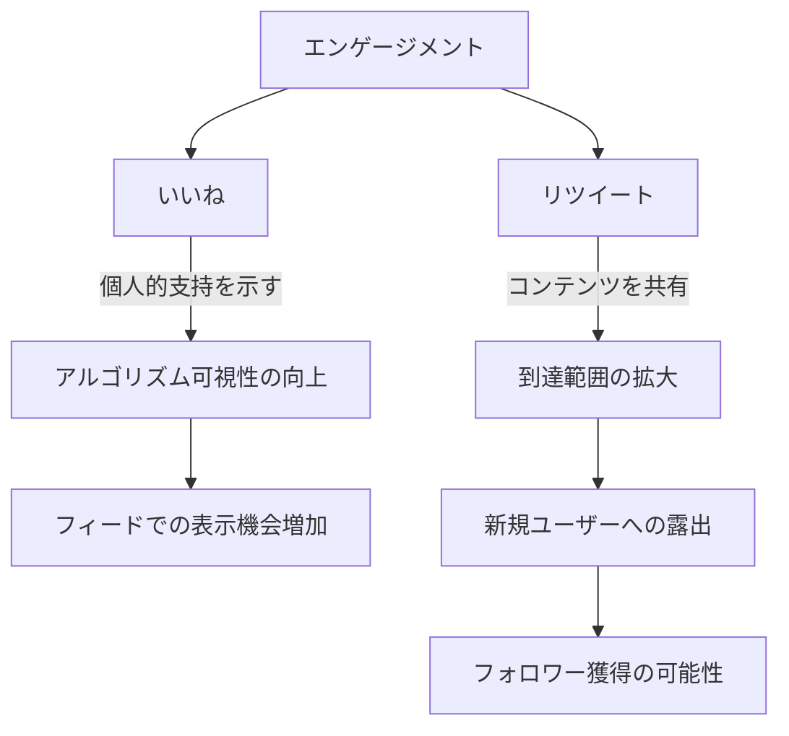
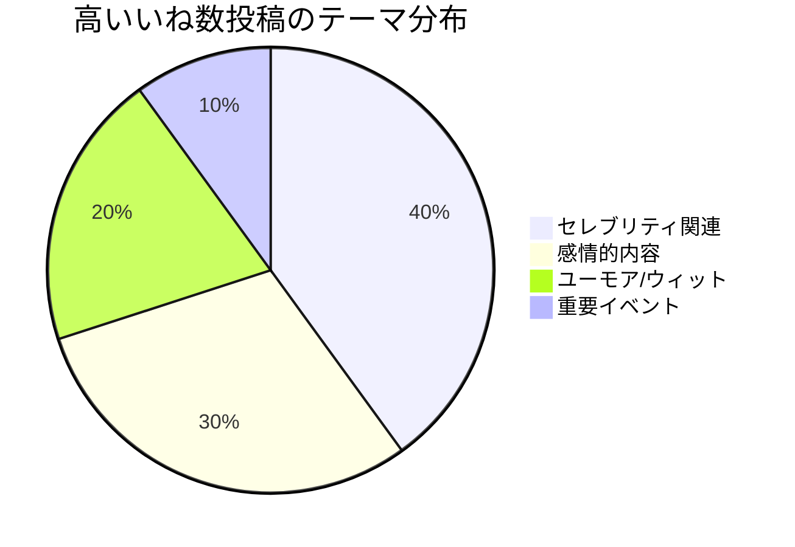
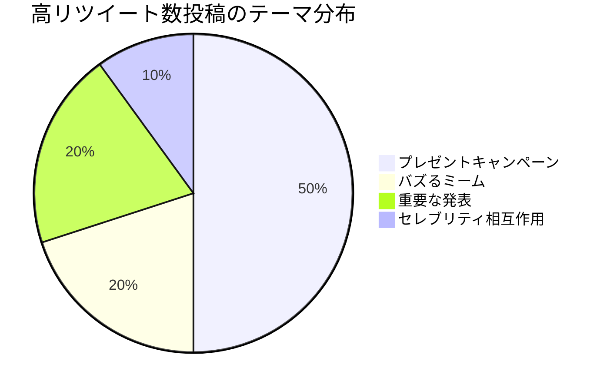
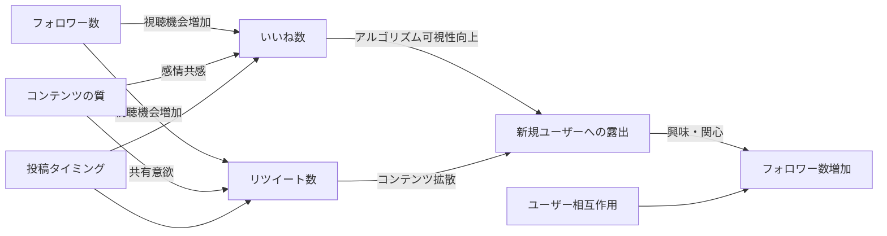

# X（旧Twitter）のいいね・リツイート・フォロワー数：因果関係の徹底解析

:::message
This article is generated by Claude.
:::

X（旧Twitter）で投稿を行うとき、「いいね」と「リツイート」のどちらが重要なのか、また、これらの指標とフォロワー数にはどのような関係があるのか気になったことはありませんか？🤔

この記事では、X上のエンゲージメント指標（いいね・リツイート）とフォロワー数の関係性を、最新の調査データや研究結果をもとに徹底的に分析していきます。単なる相関だけでなく、因果関係にも踏み込んで解説しますので、SNSマーケティングやX活用に興味がある方は、ぜひ参考にしてみてください！

## もくじ

1. [いいねとリツイート：基本的な違い](#いいねとリツイート基本的な違い)
2. [重要性の比較：いいね vs リツイート](#重要性の比較いいね-vs-リツイート)
3. [高エンゲージメント投稿の分析](#高エンゲージメント投稿の分析)
4. [フォロワー数との関係性](#フォロワー数との関係性)
5. [因果関係の推定](#因果関係の推定)
6. [実践的な示唆](#実践的な示唆)

## いいねとリツイート：基本的な違い

まずは、いいねとリツイートの基本的な役割の違いを整理してみましょう。

### いいね

いいねは「心マーク」をクリックする行為で、基本的には以下の役割があります：

- 個人的な支持や関心を示す
- かつては「Favorites」と呼ばれ、ブックマーク的な機能も
- Xのアルゴリズムに影響を与え、投稿の可視性を高める

### リツイート

リツイートは投稿を自身のフォロワーに共有する行為で、主に以下の役割があります：

- 投稿の到達範囲を拡大する
- コンテンツの拡散やバズを生む
- ユーザー間のエンゲージメントを促進する

このように、両者は似ているようで明確に異なる機能を持っています。いいねが「個人の支持」を示すのに対し、リツイートは「共有による拡散」という役割を持っているのです。

## 重要性の比較：いいね vs リツイート

では、実際にいいねとリツイートのどちらがより重要なのでしょうか？これは目的によって異なります。

### いいねの重要性

いいねは主に以下のような場合に重要です：

- 個人としてのエンゲージメントを測りたい場合
- コンテンツへの支持や関心度を知りたい場合
- アルゴリズム上の可視性を高めたい場合

### リツイートの重要性

一方、リツイートは以下のような場合に特に重要となります：

- 情報拡散を最優先したい場合
- ブランド認知度を高めたい場合
- 新しいフォロワーを獲得したい場合

:::message alert
研究によれば、リツイートは情報の拡散という観点では、いいねよりも重要視される傾向にあります。特にブランドやクリエイターにとって、リツイートは投稿の到達範囲を大きく広げる効果的な手段です。
:::

## 高エンゲージメント投稿の分析

実際に高いエンゲージメントを獲得した投稿を分析することで、いいねとリツイートの特性をより深く理解できます。ここでは、2025年4月時点での最もいいね数・リツイート数の多かった投稿TOP10を見ていきましょう。

### 高いいね数投稿の特徴

高いいね数を獲得した投稿には、以下のような共通点があります：

1. **セレブリティ関連の投稿**：Chadwick Boseman、Elon Muskなど
2. **感情的な内容**：訃報、インスピレーショナルな引用文など
3. **ユーモアやウィット**：Greta Thunbergの返信など
4. **重要なイベント**：大統領就任、社会的出来事など

### 高リツイート数投稿の特徴

高リツイート数を獲得した投稿には、以下のような共通点があります：

1. **プレゼントキャンペーン**：前澤友作、MrBeastのプレゼント企画など
2. **バズるミームやユーモア**：El Rubiusの「LIMONADA 🗿」など
3. **重要な発表**：Chadwick Bosemanの訃報など
4. **セレブリティの相互作用**：Ellen DeGeneresのオスカーセルフィーなど

### 視覚的比較

上位投稿を実際に見てみると、それぞれの特性がより明確になります：

このように、いいねとリツイートでは、ユーザーの反応を引き出す要素に明確な違いがあることがわかります。特に、リツイートではプレゼントキャンペーンの影響が顕著です。これはリツイートを条件にしているキャンペーンが多いという直接的な因果関係があるためです。

## フォロワー数との関係性

では、フォロワー数はいいねやリツイートとどのような関係があるのでしょうか？

### フォロワー数とリツイートの関係

研究によると、フォロワー数とリツイート数には相関関係があります。しかし、その相関は単純ではありません：

- 全ユーザーでは0.549のスピアマンの順位相関係数を示す
- フォロワー数上位10%のユーザーでは0.122に低下
- フォロワー数上位1%のユーザーでは0.109とさらに低下

:::details 相関係数の詳細データ
| 相関関係 | 全ユーザー | 上位10% | 上位1% |
|---------|-----------|---------|--------|
| フォロワー数 vs リツイート | 0.549 | 0.122 | 0.109 |
| フォロワー数 vs メンション | 0.638 | 0.286 | 0.309 |
| リツイート vs メンション | 0.580 | 0.638 | 0.605 |
:::

これは興味深い事実を示しています。フォロワー数が少ないユーザーでは、フォロワー数の増加がリツイート数の増加と強く関連していますが、フォロワー数が多いユーザーでは、その関連性が弱まるのです。つまり、**フォロワー数が多いだけでは、必ずしもリツイート数は増えない**ということです。

### フォロワー数といいねの関係

いいねについても同様の傾向が見られますが、リツイートほど明確なデータはありません。一般的に、フォロワー数が多いと投稿が見られる機会が増えるため、いいね数も増える可能性はありますが、コンテンツの質や関連性が主な要因となります。

業界の分析によれば、いいねとフォロワー数の比率（like to follower ratio）は、0.3%-1%が良好なエンゲージメントとされています。これは、フォロワー数に比例していいね数が増えるわけではなく、一定の比率が維持されることを示唆しています。

## 因果関係の推定

これまでの分析から、いいね・リツイート・フォロワー数の間には複雑な因果関係があることがわかりました。以下に、考えられる因果関係を図示します：

### いいねの因果関係

いいね数に影響を与える主な要因：

1. **セレブリティの影響力**：フォロワーが多いと、いいね数が自然に増える傾向
2. **感情的共感**：感情を揺さぶるコンテンツは、支持を示す手段としていいねされやすい
3. **アルゴリズムの可視性**：いいねが多い投稿はフィードに優先的に表示され、さらにいいねを集める可能性

### リツイートの因果関係

リツイート数に影響を与える主な要因：

1. **インセンティブ**：プレゼントキャンペーンなど、リツイートを条件とする場合は直接的に増加
2. **共有意欲**：有益な情報やユーモアは、共有したいという気持ちを誘発
3. **情報拡散**：重要なニュースは、他のユーザーにも知らせたいという動機からリツイートされる
4. **ファンエンゲージメント**：セレブリティの投稿は、支持を示す手段としてリツイートされる

### フォロワー数への影響

フォロワー数に影響を与える主な要因：

1. **リツイートによる露出**：リツイートが多いと新しいユーザーの目に触れる機会が増加
2. **いいねによる間接的可視性**：いいねが多いとアルゴリズム上で優遇され、結果的に露出が増加
3. **コンテンツの質と一貫性**：質の高いコンテンツを一貫して投稿することで信頼を構築
4. **ユーザーとの相互作用**：フォロワーとの積極的なコミュニケーションがエンゲージメントを高める

## 実践的な示唆

最後に、この分析から得られる実践的な示唆をまとめます。

### エンゲージメント戦略の構築

効果的なX戦略には、いいねとリツイートのバランスが重要です：

1. **リツイートを促進する工夫**
   - プレゼントキャンペーンなどのインセンティブ（可能な範囲で）
   - 共有したくなるような有益な情報やユニークな視点の提供
   - タイムリーなトピックへの言及

2. **いいねを増やす工夫**
   - 感情に訴えかける内容の投稿
   - ユーザーの共感を得られるストーリーテリング
   - ビジュアル要素の効果的な活用

### フォロワー数を増やすには

フォロワー数を効果的に増やすには：

1. **コンテンツ戦略の最適化**
   - ターゲットオーディエンスに価値ある情報を提供
   - 一貫したテーマと投稿頻度の維持
   - トレンドやタイムリーな話題への適切な反応

2. **エンゲージメントの促進**
   - フォロワーとの積極的な対話
   - リプライやメンションへの反応
   - コミュニティ感覚の醸成

:::message
フォロワー数、いいね、リツイートは相互に影響し合いますが、最終的にはコンテンツの質とユーザーとの関わり合いが結果を左右します。数字だけを追うのではなく、価値ある体験の提供を心がけましょう。
:::

## まとめ

いいね、リツイート、フォロワー数の関係は単純ではありません。データから見えてきたのは、以下の点です：

1. **目的による重要性の違い**：情報拡散にはリツイートが、支持の表明にはいいねが重要
2. **エンゲージメントの特性**：いいねは感情や個人的共感に、リツイートは共有意欲やインセンティブに関連
3. **フォロワー数との複雑な関係**：フォロワー数が多いからといって必ずしもエンゲージメントが高いわけではない
4. **相互作用の重要性**：これらの指標は相互に影響し合い、好循環を生み出す可能性がある

SNSマーケティングにおいては、これらの関係性を理解した上で、目的に合わせた戦略を構築することが重要です。単純に数字だけを追うのではなく、ユーザーにとって価値ある体験を提供することで、自然なエンゲージメントの向上につながるでしょう。

---

## 参考文献

1. Emerald Insight: Retweet or Like? That is the question
2. IEEE Xplore: The metrics of keywords to understand the difference between Retweet and Like
3. Medium: Favorites vs. Retweets (And Why One is More Important Than the Other)
4. iLounge: Reasons Why Twitter Likes are Important
5. SocialBee: Understanding How the X (Twitter) Algorithm Works in 2025
6. Wikipedia: List of most-liked tweets
7. Wikipedia: List of most-retweeted tweets
8. Measuring User Influence in Twitter: The Million Follower Fallacy
9. Two Types of Well Followed Users in the Followership Networks of Twitter
10. Follow the Leader: How Twitter Influences the Relationship between Political Leaders