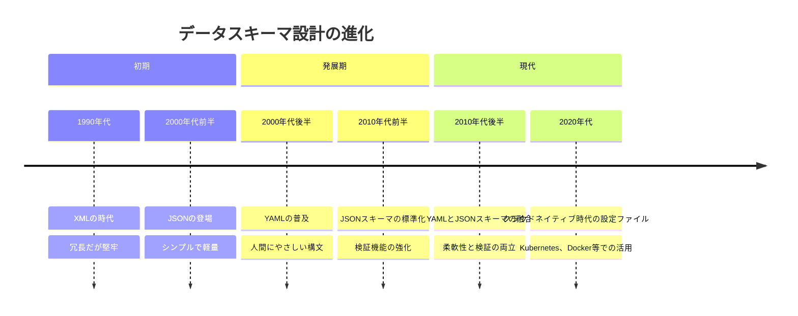
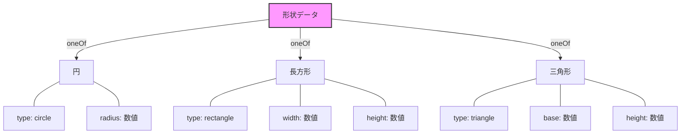
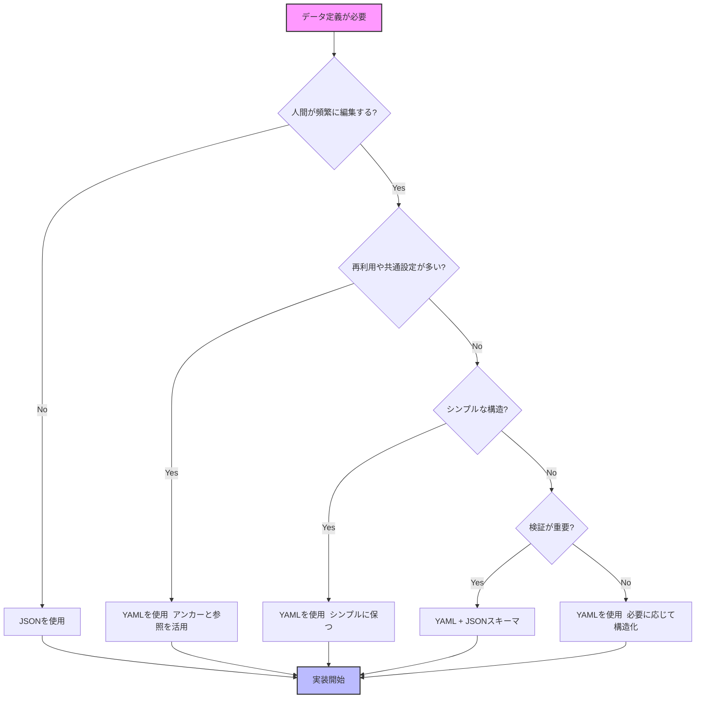

# YAMLとJSONを使ったデータスキーマ設計

:::message
This article is generated by Claude.
:::

皆さん、こんにちは！設定ファイルやデータ定義を書くとき、YAMLとJSONのどちらを選んでいますか？ 🤔

プロジェクトが大きくなるにつれて、設定ファイルやデータスキーマの管理は複雑になりがちです。特に似たような定義が何度も出てくると、コピペの嵐になってメンテナンス性が低下します。今回は、YAMLとJSONの特性を比較しながら、実践的なデータスキーマ設計の手法について掘り下げていきましょう！

## YAMLとJSONの基本的な違い

まずは、YAMLとJSONの基本的な違いを見てみましょう。両者とも階層構造を持つデータを表現できますが、書き方や機能に大きな違いがあります。


### 同じデータの表現方法の違い

同じデータ構造をYAMLとJSONで表現すると、こんな違いがあります：

#### JSON形式

```json
{
  "server": {
    "host": "example.com",
    "port": 8080,
    "enabled": true,
    "tags": ["production", "web"],
    "settings": {
      "timeout": 30,
      "retries": 3
    }
  }
}
```

#### YAML形式

```yaml
server:
  host: example.com
  port: 8080
  enabled: true
  tags:
    - production
    - web
  settings:
    timeout: 30
    retries: 3
```

YAMLはインデントを使って階層構造を表現するため、視覚的にすっきりしています。また、JSONにはない機能として、YAMLには「アンカー」と「参照」があります。これが今回の主役となります！ 🌟

## YAMLの強み：アンカーと参照

YAMLの最大の強みの一つが、「アンカー」と「参照」の機能です。これらを使うと、同じ定義を何度も書く必要がなくなります。

```yaml
# アンカーの定義（&でアンカー名を付ける）
base_settings: &base
  timeout: 60
  retry: 3
  logging: true

# アンカーの参照（*でアンカー名を参照）
production:
  <<: *base  # base_settingsの内容を展開
  environment: production
  debug: false

development:
  <<: *base  # 同じbase_settingsの内容を再利用
  environment: development
  debug: true
```

この例では、`base_settings`という共通設定を一度定義し、productionとdevelopmentの両方でそれを参照しています。`<<:`という記法は「マージキー」と呼ばれ、参照先の内容をその位置に展開します。


:::message alert
JSONにはこのようなアンカーと参照の機能はありません！同じ内容を複数箇所で使いたい場合は、それぞれの場所に同じ定義を書く必要があります。
:::

## データスキーマ設計の変遷：時間軸で見る進化

データスキーマ設計手法は時代とともに進化してきました。その歴史をグラフィックレコーディングの手法で表現してみましょう：



この進化の中で、YAMLとJSONはそれぞれの長所を活かして共存しています。特にクラウドネイティブの世界では、YAMLが設定ファイルの主流となっていますね。

## 実践的なYAMLスキーマ設計テクニック

それでは、YAMLを使った実践的なスキーマ設計テクニックを見ていきましょう。

### 1. 共通設定の再利用パターン

複数の環境や設定で共通部分を再利用するパターンです：

```yaml
# データベース接続の基本設定
db_connection: &db_default
  driver: mysql
  host: localhost
  port: 3306
  timeout: 30
  pool:
    max: 10
    idle: 5

# 各環境での設定
environments:
  production:
    database:
      <<: *db_default  # 基本設定を展開
      host: prod-db.example.com  # 上書き
      name: app_production
      user: prod_user
  
  staging:
    database:
      <<: *db_default
      host: stage-db.example.com
      name: app_staging
      user: stage_user
  
  development:
    database:
      <<: *db_default  # 開発環境ではlocalhostをそのまま使用
      name: app_development
      user: dev_user
```

このパターンを使えば、共通設定を一箇所で管理しつつ、環境ごとに必要な部分だけを上書きできます。設定ファイルがすっきりして、メンテナンスも容易になりますね！ 🧹

### 2. 複合型定義による柔軟なスキーマ設計

YAMLのアンカー機能とJSONスキーマの型システムを組み合わせると、より柔軟で再利用性の高いスキーマを設計できます：

```yaml
# 基本的な型定義
definitions:
  non_empty_string: &non_empty_string
    type: string
    minLength: 1
  
  email: &email
    allOf:
      - *non_empty_string  # 非空文字列の性質を継承
      - format: email      # さらにメール形式の制約を追加
  
  phone_number: &phone
    type: string
    pattern: "^\\+?[0-9]{10,15}$"
  
  # 連絡先情報の複合型
  contact_info: &contact_info
    type: object
    properties:
      email: *email
      phone: *phone
    required: [email]  # メールは必須、電話番号はオプション

# ユーザースキーマ
user:
  type: object
  properties:
    id:
      type: string
      format: uuid
    name:
      $ref: "#/definitions/non_empty_string"  # JSONスキーマの参照方式
    contact:
      $ref: "#/definitions/contact_info"
  required: [id, name, contact]
```

この例では、YAMLのアンカー(`&`と`*`)とJSONスキーマの`$ref`参照を組み合わせています。型定義を再利用することで、スキーマの一貫性を保ちながら複雑なデータ構造を表現できるようになります。

### 3. アンカーのスコープとマルチドキュメント活用

YAMLでは、1つのファイルに複数のドキュメントを含めることができます。各ドキュメントは`---`で区切られます。これを活用すると、アンカーのスコープを制御できます：

```yaml
# グローバル定義（共通で使える）
---
common: &common
  version: 1.0
  updated_at: 2025-04-29
  company: Example Corp

# アプリケーション設定
---
app_config:
  name: MyAwesomeApp
  <<: *common  # 共通定義を展開
  features:
    dark_mode: true
    notifications: true

# APIサーバー設定
---
api_server:
  <<: *common  # 同じ共通定義を再利用
  host: api.example.com
  port: 443
  ssl: true
```

この方法を使うと、関連する設定をグループ化しながらも、共通の定義を再利用できます。大規模な設定が必要なプロジェクトで特に役立ちます。

## 複雑なデータ構造のモデリング

より複雑なデータ構造は、YAMLのアンカーとJSONスキーマの論理演算子を組み合わせてモデリングできます。

### 和型（Sum Type / Union Type）の表現

異なる種類のデータを表現する「和型」は、JSONスキーマの`oneOf`で表現できます：



これをYAML+JSONスキーマで表現すると：

```yaml
# 図形の和型表現
shape:
  oneOf:
    - type: object
      properties:
        type: 
          enum: [circle]
        radius:
          type: number
      required: [type, radius]
    - type: object
      properties:
        type:
          enum: [rectangle]
        width:
          type: number
        height:
          type: number
      required: [type, width, height]
    - type: object
      properties:
        type:
          enum: [triangle]
        base:
          type: number
        height:
          type: number
      required: [type, base, height]
```

この設計手法は、APIのレスポンスや設定ファイルで異なる種類のデータを扱う場合に非常に便利です。

### 直積型（Product Type）の表現

複数の型を組み合わせる「直積型」は、オブジェクトのネストで表現できます：

```yaml
# 人物と住所の直積型
person_with_address:
  type: object
  properties:
    person:
      type: object
      properties:
        name:
          type: string
        age:
          type: integer
      required: [name, age]
    address:
      type: object
      properties:
        street:
          type: string
        city:
          type: string
      required: [street, city]
  required: [person, address]
```

このパターンを使うと、関連するデータをグループ化して、より表現力豊かなデータモデルを構築できます。

## YAMLとJSONを使い分ける実践的ガイドライン

YAMLとJSONには、それぞれ得意分野があります。それらをどう使い分けるべきか、実践的なガイドラインを示します：



## 実際のユースケース：Kubernetesの設定ファイル

実際のユースケースとして、Kubernetesの設定ファイルを見てみましょう。Kubernetesでは、YAML形式の設定ファイルが広く使われています：

```yaml
# ベースとなるPodの設定
base_pod: &base_pod
  metadata:
    labels:
      app: myapp
  spec:
    containers:
    - name: myapp
      image: myapp:latest
      resources:
        limits:
          memory: "256Mi"
          cpu: "500m"
      ports:
      - containerPort: 8080

# ウェブアプリケーションのデプロイメント
apiVersion: apps/v1
kind: Deployment
metadata:
  name: myapp-web
spec:
  replicas: 3
  selector:
    matchLabels:
      app: myapp
      component: web
  template:
    <<: *base_pod  # ベース設定を継承
    metadata:
      labels:
        app: myapp
        component: web
    spec:
      containers:
      - name: myapp
        env:
        - name: COMPONENT
          value: "web"

# APIサーバーのデプロイメント
apiVersion: apps/v1
kind: Deployment
metadata:
  name: myapp-api
spec:
  replicas: 2
  selector:
    matchLabels:
      app: myapp
      component: api
  template:
    <<: *base_pod  # 同じベース設定を再利用
    metadata:
      labels:
        app: myapp
        component: api
    spec:
      containers:
      - name: myapp
        env:
        - name: COMPONENT
          value: "api"
```

この例では、共通のPod設定をアンカー(`&base_pod`)で定義し、異なるデプロイメントで参照(`<<: *base_pod`)しています。これによって、重複を減らし、一貫性のある設定を維持できます。

:::message
Kubernetesの実際の設定ファイルでは、このようなYAMLのアンカーと参照機能は使用されないことが多いです。これは、Kubernetesのリソースが通常は個別のファイルとして管理され、さらに高度なツール（Helm、Kustomizeなど）によってテンプレート化されるためです。上記の例は、YAMLの機能を説明するための例として示しています。
:::

## まとめ：各アプローチの長所と使い分け

YAMLとJSONを使ったデータスキーマ設計について見てきましたが、それぞれの長所と使い分けをまとめると：

| 特性 | YAML | JSON | 使い分けのポイント |
|------|------|------|-------------------|
| 可読性 | ⭐⭐⭐⭐⭐ | ⭐⭐⭐ | 人間が頻繁に編集する場合はYAML |
| 記述量 | ⭐⭐⭐⭐⭐ | ⭐⭐⭐ | より簡潔に書きたいならYAML |
| 処理速度 | ⭐⭐⭐ | ⭐⭐⭐⭐⭐ | パフォーマンスが重要ならJSON |
| 再利用性 | ⭐⭐⭐⭐⭐ | ⭐ | 共通設定が多いならYAML |
| ツールサポート | ⭐⭐⭐⭐ | ⭐⭐⭐⭐⭐ | 広いエコシステムが必要ならJSON |
| 構文エラーの発見 | ⭐⭐ | ⭐⭐⭐⭐ | インデントによるエラーを避けたいならJSON |

YAMLのアンカーと参照機能は、大規模で複雑な設定ファイルを管理する上で非常に強力なツールです。特に、似たような設定が何度も出てくる場合に、コードの重複を減らし、メンテナンス性を高めることができます。

一方、JSONはシンプルで厳格な構文を持ち、多くのプログラミング言語やツールでネイティブにサポートされています。特に、プログラムによって生成・消費されるデータ交換の形式としては優れています。

最終的には、プロジェクトの要件やチームの好みに合わせて選択するのがベストです。また、両者のいいとこ取りをするアプローチとして、YAMLの構文の読みやすさとJSONスキーマの型検証能力を組み合わせる方法も効果的です。

あなたのプロジェクトでも、これらの設計手法を活用して、より保守性の高い、堅牢なデータ定義を作ってみてください！ 🚀
