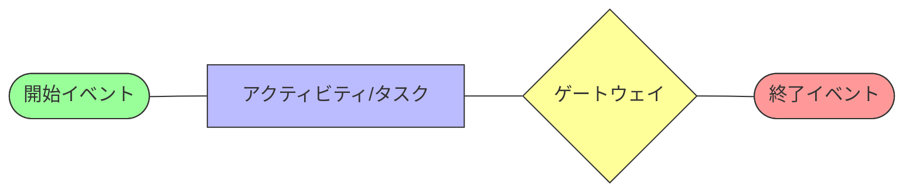
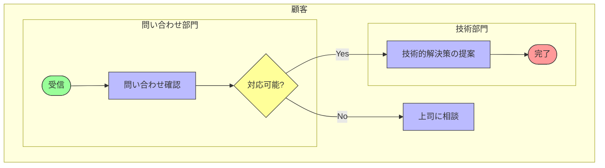
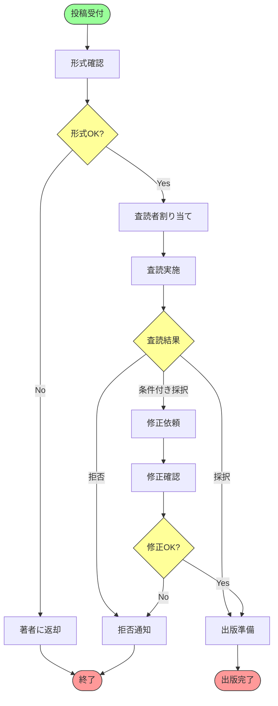

:::message
This chapter is generated by Claude.
:::

## BPMNとは 🔍

BPMN（Business Process Model and Notation）は、ビジネスプロセスを視覚的に表現するための標準的な表記法です。2004年にBPMI（Business Process Management Initiative）によって策定され、その後OMGに引き継がれ、現在はBPMN 2.0が最新バージョンとして広く使用されています。

簡単に言えば、BPMNは「業務の流れ」を誰にでもわかる形で図に表すための共通言語です。「この業務ではまず何をして、次に何をして...」という作業の順番や条件分岐を、特定の記号や図形を使って表現します。

## BPMNの主要要素 🧩

BPMNには数多くの記号がありますが、基本的な要素は以下の4つのカテゴリに分類されます：

1. **フローオブジェクト**：プロセスの主要な構成要素
2. **接続オブジェクト**：フローオブジェクトを接続する線
3. **スイムレーン**：プロセスの責任者や部門を表す
4. **アーティファクト**：追加情報を提供する要素

### 1. フローオブジェクト

- **イベント**：プロセスの「何かが起こる」ポイント（丸い形）
  - 開始イベント：プロセスの開始点
  - 中間イベント：プロセス中で発生するイベント
  - 終了イベント：プロセスの終了点

- **アクティビティ**：実行される作業（角丸の長方形）
  - タスク：分割できない単一の作業
  - サブプロセス：さらに詳細化できる複合的な作業

- **ゲートウェイ**：プロセスの分岐や結合（ダイヤモンド形）
  - 排他（XOR）ゲートウェイ：条件によって一つのパスを選択
  - 並列（AND）ゲートウェイ：複数のパスを同時に実行
  - 包含（OR）ゲートウェイ：条件によって複数のパスを選択可能

### 2. 接続オブジェクト

- **シーケンスフロー**：アクティビティの実行順序を示す（実線矢印）
- **メッセージフロー**：異なるプール間のメッセージ交換（破線矢印）
- **関連**：アーティファクトとの関連を示す（点線）

### 3. スイムレーン

- **プール**：参加者（組織や部門）を表す大きな箱
- **レーン**：プールをさらに分割し、役割や部署を表す

### 4. アーティファクト

- **データオブジェクト**：アクティビティで必要なデータを表す
- **グループ**：関連するアクティビティをグループ化する
- **テキスト注釈**：追加の説明文

## BPMNダイアグラムの例 ✨

では、簡単な例として「論文査読プロセス」をBPMNで表現してみましょう：

この図を見れば、論文がどのようなプロセスで審査され、出版されるかが一目でわかりますね！

## BPMNの利点と課題 👍👎

### 利点
- **標準化**：国際標準として広く認知されている
- **表現力**：ビジネスプロセスを詳細に表現できる
- **理解しやすさ**：技術者と非技術者の橋渡しになる
- **自動化**：BPMSツールで直接実行可能

### 課題
- **複雑さ**：多くの記号があり学習コストが高い
- **柔軟性の欠如**：非構造的なプロセスの表現が難しい（ここでCMMNの出番！）
- **決定ロジックの表現**：複雑な意思決定の詳細表現が難しい（ここでDMNの出番！）

## BPMNの実務での活用シーン 💼

BPMNは以下のようなシーンで特に効果を発揮します：

1. **業務プロセスの可視化と共有**  
   「うちの会社のこの業務、実際どうなってるの？」という疑問に答える

2. **業務改善の基盤作り**  
   現状のプロセスを図示することで、無駄や改善点が見えてくる

3. **システム要件定義**  
   新システムが対応すべき業務フローを明確に定義

4. **BPM（ビジネスプロセス管理）の基盤**  
   モデルからワークフローを自動生成

:::message
実際のビジネスシーンでは、完璧な図を作ることより、関係者間で「プロセスの共通理解」を作ることが重要です。小さく始めて、徐々に詳細化していく方法がオススメです！
:::

## BPMNモデリングの実践ポイント 🔑

BPMNを効果的に活用するためのポイントをいくつか紹介します：

### 目的を明確に
モデリングの目的（コミュニケーション用か、自動化用かなど）によって、必要な詳細度が変わります。

### 適切な抽象度を選ぶ
すべてを詳細に描くと複雑になりすぎるため、最初は大まかに、必要に応じて詳細化するアプローチが効果的です。

### 命名規則を統一
「申請書確認」と「申請書チェック」など、似た表現の乱用を避け、用語を統一しましょう。

### レビューを重視
多くの関係者にモデルをレビューしてもらい、実際のプロセスと合っているか確認することが重要です。

## 次のステップ 🚶

BPMNの基本を理解したところで、次のような疑問が浮かぶかもしれません：

- 「でも、うちの業務はケースバイケースで、決まったフローがない部分もあるんだけど...」
- 「複雑な判断ロジックをもっと詳細に表現したいんだけど...」

そんな時こそ、次の章で紹介するCMMN（ケース管理）とDMN（意思決定モデル）の出番です！これらのモデリング言語とBPMNを組み合わせることで、より複雑なビジネスロジックも表現できるようになります。

:::details BPMNツールの例
- [Camunda Modeler](https://camunda.com/download/modeler/) - オープンソースのBPMNモデリングツール
- [Bizagi Modeler](https://www.bizagi.com/en/platform/modeler) - 無料のBPMNモデリングツール
- [Signavio/SAP Signavio Process Manager](https://www.signavio.com/) - エンタープライズ向けBPMツール
- [Visual Paradigm](https://www.visual-paradigm.com/) - 統合モデリングプラットフォーム
:::
