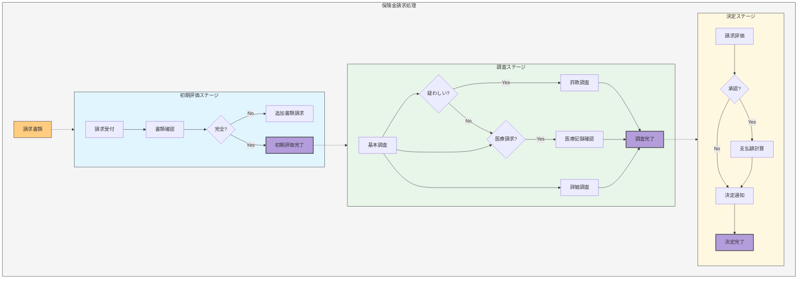
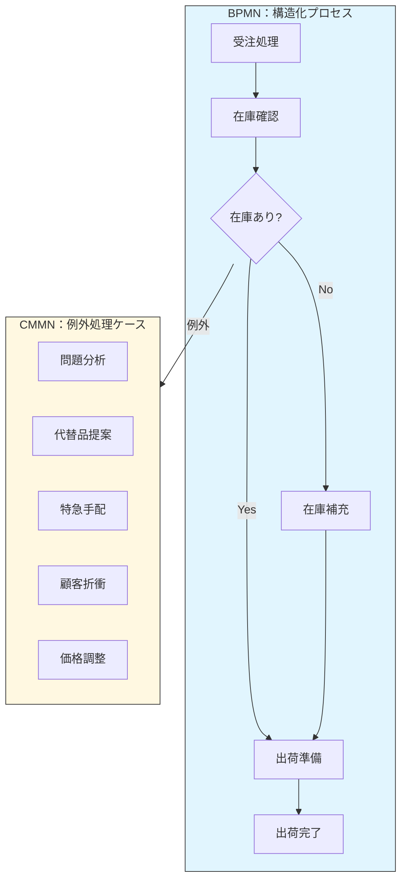

:::message
This chapter is generated by Claude.
:::

## CMMNとは：非構造化プロセスへの挑戦 🔍

CMMN（Case Management Model and Notation）は、従来のプロセスモデリングでは表現しきれなかった「非構造化」で「知識労働者主導」のプロセスを表現するために開発されたモデリング言語です。2014年にOMG（Object Management Group）によって標準化され、現在はCMMN 1.1が最新バージョンとして使用されています。

### BPMNとの違い：「レシピ」と「レシピ本」の違い 🍳

BPMNとCMMNの違いを料理に例えると分かりやすいかもしれません：

- **BPMN**：「レシピ」のようなもの。一連の手順が明確に定義され、同じ順序で繰り返し実行される
- **CMMN**：「レシピ本」のようなもの。状況に応じて参照する章が変わり、知識と経験に基づいて臨機応変に対応する

つまり、CMMNは以下のような特性を持つプロセスに適しています：

- 実行順序が事前に決まっていない
- 知識労働者の判断で進行が変わる
- ケースごとに異なる対応が必要

## CMMNの主要要素 🧩

CMMNのモデルは「ケース」と呼ばれる単位で表現され、以下の主要要素から構成されます：

### 1. ケースファイル項目（Case File Items）
ケースに関連するデータやドキュメントを表します。フォルダアイコンで表現されます。

### 2. ケースプラン（Case Plan）
ケース全体を表す大きな枠組みです。角の丸い長方形で表現されます。

### 3. ステージ（Stages）
関連するケースタスクをグループ化したもので、「フェーズ」と考えることもできます。角の丸い長方形で表現され、左上に折り目アイコンがあります。

### 4. タスク（Tasks）
実際の作業単位を表します。タスクには以下の種類があります：
- **人間タスク（Human Task）**：人が実行する作業
- **プロセスタスク（Process Task）**：BPMNプロセスを呼び出す作業
- **ケースタスク（Case Task）**：別のCMMNケースを呼び出す作業
- **意思決定タスク（Decision Task）**：DMNモデルを呼び出す作業

### 5. マイルストーン（Milestones）
ケースの重要な状態や達成点を表します。角の丸い長方形で表現されます。

### 6. イベントリスナー（Event Listeners）
特定のイベントを検出します。円形で表現されます。

### 7. センティネル（Sentries）
条件やイベントに基づいて、要素の実行可能性を制御します。ダイヤモンド形のアイコンで表現されます。

## CMMNダイアグラムの例 ✨

具体例として、「保険金請求処理」のケースをCMMNで表現してみましょう：

この図では、保険金請求処理の流れがケースとして表現されています。初期評価、調査、決定という3つのステージに分かれており、それぞれの中に様々なタスクが含まれています。特に調査ステージでは、状況に応じて異なる調査パスが選択される可能性を示しています。

## CMMNの表記方法の詳細 📝

### プランニング表と実行表

CMMNの要素には、「計画時に決まるもの」と「実行時に決まるもの」という区別があります：

- **プランニング表（Planning Table）**：事前に定義された要素を表す
- **離散項目マーカー（Discretionary Item Marker）**：実行時に知識労働者の判断で追加できる要素を表す（点線の境界線で示される）

### アプリケータビリティルール

要素の実行条件を表す「センティネル（Sentries）」には主に2種類あります：

- **エントリクライテリア**：要素が開始できる条件（ダイヤモンドが要素の左側に表示）
- **エグジットクライテリア**：要素が終了する条件（ダイヤモンドが要素の右側に表示）

### 繰り返し表現

タスクやステージは繰り返し実行できることを示すマーカーがあります：

- **反復マーカー**：要素を複数回実行できることを示す（＃マーク）
- **必須マーカー**：要素が必ず実行されなければならないことを示す（！マーク）
- **自動開始マーカー**：条件が満たされると自動的に開始されることを示す（▶マーク）

## ユースケース：CMMNが適している場面 🎯

CMMNは以下のような業務プロセスに特に適しています：

1. **ケースワーク**
   - 保険金請求処理
   - 医療診断・治療計画
   - 法的手続き（訴訟など）

2. **インシデント管理**
   - ITサービスデスク
   - 緊急対応
   - 苦情処理

3. **プロジェクト管理**
   - 研究開発プロジェクト
   - ソフトウェア開発（特にアジャイル）
   - クリエイティブなプロジェクト

4. **顧客対応**
   - カスタマーサポート
   - 営業活動
   - オンボーディングプロセス

:::message
CMMNの強みは「知識労働者の裁量」を明示的にモデル化できることです。最初から完璧なプロセスを定義するのではなく、経験者の知見を活かして柔軟に対応できるプロセスを設計できます。
:::

## CMMNの利点と課題 👍👎

### 利点
- **柔軟性**：非構造化プロセスを表現できる
- **知識労働の可視化**：暗黙知を形式知化できる
- **BPMN/DMNとの連携**：3つのモデリング言語を組み合わせて使える
- **標準化**：OMGにより国際標準として定義されている

### 課題
- **普及度**：BPMNほど広く使われていない
- **学習曲線**：新しい概念のため学習コストが高い
- **ツールのサポート**：対応ツールがまだ限られている

## CMMNとBPMNの連携：ハイブリッドアプローチ 🔄

実際のビジネスでは、構造化されたプロセス（BPMN）と非構造化なケース（CMMN）が混在しています。両者を組み合わせることで、より現実的なモデルを作ることができます：

この例では、通常の受注処理はBPMNで表現されていますが、例外が発生した場合はCMMNのケース処理に移行します。ケース処理では、状況に応じて知識労働者が適切なアクションを選択できます。

## 次のステップ 🚶

CMMNの基本を理解したところで、次に考えるべきは「意思決定の詳細をどうモデル化するか」という問題です。BPMNのゲートウェイやCMMNのセンティネルの中にある「判断ロジック」をさらに詳細に表現するために、DMN（Decision Model and Notation）が必要になります。

次の章では、DMNについて詳しく見ていきましょう。DMNを加えることで、「プロセスフロー」「ケース管理」「意思決定ロジック」という3つの視点からビジネスを完全にモデル化できるようになります！

:::details CMMN対応ツール
- [Camunda Platform](https://camunda.com/) - BPMN, CMMN, DMNをサポートするオープンソースプラットフォーム
- [Trisotech Digital Enterprise Suite](https://www.trisotech.com/) - BPMN, CMMN, DMNのモデリングとシミュレーションをサポート
- [KnowProcess](https://knowprocess.com/) - ケース管理に特化したツール
- [IBM Case Manager](https://www.ibm.com/products/case-manager) - エンタープライズケース管理ソリューション
:::
