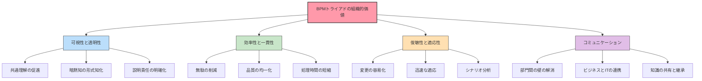
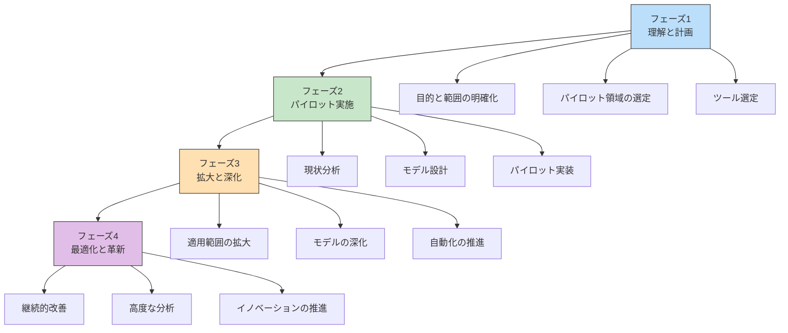
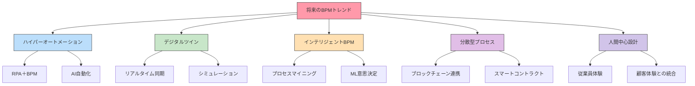

:::message
This chapter is generated by Claude.
:::

## ビジネスプロセスモデリングの旅を振り返って 🗺️

本書では、ビジネスプロセスモデリングの3大標準であるBPMN、CMMN、DMNについて詳しく学んできました。この最終章では、これまでの学びを振り返り、これからのビジネスプロセスモデリングの可能性と未来への展望を考えていきましょう。

私たちの旅は、次のような道のりをたどってきました：

この旅を通じて、ビジネスプロセスをモデル化する3つの視点を学びました：

- **BPMN**：「何を」「いつ」するか（プロセスの流れ）
- **CMMN**：「状況に応じて何が」必要か（ケース管理）
- **DMN**：「どのように」判断するか（意思決定ロジック）

これらの3つのモデリング言語を組み合わせることで、ビジネスロジック全体を包括的に表現できることを理解しました。では、これまでの学びを総括し、これからのビジネスプロセスモデリングの展望を考えていきましょう。

## BPMトライアドがもたらす組織的価値 💎

BPMトライアド（BPMN、CMMN、DMN）の活用がもたらす組織的価値について考えてみましょう。

### 1. 可視性と透明性の向上

ビジネスプロセスを明確に可視化することで、以下のような価値が生まれます：

- **共通理解の促進**：部門を超えた一貫した理解が可能に
- **暗黙知の形式知化**：個人の頭の中にあった知識が組織の資産に
- **説明責任の明確化**：誰が何をすべきかが明確に
- **トレーサビリティの確保**：なぜその判断がなされたかを追跡可能に

### 2. 効率性と一貫性の向上

標準化されたプロセスとルールにより、以下のような効果が期待できます：

- **無駄の削減**：重複作業や非効率な手順の特定と改善
- **品質の均一化**：担当者による判断のばらつきを軽減
- **パフォーマンスの向上**：最適化されたプロセスによる処理時間の短縮
- **エラーの削減**：明確なルールとガイダンスによるミスの防止

### 3. 俊敏性と適応性の強化

モデルベースのアプローチにより、変化への対応力が高まります：

- **変更の容易化**：モデルの修正だけで業務変更が可能に
- **迅速な適応**：市場や規制の変化に素早く対応
- **シナリオ分析**：モデル上でのシミュレーションによる影響予測
- **継続的改善**：データに基づく段階的な最適化

### 4. コミュニケーションの改善

共通言語としてのモデリングにより、以下の効果が生まれます：

- **部門間の壁の解消**：共通のモデルを通じた対話
- **ビジネスとITの連携強化**：相互理解の促進
- **ステークホルダーの巻き込み**：視覚的モデルを通じた参加
- **知識の共有と継承**：モデルを通じた効果的な知識移転

## 成功するモデリング導入のロードマップ 🗺️

ビジネスプロセスモデリングを組織に導入するには、段階的なアプローチが効果的です。以下に、成功するための4段階のロードマップを提案します。

### フェーズ1：理解と計画（1-3ヶ月）

- **目的と範囲の明確化**：なぜモデリングを導入するのか？
- **パイロット領域の選定**：小規模な成功体験を作るための対象業務
- **チーム編成**：ビジネスとIT両方のスキルを持つコアチーム
- **ツール選定**：組織の成熟度と目的に合ったツールの選択
- **トレーニング計画**：必要なスキルと知識の習得計画

### フェーズ2：パイロット実施（3-6ヶ月）

- **現状分析**：対象業務の現状プロセスの可視化
- **モデル設計**：BPMNを中心とした初期モデルの作成
- **検証とレビュー**：ステークホルダーとのモデル確認
- **パイロット実装**：限定的な範囲での実装とテスト
- **効果測定**：KPIに基づく効果の可視化

### フェーズ3：拡大と深化（6-12ヶ月）

- **適用範囲の拡大**：他の業務領域へのモデリング展開
- **モデルの深化**：CMMNやDMNの追加によるモデルの充実
- **ガバナンス体制の確立**：モデル管理とバージョン管理の仕組み
- **自動化の推進**：プロセスエンジンなどを活用した自動化
- **成功事例の共有**：組織内での普及促進

### フェーズ4：最適化と革新（12ヶ月以降）

- **継続的改善**：データに基づくモデルの最適化
- **高度な分析の導入**：プロセスマイニングなどの活用
- **イノベーションの推進**：モデルを基盤とした業務革新
- **エコシステムの拡大**：社外連携も含めたプロセスの統合
- **成熟度の向上**：組織全体のBPM能力の継続的な向上

## 成功のための7つの原則 🌟

ビジネスプロセスモデリングを成功させるための7つの基本原則をご紹介します。

### 1. 目的志向の原則

**「なぜ」モデリングをするのかを常に意識する**

- 明確な目的と期待成果を定義する
- 目的に合わせてモデルの詳細度を調整する
- ROI（投資対効果）を測定可能にする

### 2. 価値重視の原則

**顧客価値や業務価値を生まない活動を排除する**

- 価値を生まない活動（無駄）を特定する
- エンドツーエンドでの価値創出を考える
- 改善の優先順位を価値基準で決定する

### 3. 適切な抽象化の原則

**モデルは複雑さを「管理」するためのもの**

- 必要以上に詳細にしない
- 目的に応じた抽象度を選択する
- 階層的なモデル構造で複雑さを管理する

### 4. 協働の原則

**モデリングは「共創」のプロセス**

- ビジネスとITの協働を促進する
- 実際の業務担当者を巻き込む
- 多様な視点を取り入れる

### 5. 段階的アプローチの原則

**一度にすべてを完璧にしようとしない**

- 小さく始めて段階的に拡大する
- 早期の成功体験を重視する
- 継続的な改善サイクルを回す

### 6. 実証ベースの原則

**データと事実に基づいた判断を行う**

- 実測データでモデルを検証する
- 仮説と検証のサイクルを回す
- 成果を定量的に測定する

### 7. 全体最適の原則

**部分最適より全体最適を重視する**

- サイロを超えたエンドツーエンドの視点
- 上流・下流への影響を考慮する
- システム思考で複雑な関係性を理解する

:::message
これらの原則は、単なるテクニカルなモデリングのガイドラインではなく、ビジネスプロセスマネジメント全体の成功を導く考え方です。モデルは「絵」ではなく、業務改善と価値創出のための強力なツールであることを常に意識しましょう。
:::

## 将来のトレンドとイノベーション 🚀

ビジネスプロセスモデリングの将来を形作る重要なトレンドと、それがもたらす可能性について考えてみましょう。

### 1. ハイパーオートメーション

複数の自動化技術を統合したエンドツーエンドの自動化が進展します。

- **RPA＋BPM**：ロボティックプロセス自動化とBPMの連携
- **インテリジェントオートメーション**：AIと業務自動化の融合
- **ローコード・ノーコード**：技術者でなくても実装可能に
- **自律型プロセス**：自己修復や自己最適化するプロセス

### 2. デジタルツインとシミュレーション

実世界のプロセスをデジタル空間で再現し、実験や予測を行います。

- **リアルタイムモニタリング**：実際のプロセスとデジタルモデルの同期
- **What-If分析**：変更影響のシミュレーション
- **予測的プロセス管理**：問題発生前の予防的対応
- **最適化シナリオ**：様々な条件での最適解の探索

### 3. インテリジェントBPM

AIがプロセスの理解、実行、最適化を支援します。

- **プロセスマイニング**：実行データからのモデル発見と検証
- **自然言語プロセスモデリング**：言葉からモデルを生成
- **意思決定の高度化**：機械学習によるルールの最適化
- **コンテキストアウェアプロセス**：状況に応じた適応型プロセス

### 4. 分散型プロセス実行

ブロックチェーンや分散台帳技術がプロセス実行の新たな可能性を開きます。

- **組織間プロセス**：信頼性の高い企業間プロセス連携
- **スマートコントラクト**：自動執行型の契約プロセス
- **プロセストークン化**：プロセス参加へのインセンティブ設計
- **分散型自律組織（DAO）**：自律的に運営されるプロセス組織

### 5. 人間中心のプロセスデザイン

テクノロジーだけでなく、人間の経験を重視したアプローチが広がります。

- **従業員体験（EX）の向上**：プロセス参加者の満足度向上
- **顧客体験（CX）との統合**：内部プロセスと顧客体験の一体化
- **デザイン思考の導入**：共感に基づくプロセス設計
- **エンゲージメント主導型プロセス**：参加を促すゲーミフィケーション

## 学びを実践に移すためのアクションプラン 🎯

本書の学びを実際の業務に活かすための具体的なステップをご紹介します。

### 初級者向けアクションプラン

ビジネスプロセスモデリングを始めたばかりの方へのアドバイスです。

1. **基礎知識の習得**
   - 標準的なBPMN記法の習得（2週間）
   - 無料モデリングツールの試用（1週間）
   - 既存の業務を簡易的にモデル化（2週間）

2. **小さなプロジェクトの実施**
   - 身近な業務プロセスの可視化（現状把握）
   - 改善点の特定とモデル修正（To-Be設計）
   - 関係者とのモデル共有と議論

3. **スキルの拡張**
   - コミュニティや勉強会への参加
   - オンラインチュートリアルの活用
   - 認定資格の取得検討（OCEB、CBPP等）

### 中級者向けアクションプラン

既にBPMNの基礎を理解している方へのステップアップ策です。

1. **モデリングスキルの拡張**
   - CMMNとDMNの学習
   - モデル間の連携パターンの習得
   - 実装を見据えた詳細なモデリング

2. **組織内普及の推進**
   - モデリングガイドラインの策定
   - 社内ワークショップの開催
   - モデリング成功事例の共有

3. **自動化への挑戦**
   - プロセスエンジンの導入検討
   - シンプルなプロセスの自動化実験
   - API連携などの技術検証

### 上級者向けアクションプラン

モデリングと実装経験がある方への次のステップです。

1. **高度なモデリングと分析**
   - プロセスマイニングの導入
   - シミュレーションによる最適化
   - 複雑なエンドツーエンドプロセスのモデル化

2. **エンタープライズBPMの展開**
   - BPM推進センターの設立
   - 組織全体のプロセスアーキテクチャ設計
   - ガバナンスと標準化の推進

3. **イノベーションの推進**
   - AIとBPMの統合検証
   - デジタルツインの構築
   - 新しいビジネスモデルの探索

## 継続的な学習のための資源 📚

ビジネスプロセスモデリングの学習を継続するための情報源をご紹介します。

### 公式資料とガイド

- **OMG仕様書**：[BPMN 2.0仕様](https://www.omg.org/spec/BPMN/), [CMMN 1.1仕様](https://www.omg.org/spec/CMMN/), [DMN 1.3仕様](https://www.omg.org/spec/DMN/)
- **各ツールのドキュメント**：[Camunda Docs](https://docs.camunda.org/), [Flowable Docs](https://www.flowable.com/open-source/docs/), [Trisotech Resources](https://www.trisotech.com/resources/)
- **標準化団体の資料**：[ABPMP BPM CBOK](https://www.abpmp.org/), [WfMC](https://www.wfmc.org/), [BPTrends](https://www.bptrends.com/)

### コミュニティとフォーラム

- **ソーシャルグループ**：[BPM.com](https://bpm.com/), [LinkedIn BPM Groups](https://www.linkedin.com/groups/), [BPMN Forum](https://forum.bpmn.io/)
- **オープンソースコミュニティ**：[Camunda Forum](https://forum.camunda.org/), [Flowable Forum](https://forum.flowable.org/), [jBPM Community](https://www.jbpm.org/community/)
- **イベントと会議**：[BPM Conference](https://bpm-conference.org/), [CamundaCon](https://camunda.com/events/camundacon/), [Process Excellence Network](https://www.processexcellencenetwork.com/)

### 学習プラットフォームとコース

- **オンラインコース**：[Coursera BPM Courses](https://www.coursera.org/), [Udemy BPM Courses](https://www.udemy.com/topic/business-process-management/), [edX Process Mining](https://www.edx.org/)
- **認定資格プログラム**：[OMG OCEB 2](https://www.omg.org/oceb-2/), [ABPMP CBPP](https://www.abpmp.org/page/certification), [Camunda Certification](https://camunda.com/services/training/)
- **学術リソース**：[Springer BPM Books](https://www.springer.com/), [IEEE BPM Publications](https://www.ieee.org/), [ACM Digital Library](https://dl.acm.org/)

### ブログと最新情報

- **企業ブログ**：[Camunda Blog](https://camunda.com/blog/), [Signavio Blog](https://www.signavio.com/blog/), [Appian Blog](https://www.appian.com/blog/)
- **専門家のブログ**：[Bruce Silver's Blog](https://methodandstyle.com/blog/), [Sandy Kemsley's Column 2](https://column2.com/), [BPM Leader](https://www.bpmleader.com/)
- **ニュースレター**：[BPM.com Newsletter](https://bpm.com/), [Process Excellence Network](https://www.processexcellencenetwork.com/), [Digital Enterprise Community](https://www.linkedin.com/groups/77912/)

## おわりに：ビジネスプロセスモデリングの未来を創る 🌈

ビジネスプロセスモデリングの旅は、単なるテクニックの習得ではなく、組織変革の強力な武器を手に入れる過程です。本書を通じて学んだBPMN、CMMN、DMNという3つのモデリング言語は、それぞれ異なる視点からビジネスロジックを表現する力を持っていますが、その真の価値は組み合わせることで発揮されます。

現代のビジネス環境は、かつてないほど複雑で変化が速く、予測が難しいものになっています。このような環境で成功するには、ビジネスの「何を」「いつ」「どのように」を明確に定義し、柔軟に適応できる能力が不可欠です。BPMトライアドはまさにそのための強力なツールセットなのです。

しかし、忘れてはならないのは、モデリングはあくまで手段であり、目的ではないということです。最終的な目標は、顧客と従業員の体験を向上させ、組織の効率性と俊敏性を高め、ビジネス価値を創出することにあります。

これからビジネスプロセスモデリングの実践を始める方も、既に取り組んでいる方も、この本がお役に立てれば幸いです。モデリングの旅に終わりはありません。常に学び、試し、改善し続けることで、皆さんのビジネスと組織はより良い未来へと進化していくでしょう。

さあ、モデルを「描く」だけでなく「動かす」世界へ踏み出しましょう。ビジネスプロセスモデリングの真の力は、実践の中にこそあるのです。

:::message
「世界は考えるためにあるのではなく、変えるためにある。」 — カール・マルクス

モデリングも同様です。描くためでなく、変革するためにあるのです。
:::

## 著者からのメッセージ 💌

本書がビジネスプロセスモデリングの世界への入り口となり、皆さんの業務改革の一助となれば幸いです。学びを実践に移し、実際の成果を生み出していくことが、本書の最大の目的です。

皆さんのビジネスプロセスモデリングの旅が、発見と創造と変革に満ちたものになりますように。

より良いビジネスプロセスが、より良いビジネスを創ります。そして、より良いビジネスが、より良い世界を創ります。

ビジネスプロセスモデリングの可能性は無限大です。さあ、一緒に探求を続けましょう！

:::details 参考文献・リソース
- Silver, Bruce. "BPMN Method and Style, 2nd Edition." Cody-Cassidy Press, 2011.
- Freund, Jakob, and Bernd Rücker. "Real-Life BPMN: Using BPMN 2.0 to Analyze, Improve, and Automate Processes in Your Company." CreateSpace, 2016.
- Von Rosing, Mark, et al. "The Complete Business Process Handbook: Body of Knowledge from Process Modeling to BPM, Volume I." Morgan Kaufmann, 2014.
- Dumas, Marlon, et al. "Fundamentals of Business Process Management." Springer, 2018.
- Taylor, James, et al. "BPM for Dummies." Wiley, 2019.
- OMG. "Business Process Model and Notation (BPMN) Version 2.0.2." December 2013.
- OMG. "Case Management Model and Notation (CMMN) Version 1.1." December 2016.
- OMG. "Decision Model and Notation (DMN) Version 1.3." March 2020.
:::
