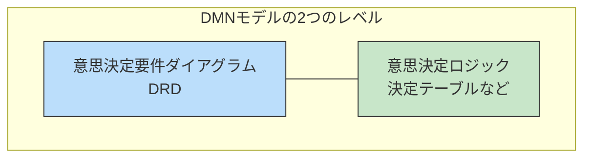
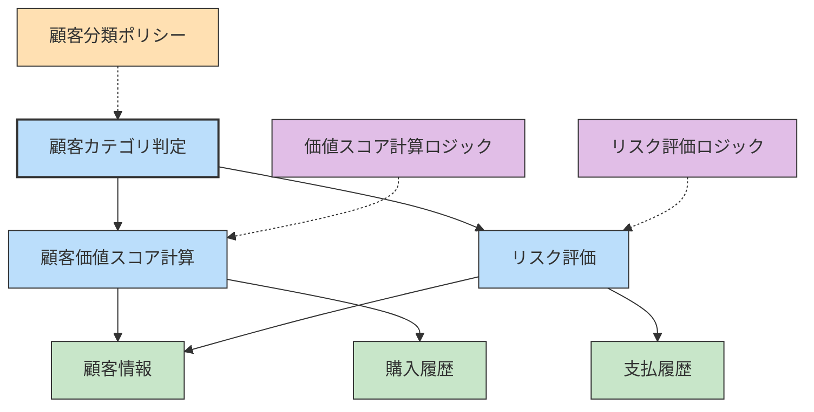
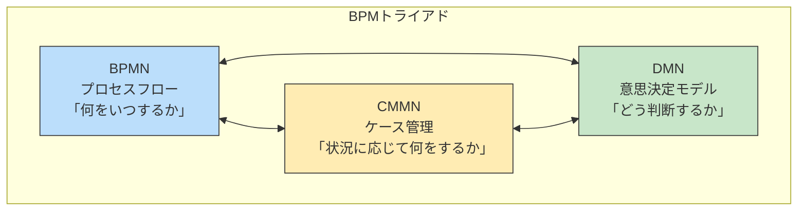

:::message
This chapter is generated by Claude.
:::

## DMNとは：意思決定ロジックを明確に 🔍

DMN（Decision Model and Notation）は、ビジネスにおける意思決定ロジックをモデル化するための標準的な表記法です。2015年にOMG（Object Management Group）によって標準化され、現在はDMN 1.3が最新バージョンとして利用されています。

DMNの目的は「どのように決断するか」という意思決定のロジックを明確かつ詳細に表現することです。BPMNやCMMNが「何をするか」や「いつ何をするか」を表現するのに対し、DMNは「なぜその選択をするのか」を表現します。

## なぜDMNが必要なのか？ 💡

ビジネスプロセス（BPMN）の中には多くの分岐点があり、ケース管理（CMMN）にも様々な判断ポイントがあります。しかし、これらのモデルだけでは「どのような条件で、どのような判断を行うか」という詳細なロジックまでは表現しきれません。

例えば：
- 「このお客様にはどのローンプランを提案すべきか？」
- 「この保険請求は承認すべきか、拒否すべきか？」
- 「この製品にはどの価格設定を適用すべきか？」

このような複雑な判断ロジックをDMNで表現することで、以下のようなメリットが生まれます：

- **透明性**：意思決定のロジックが誰でも理解できる形で表現される
- **一貫性**：同じ条件では同じ判断が行われることを保証できる
- **再利用性**：一度定義した決定ロジックを別のプロセスでも利用できる
- **自動化**：意思決定エンジンで直接実行することが可能

## DMNの2つの主要な構成要素 🧩

DMNは大きく分けて2つのレベルからなります：

1. **意思決定要件ダイアグラム（DRD: Decision Requirements Diagram）**  
   意思決定の構造と依存関係を示す高レベルの図

2. **意思決定ロジック（Decision Logic）**  
   具体的な判断ルールを定義する詳細レベル（主に決定テーブルで表現）

## 意思決定要件ダイアグラム（DRD）の要素 📊

DRDは意思決定の構造を視覚的に表現するもので、以下の主要な要素から構成されます：

### 1. 意思決定（Decision）
判断を行う対象を表します。長方形で表現され、内部に意思決定ロジック（主に決定テーブル）が定義されます。

### 2. 入力データ（Input Data）
意思決定に必要な外部からのデータを表します。角の丸い長方形で表現されます。

### 3. ナレッジソース（Knowledge Source）
意思決定の根拠となる知識や情報源（法律、ポリシー、専門家の知見など）を表します。折り目付きの長方形で表現されます。

### 4. ビジネスナレッジモデル（Business Knowledge Model）
再利用可能な意思決定ロジックを表します。折り目付きの長方形で表現されます。

### 5. 情報要求（Information Requirement）
意思決定が必要とする情報の流れを表す実線矢印です。

### 6. ナレッジ要求（Knowledge Requirement）
ビジネスナレッジモデルへの参照を表す点線矢印です。

### 7. 権威要求（Authority Requirement）
ナレッジソースへの参照を表す破線矢印です。

## 意思決定テーブルの構造 📋

DMNの中心的な表現方法である意思決定テーブルは、条件と結果を表形式で表したものです。以下のように構成されます：

| 入力条件1 | 入力条件2 | 出力結果 |
|---------|---------|--------|
| 条件値1-1 | 条件値2-1 | 結果1   |
| 条件値1-2 | 条件値2-2 | 結果2   |
| 条件値1-3 | 条件値2-3 | 結果3   |

実際の例として、「ローン承認」の意思決定テーブルを見てみましょう：

| 年収 | 信用スコア | ローン額 | 結果 |
|------|----------|--------|------|
| >=50,000 | >=700 | <=300,000 | 承認 |
| >=80,000 | >=650 | <=500,000 | 承認 |
| >=100,000 | >=600 | <=700,000 | 承認 |
| <50,000 | - | - | 拒否 |
| - | <600 | - | 拒否 |
| - | - | >700,000 | 追加審査 |

このテーブルは「どのような条件でローンを承認/拒否/追加審査するか」というロジックを明確に定義しています。

## DMNダイアグラムの例 ✨

具体例として、「顧客カテゴリ判定」のDMNモデルを見てみましょう：

この図では、「顧客カテゴリ判定」という最終的な意思決定が、「顧客価値スコア計算」と「リスク評価」という2つの下位決定に依存しています。それぞれの決定には必要な入力データがあり、再利用可能なロジックやポリシーが関連付けられています。

次に、「顧客カテゴリ判定」の決定テーブルを見てみましょう：

| 顧客価値スコア | リスク評価 | 顧客カテゴリ |
|--------------|----------|------------|
| >=80         | 低       | プラチナ    |
| >=60         | 低       | ゴールド    |
| >=80         | 中       | ゴールド    |
| >=40         | 低       | シルバー    |
| >=60         | 中       | シルバー    |
| >=80         | 高       | シルバー    |
| <40          | 低       | ブロンズ    |
| <60          | 中       | ブロンズ    |
| <80          | 高       | ブロンズ    |
| 任意          | 極高     | 対象外      |

この決定テーブルによって、顧客の価値スコアとリスク評価に基づいて、どのカテゴリに分類するかが明確に定義されています。

## DMNの表現力：FEEL式言語 🔣

DMNには、より複雑な条件や計算を表現するためのFEEL（Friendly Enough Expression Language）という式言語が含まれています。FEELを使うと、以下のような表現が可能になります：

- **数学的表現**：`(収入 * 0.2) + ボーナス`
- **条件式**：`if 年齢 >= 20 then "成人" else "未成年"`
- **リスト操作**：`購入履歴[最近3ヶ月].合計金額`
- **日付操作**：`today() - 契約日 > duration("P1Y")` （契約日から1年以上経過）

FEELを活用することで、単純な決定テーブルだけでは表現しきれない複雑なビジネスロジックも表現できるようになります。

## DMNの実用的なユースケース 🎯

DMNは以下のようなシーンで特に効果を発揮します：

### 1. 金融サービス
- ローン審査
- 与信管理
- 不正検知
- 投資商品の適合性判断

### 2. 保険業
- 引受基準
- 保険料計算
- 保険金支払い査定
- リスク評価

### 3. 顧客管理・マーケティング
- セグメンテーション
- キャンペーン適用条件
- 価格設定
- 個別化サービス判断

### 4. 規制遵守
- コンプライアンスチェック
- 適格性審査
- 税務計算

:::message
DMNの大きな価値は「ビジネスルールの所有権をビジネス部門に移す」点にあります。技術者ではない業務担当者でも理解・編集できるため、ルール変更のたびにシステム部門に依頼する必要がなくなります！🚀
:::

## DMNと他のモデルとの連携 🔄

DMNは単独でも使えますが、BPMNやCMMNと組み合わせることでより強力になります：

- **BPMNとDMN**：BPMNの分岐ゲートウェイでの判断ロジックをDMNで詳細化
- **CMMNとDMN**：CMMNのセンティネル（条件）の詳細ロジックをDMNで表現
- **三者の連携**：プロセス、ケース、意思決定の全体像を統合的にモデル化

## DMNの利点と課題 👍👎

### 利点
- **透明性**：「ブラックボックス」だった意思決定ロジックを可視化
- **ビジネス主導**：技術者でなくても理解・編集可能
- **一貫性**：同じ条件では常に同じ結果を保証
- **テスト可能性**：意思決定ロジックを独立してテスト可能
- **自動化**：DMNエンジンで直接実行可能

### 課題
- **普及度**：BPMNほど広く使われていない
- **表現の限界**：非常に複雑なロジックは表現しきれないことも
- **ツールサポート**：対応ツールがまだ限られている

## DMN導入のベストプラクティス 🔑

DMNを効果的に活用するためのポイントをいくつか紹介します：

### 1. 段階的アプローチ
最初から複雑なモデルを作るのではなく、主要な意思決定から始めて徐々に詳細化していく方法が効果的です。

### 2. ビジネス部門の関与
技術部門だけでなく、実際にルールを運用するビジネス部門の積極的な参加が成功の鍵です。

### 3. テストケースの作成
各決定テーブルに対して、様々な入力パターンとそれに対する期待結果を定義したテストケースを作成しましょう。

### 4. モジュール化と再利用
共通のビジネスロジックはBKM（Business Knowledge Model）として定義し、複数の意思決定で再利用できるようにしましょう。

### 5. ガバナンスの確立
意思決定モデルの変更管理やバージョン管理の仕組みを確立し、誰がいつどのように変更できるかを明確にしておきましょう。

## 次のステップ 🚶

DMNの基本を理解したところで、次の章ではBPMN、CMMN、DMNの3つのモデルがどのように連携し、相互作用するかについて詳しく見ていきます。これら3つを組み合わせることで、ビジネスロジック全体を表現できるようになります。

BPMN、CMMN、DMNは、それぞれが異なる視点からビジネスロジックを表現する「BPMトライアド」として機能します。次の章では、これらをどのように組み合わせて、より完全なビジネスモデルを構築するかを探っていきましょう！

:::details DMN対応ツール
- [Camunda Platform](https://camunda.com/) - BPMN, CMMN, DMNをサポートするオープンソースプラットフォーム
- [Trisotech Digital Enterprise Suite](https://www.trisotech.com/) - BPMN, CMMN, DMNのモデリングとシミュレーションをサポート
- [Red Hat Decision Manager](https://www.redhat.com/en/technologies/jboss-middleware/decision-manager) - 企業向け意思決定管理プラットフォーム
- [IBM Operational Decision Manager](https://www.ibm.com/products/operational-decision-manager) - エンタープライズ意思決定管理ソリューション
- [Signavio Decision Manager](https://www.signavio.com/products/decision-manager/) - ビジネス向け意思決定管理ツール
:::
