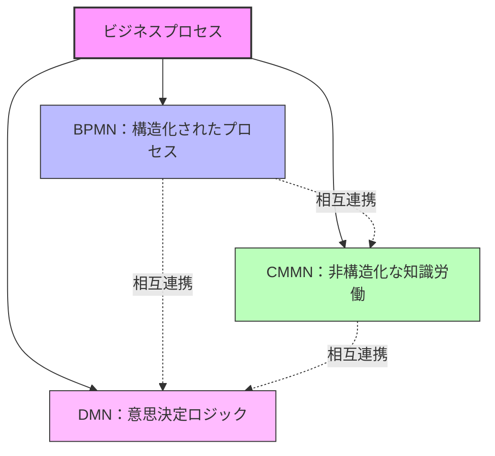

:::message
This chapter is generated by Claude.
:::

## ビジネスプロセスモデリングとは何か？ 🤔

ビジネスプロセスモデリングは、組織内のプロセスを視覚的に表現し、理解し、分析し、改善するための手法です。現代の企業では、複雑なプロセスを効率的に管理するために、標準化されたモデリング手法が不可欠になっています。

「百聞は一見にしかず」というように、複雑なプロセスやルールは文章で説明するよりも、視覚的に表現した方がはるかに理解しやすくなります。ここで登場するのが、OMG（Object Management Group）によって標準化された3つの重要なモデリング言語です：

- **BPMN** (Business Process Model and Notation) 📊
- **CMMN** (Case Management Model and Notation) 📁
- **DMN** (Decision Model and Notation) 🧠

これら3つのモデリング言語は、「BPMトライアド（三位一体）」とも呼ばれ、それぞれ異なる視点からビジネスプロセスを表現します。全て把握すると、ビジネスロジックを完全に表現できるようになるのです！

## なぜBPMN、CMMN、DMNが重要なのか？ 💡

ビジネスプロセスモデリングの意義は、単にプロセスを図で表現することだけではありません。その真の価値は以下のような点にあります：

- **コミュニケーションの円滑化** - 技術者と非技術者が同じ言語で会話できる
- **プロセス改善の基盤** - 現状のプロセスを可視化することで改善点が見えてくる
- **自動化への第一歩** - モデルからプロセスの自動化を実現できる
- **標準化によるメリット** - 組織間でのプロセス共有や統合が容易になる

特に3つのモデリング言語を組み合わせることで、以下のような強力な表現力を手に入れることができます：

## このブックで学べること 📚

本書では、BPMN、CMMN、DMNの基礎から応用まで、実践的な例を交えながら解説していきます。具体的には：

1. 各モデリング言語の基本概念と表記法
2. モデル間の関連性と連携方法
3. 実際のビジネスシナリオでの活用例
4. モデリングツールの選定と導入方法
5. モデルを実行可能なコードへと変換する手法

:::message alert
モデリングだけで終わらせないことが重要です！本書では理論だけでなく、実際の業務改善や自動化までの道筋も解説します。
:::

## 対象読者 👥

本書は以下のような方々に最適です：

- ビジネスアナリスト
- プロセスエンジニア
- IT開発者・アーキテクト
- デジタルトランスフォーメーション推進担当者
- プロジェクトマネージャー
- 業務改善に関わる全ての方

プログラミングの経験がなくても理解できるよう、基本的な概念から丁寧に解説していきます。一方で、技術的な実装に興味がある読者のために、より高度なトピックも取り上げています。

## さあ、始めましょう！ 🚀

ビジネスプロセスモデリングの旅に出発する準備はできましたか？次の章からは、まずBPMNの基礎について学んでいきましょう。プロセスフローを明確に表現するための第一歩を踏み出しましょう！

:::details 参考資料
- OMG（Object Management Group）公式サイト: https://www.omg.org/
- BPMN 2.0 仕様: https://www.omg.org/spec/BPMN/
- CMMN 1.1 仕様: https://www.omg.org/spec/CMMN/
- DMN 1.3 仕様: https://www.omg.org/spec/DMN/
:::
