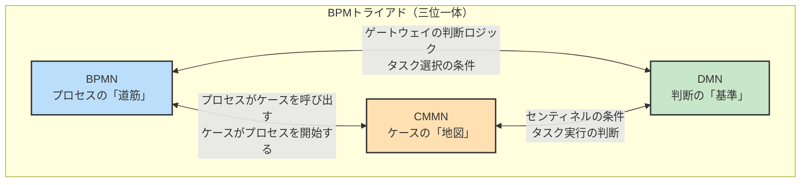
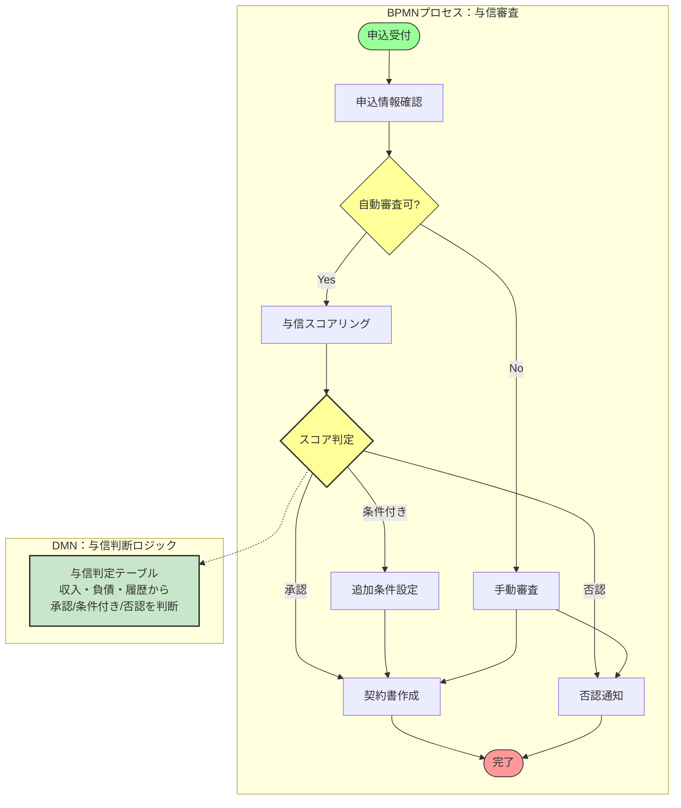
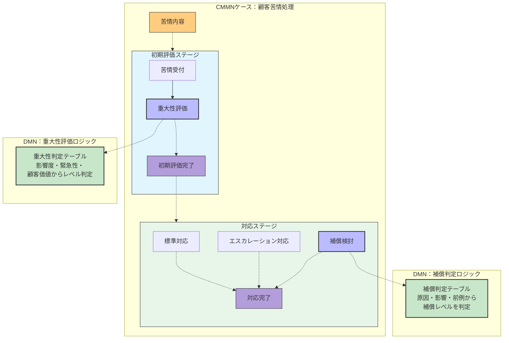
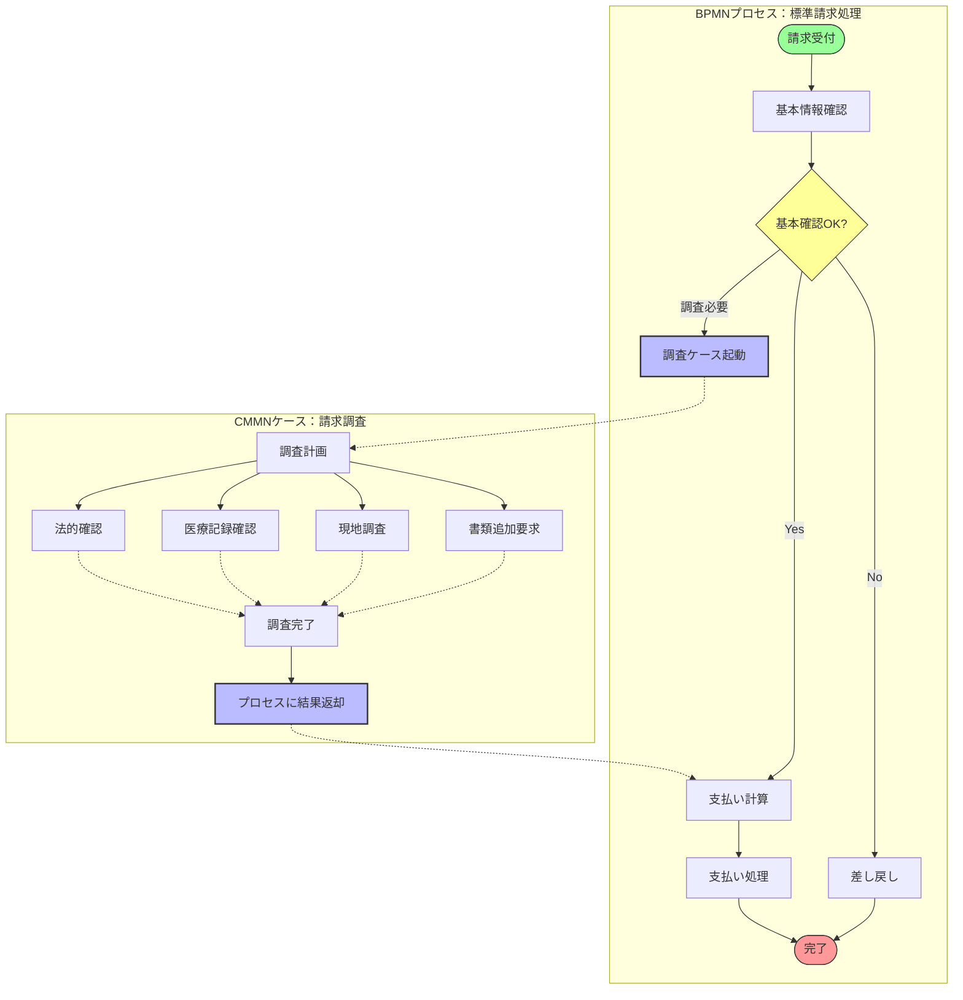
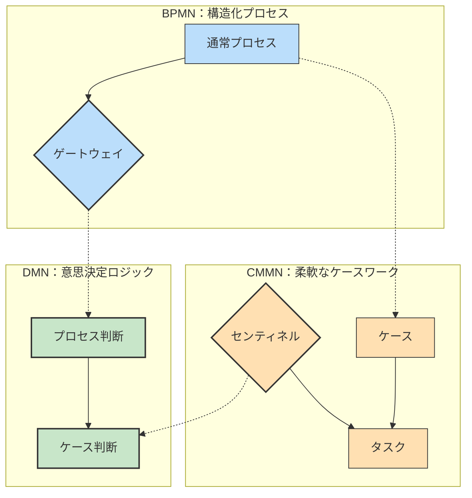
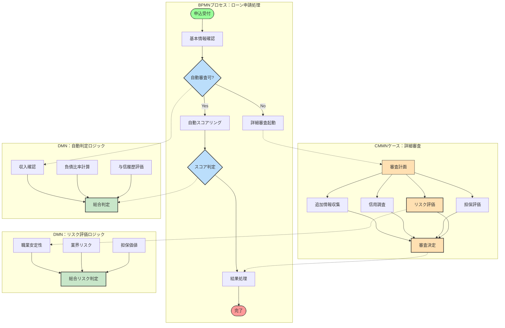
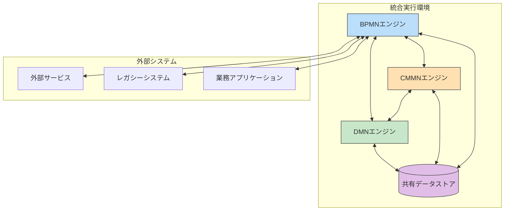

:::message
This chapter is generated by Claude.
:::

## BPMトライアド：3つのモデリング言語の連携 🌐

ここまでの章で、ビジネスプロセスモデリングの3つの標準的な言語について学んできました。それぞれのモデルは異なる視点からビジネスロジックを表現します：

- **BPMN**：構造化されたプロセスの流れを表現（**何を**、**いつ**するか）
- **CMMN**：非構造化なケースベースの作業を表現（**状況に応じて何が**必要か）
- **DMN**：意思決定ロジックを表現（**どのように**判断するか）

これら3つのモデリング言語は個別に使用することもできますが、組み合わせることでその真価を発揮します。この「BPMトライアド」と呼ばれる3つのモデルの連携について、詳しく見ていきましょう。

## 現実のビジネスはハイブリッド 🔀

現実のビジネスオペレーションでは、構造化されたプロセス、柔軟なケースワーク、明確な意思決定ルールが混在しています。例えば、保険金請求処理を考えてみましょう：

1. **構造化プロセス**（BPMN）：請求受付→基本情報確認→支払処理→通知送付
2. **ケースワーク**（CMMN）：複雑な請求や不正の可能性がある場合の調査活動
3. **意思決定ルール**（DMN）：支払可否や金額の判断ロジック

これらを別々にモデル化するよりも、相互に連携させることで、より現実に即したモデルを作ることができます。

## BPMN + DMN：プロセスの判断ポイントを明確に 🤝

BPMNとDMNの連携は、プロセス内の複雑な判断ロジックを明確にするのに役立ちます。

### 連携ポイント

- **ゲートウェイの判断ロジック**
- **ビジネスルールタスク**
- **条件付きイベント**

### 例：与信審査プロセス

この例では、BPMN内の「スコア判定」ゲートウェイの複雑な判断ロジックをDMNの決定テーブルとして外部化しています。これにより：

- プロセスモデルがシンプルになる
- 判断ロジックを詳細に定義できる
- ルール変更時にプロセス全体を修正する必要がない

## CMMN + DMN：ケースワークの判断条件を明確に 🤝

CMMNとDMNの連携は、ケース実行における判断条件を明確にするのに役立ちます。

### 連携ポイント

- **センティネル（エントリ/エグジットクライテリア）の条件**
- **意思決定タスク**
- **マイルストーンの達成条件**

### 例：顧客苦情処理ケース

この例では、CMMNケース内の「重大性評価」タスクと「補償検討」タスクの判断ロジックをDMNの決定テーブルとして外部化しています。これにより：

- ケースワーカーの判断基準が明確になる
- 複雑な評価ロジックを詳細に定義できる
- 評価基準の変更がケースモデル全体に影響しない

## BPMN + CMMN：構造と柔軟性の両立 🤝

BPMNとCMMNの連携は、構造化されたプロセスと柔軟なケースワークを組み合わせるのに役立ちます。

### 連携ポイント

- **プロセスからケースの呼び出し**
- **ケースからプロセスの開始**
- **例外処理の連携**

### 例：保険金請求処理

この例では、通常のBPMNプロセスから、調査が必要な場合にCMMNケースを呼び出しています。調査ケースでは柔軟に必要なタスクを実行し、結果をBPMNプロセスに戻しています。これにより：

- 標準的な処理は効率的なプロセスで実行
- 複雑な調査は柔軟なケースワークで実施
- 全体としての一貫性を保持

## 3つのモデルの完全統合：完全なビジネスロジックの表現 🌟

BPMNとCMMNとDMNを全て組み合わせることで、ビジネスロジックを完全に表現することができます。

### 連携の全体像

### 実例：与信審査のエンドツーエンドプロセス

以下は、ローン申請から審査、契約までの一連のプロセスを3つのモデルで表現した例です：

このように、3つのモデルを組み合わせることで：

- 標準的な処理フローを明確に表現（BPMN）
- 複雑なケースでの柔軟な対応を可能に（CMMN）
- 自動判断や人間の意思決定の基準を明確化（DMN）

ビジネスロジック全体を、それぞれの特性を活かしながら表現することができます。

## 統合のメリットとベストプラクティス ✅

### メリット

1. **完全な表現力**  
   ビジネスロジックのあらゆる側面を表現できる

2. **責任の分離**  
   プロセス、ケース、ルールを別々にモデル化し管理できる

3. **変更の局所化**  
   ルール変更がプロセス全体に影響しない

4. **再利用性の向上**  
   意思決定ロジックを複数のプロセスやケースで再利用できる

5. **理解しやすさ**  
   それぞれの観点から最適な表現方法でモデル化できる

### ベストプラクティス

#### 1. モデル間の明確な境界設定
各モデルの役割と責任を明確にし、重複を避けましょう。

#### 2. 段階的アプローチ
全てを一度に導入するのではなく、最も価値のある部分から段階的に導入していきましょう。

#### 3. メタモデルの定義
組織全体で一貫したモデル連携のためのメタモデル（モデル間の関係を定義するモデル）を確立しましょう。

#### 4. 命名規則の統一
異なるモデル間で同じ概念には同じ名前を使い、一貫性を保ちましょう。

#### 5. 変更管理の確立
複数のモデルにまたがる変更の影響を管理するプロセスを確立しましょう。

## 統合モデルの実装アプローチ 🛠️

BPMトライアドのモデルを実際のシステムに実装する方法はいくつかあります：

### 1. 統合BPMSプラットフォーム
Camunda、Trisotech、Red Hat Process Automation Managerなどの製品は、3つのモデルを統合的に実行できるプラットフォームを提供しています。

### 2. サービス連携アプローチ
各モデル用の専用エンジンをAPIで連携させる方法です。これにより、各モデルに最適なツールを選択できます。

### 3. コード生成アプローチ
モデルからコードを生成し、既存のアプリケーションに統合する方法です。この方法は特に既存システムとの統合に有効です。

## 実際の企業での活用例 🏢

BPMトライアドのアプローチを成功させている企業の事例をいくつか紹介します：

### 金融機関の例
大手銀行が融資申請処理にBPMトライアドを導入し、以下のような成果を得ました：
- 審査プロセスの30%短縮
- 一貫性のある判断による承認精度の向上
- ルール変更時間の90%削減

### 保険会社の例
保険金請求処理にトライアドアプローチを適用し、以下の効果がありました：
- 標準ケースの自動処理率の向上（60%→85%）
- 複雑なケースの処理時間の25%短縮
- コンプライアンス違反の大幅減少

### 公共機関の例
許認可申請処理にBPMトライアドを採用し、以下の改善を実現しました：
- 処理のスループット50%向上
- 判断の透明性確保によるアカウンタビリティの向上
- 法改正に伴うシステム変更の柔軟化

:::message
実際の導入では、いきなり3つ全てのモデルを導入するのではなく、最も効果の高い部分から始め、徐々に拡大していくアプローチが成功率を高めます。多くの場合、まずBPMNでプロセスを可視化し、次にDMNで判断基準を明確化し、最後にCMMNで柔軟なケースワークをサポートするという順序が効果的です。
:::

## 統合モデリングの課題と対応策 ⚠️

### 課題1：複雑性の増加
3つのモデルを扱うことで全体の複雑性が高まる可能性があります。

**対応策**：
- モデル間の責任分担を明確に
- 適切な抽象化レベルを維持
- ステークホルダーごとに必要なビューを提供

### 課題2：スキルセットの確保
各モデリング言語に精通した人材の確保が難しい場合があります。

**対応策**：
- 段階的なトレーニングプログラムの実施
- 外部エキスパートの活用
- コミュニティへの参加による知識共有

### 課題3：ツールの制約
全てのモデルを統合的にサポートするツールが限られています。

**対応策**：
- 各モデルの連携ポイントを明確に定義
- オープンスタンダードを優先するツール選定
- APIを活用した柔軟な連携

## 今後の展望：BPMトライアドの進化 🔮

BPMトライアドの標準や活用方法は今後も進化を続けます。いくつかの注目すべきトレンドを紹介します：

### 1. AIとの融合
機械学習と意思決定モデル（DMN）の統合により、より高度な自動判断が可能になります。

### 2. デジタルツインとの連携
ビジネスプロセスのデジタルツインを構築し、シミュレーションや予測分析に活用する動きが進んでいます。

### 3. ローコード/ノーコードプラットフォームへの統合
非技術者でもBPMトライアドのモデルを構築・実行できるプラットフォームの発展が期待されます。

### 4. イベント駆動アーキテクチャとの統合
BPMトライアドとイベント駆動アーキテクチャを組み合わせることで、よりリアクティブなビジネスオペレーションが実現できます。

## まとめ：BPMトライアドの総合力 💪

BPMN、CMMN、DMNの3つのモデリング言語は、それぞれが得意とする領域で強みを発揮します。しかし、本当の価値はこれらを連携させて活用することで生まれます。

3つのモデルを統合することで：
- **構造化プロセス**と**柔軟なケースワーク**の両方をサポート
- **詳細な意思決定ロジック**を透明化
- ビジネスルールの**変更管理**を効率化
- システム開発と業務部門の**コミュニケーション**を円滑化

BPMトライアドは、デジタルトランスフォーメーションの時代に必要な「業務の可視化」「柔軟な対応」「透明な判断」を実現するための強力なツールセットとなります。

次の章では、これらのモデリング手法を実際のビジネスシナリオに適用した具体的な例を見ていきましょう！

:::details 参考資料
- [OMG: BPMN, CMMN, and DMN: An Introduction to the Decision Model](https://www.omg.org/news/meetings/tc/berlin-15/special-events/miwg-presentations/bock.pdf)
- [Bruce Silver: BPMN, CMMN, DMN: The Field Guide to Process Automation](https://methodandstyle.com/bpmn-cmmn-dmn-field-guide/)
- [Denis Gagné: The BPM Trilogy: BPMN, CMMN, DMN](https://www.trisotech.com/articles/bpm-trilogy-bpmn-cmmn-dmn/)
- [Camunda: BPMN, CMMN, DMN: The Modeling Trilogy](https://camunda.com/bpmn/reference/)
:::
