:::message
This chapter is generated by Claude.
:::

## モデリングを実際のビジネスに活かす 🔍

理論を理解することも大切ですが、実際のビジネスシナリオに適用してこそBPMN、CMMN、DMNの真価が発揮されます。この章では、様々な業種の具体的な業務シナリオに3つのモデリング手法を適用した例を紹介します。

それぞれの例では、「なぜその手法を選んだのか？」「どのようにモデル化したのか？」「どんな効果があったのか？」について詳しく見ていきましょう。

## 金融業界の例：住宅ローン申請処理 🏦

住宅ローンの申請から承認までの一連のプロセスは、構造化された部分と柔軟な判断が必要な部分が混在する代表的な例です。

### シナリオの概要

お客様が住宅ローンを申請してから、審査、承認、契約締結までの一連の流れをモデル化します。

- **標準プロセス**：申込受付→基本審査→与信判断→契約手続き
- **例外処理**：特殊案件の詳細調査
- **判断基準**：申込者の属性に基づく承認条件

### BPMN：標準的なローン申請プロセス

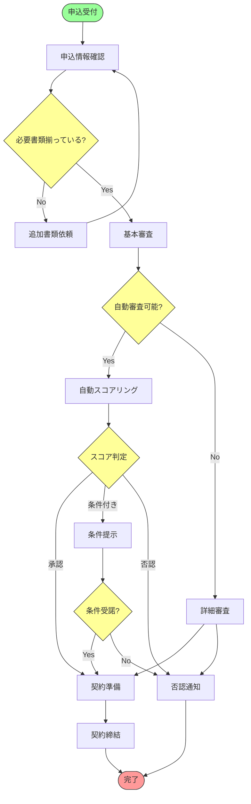

### CMMN：詳細審査ケース

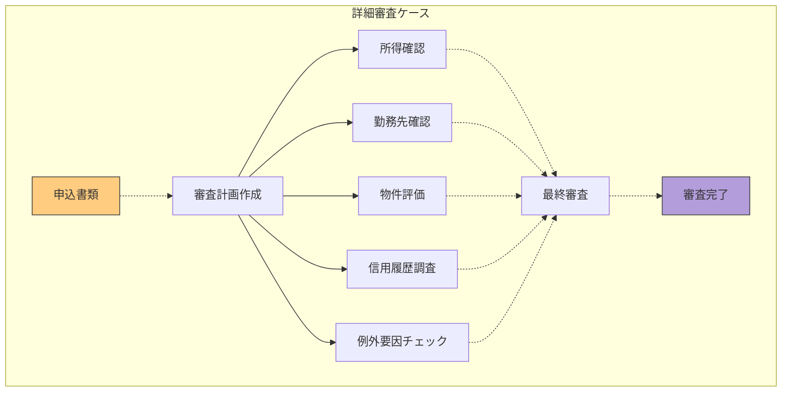

### DMN：ローン承認基準

#### 自動スコアリングの決定テーブル

| 年収 | 勤続年数 | 信用スコア | 借入比率 | 結果 |
|------|---------|----------|---------|------|
| >=8,000,000 | >=3 | >=700 | <=35% | 承認 |
| >=6,000,000 | >=5 | >=650 | <=30% | 承認 |
| >=8,000,000 | <3 | >=700 | <=35% | 条件付き |
| >=6,000,000 | <5 | >=650 | <=30% | 条件付き |
| <6,000,000 | - | - | - | 詳細審査 |
| - | - | <600 | - | 否認 |
| - | - | - | >40% | 否認 |

### 3つのモデルの連携

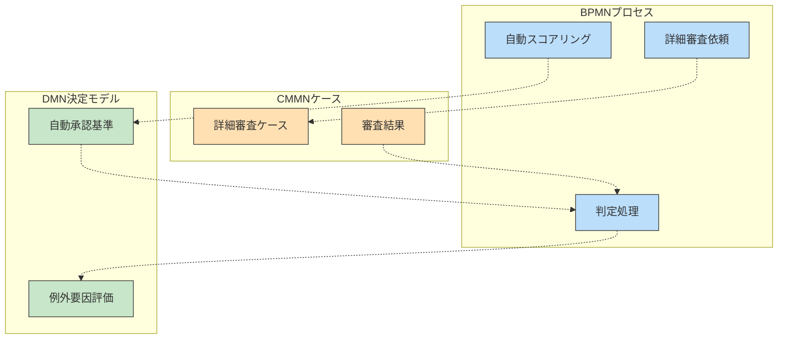

### 実装による効果
- 処理時間の短縮（通常案件の自動承認率70%）
- 審査基準の一貫性確保
- コンプライアンスの向上（判断根拠の透明化）
- 業務改善サイクルの確立（データに基づく基準の最適化）

## 医療分野の例：患者診療プロセス 🏥

医療の現場では、標準的な処置手順と医師の専門的判断が組み合わさる複雑なプロセスが多く存在します。

### シナリオの概要

患者の初診から診断、治療計画、治療実施、フォローアップまでの一連の流れをモデル化します。

- **標準プロセス**：受付→初診→基本検査→診断→治療→フォローアップ
- **ケース管理**：疾患別の治療計画と実施
- **判断基準**：症状と検査結果に基づく診断と治療方針決定

### BPMN：標準診療プロセス

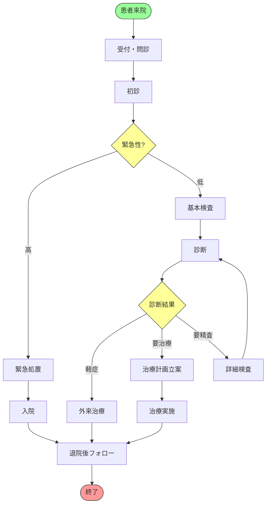

### CMMN：疾患別治療ケース

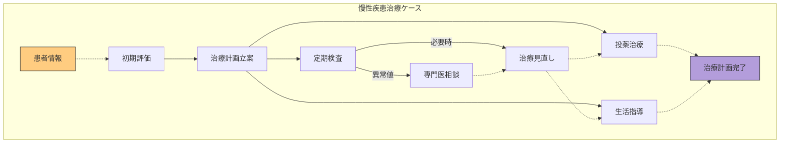

### DMN：診断・治療方針決定

#### 診断評価の決定テーブル

| 主訴 | バイタル | 検査結果A | 検査結果B | 診断 | 推奨治療 |
|------|---------|----------|----------|------|---------|
| 胸痛 | 血圧高 | 心電図異常 | - | 虚血性心疾患疑い | 循環器専門医、追加検査 |
| 胸痛 | 正常 | 心電図正常 | D-ダイマー高 | 肺塞栓疑い | CT検査、呼吸器専門医 |
| 胸痛 | 正常 | 心電図正常 | D-ダイマー正常 | 筋骨格系疼痛 | 消炎鎮痛薬、経過観察 |
| 発熱 | 発熱 | 白血球↑ | CRP↑ | 細菌感染症 | 抗生物質、対症療法 |
| 発熱 | 発熱 | 白血球正常 | CRP軽度↑ | ウイルス感染疑い | 対症療法、経過観察 |

### 3つのモデルの連携

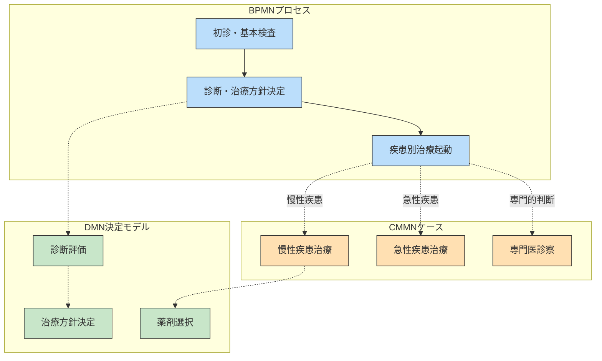

### 実装による効果
- 診療標準の確立と品質向上
- 医師の意思決定支援
- 患者ごとの最適な治療計画
- 医療安全の向上（見落とし防止）
- 研修医・新人医師の教育支援

## 製造業の例：製品開発プロセス 🏭

製品開発は構造化されたフェーズと創造的な問題解決が混在する複雑なプロセスです。

### シナリオの概要

新製品の企画から設計、試作、テスト、量産化までの一連の流れをモデル化します。

- **標準プロセス**：企画→設計→試作→評価→量産準備→生産
- **ケース管理**：設計変更対応、問題解決
- **判断基準**：品質基準、コスト評価、リスク評価

### BPMN：製品開発標準プロセス

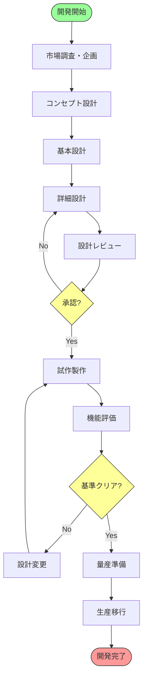

### CMMN：設計変更ケース

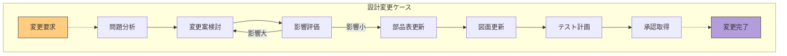

### DMN：製品評価基準

#### 機能評価の決定テーブル

| 性能指標A | 性能指標B | 耐久性 | 安全性 | コスト | 評価結果 |
|-----------|----------|-------|--------|-------|----------|
| 目標達成 | 目標達成 | 基準クリア | 問題なし | 予算内 | 承認 |
| 目標未達 | 目標達成 | 基準クリア | 問題なし | 予算内 | 条件付き承認 |
| 目標達成 | 目標未達 | 基準クリア | 問題なし | 予算内 | 条件付き承認 |
| 目標達成 | 目標達成 | 基準未達 | 問題なし | 予算内 | 要改善 |
| 目標達成 | 目標達成 | 基準クリア | 問題あり | - | 不適合 |
| - | - | - | - | 予算超過 | 要コスト検討 |

### 3つのモデルの連携

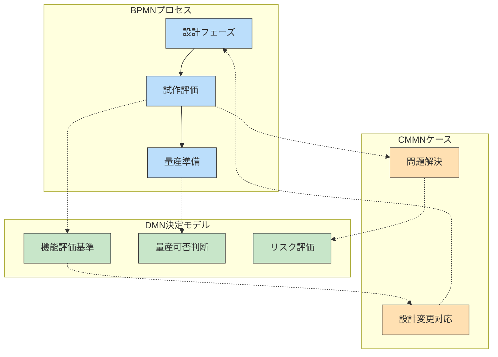

### 実装による効果
- 開発期間の短縮（20%削減）
- 設計変更の効率化
- 品質問題の早期発見
- 開発ナレッジの蓄積
- 部門間コミュニケーションの円滑化

## 公共サービスの例：許認可申請処理 🏛️

行政における許認可業務は、定型的な処理と個別判断が組み合わさる好例です。

### シナリオの概要

市民からの許認可申請（建築許可、営業許可など）の受付から審査、承認までのプロセスをモデル化します。

- **標準プロセス**：申請受付→形式確認→内容審査→決裁→結果通知
- **ケース管理**：例外案件の特別審査
- **判断基準**：法令に基づく適合性評価

### BPMN：標準許認可プロセス

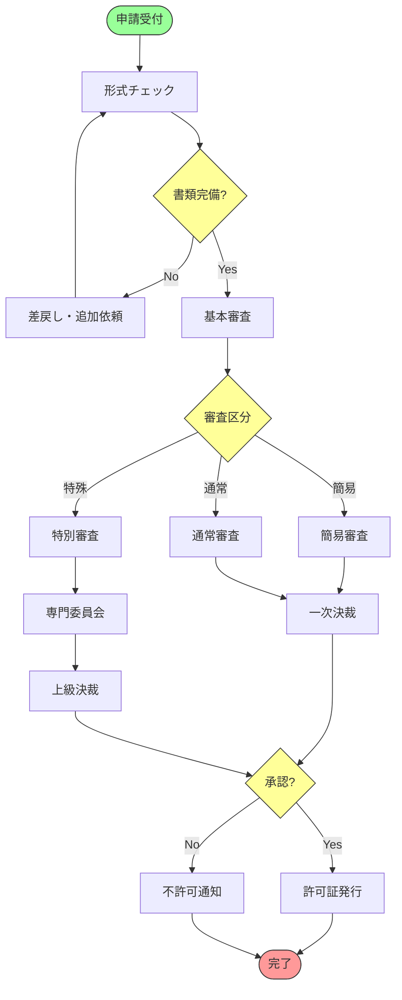

### CMMN：特別審査ケース

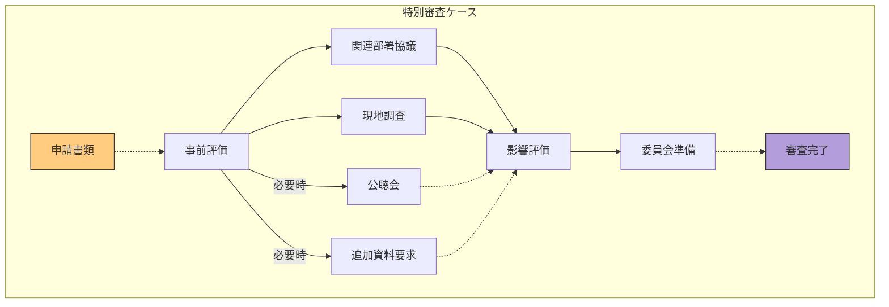

### DMN：審査基準評価

#### 建築許可審査の決定テーブル

| 用途地域 | 建蔽率 | 容積率 | 高さ制限 | 接道状況 | 判定 |
|---------|--------|--------|----------|----------|------|
| 第一種住居 | <=50% | <=100% | <=10m | 基準適合 | 適合 |
| 第一種住居 | <=50% | <=100% | >10m | 基準適合 | 条件付き |
| 第一種住居 | >50% | <=100% | <=10m | 基準適合 | 条件付き |
| 第一種住居 | >50% | >100% | - | - | 不適合 |
| 商業 | <=80% | <=400% | - | 基準適合 | 適合 |
| 商業 | >80% | <=400% | - | 基準適合 | 条件付き |
| - | - | - | - | 基準不適合 | 不適合 |

### 3つのモデルの連携

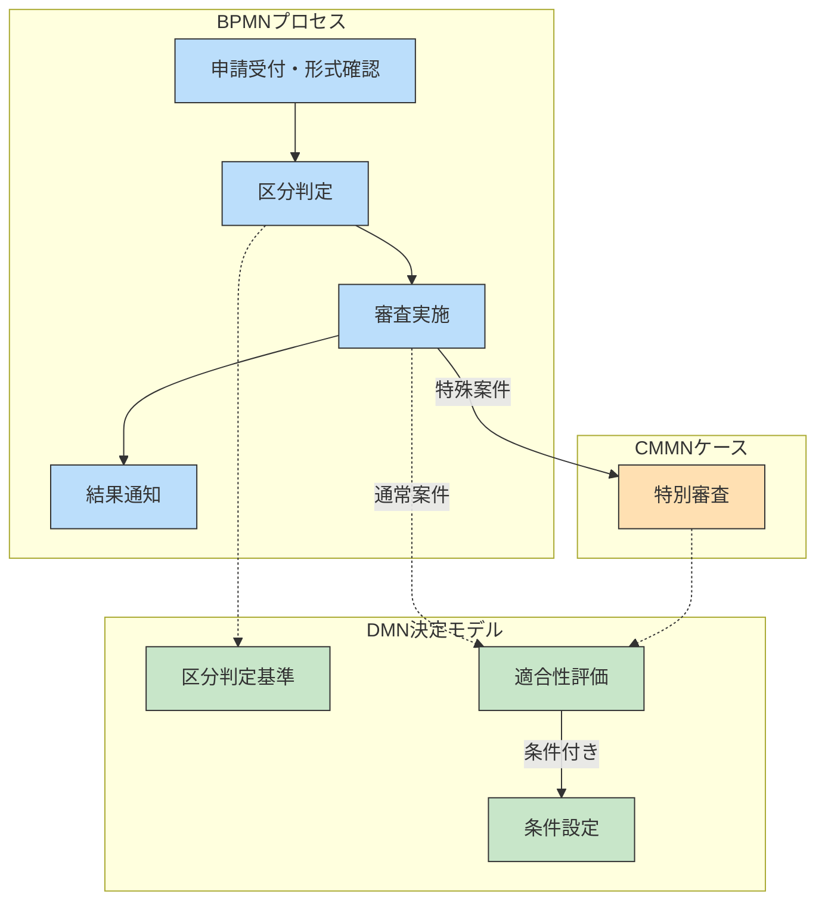

### 実装による効果
- 処理時間の短縮（単純案件は50%短縮）
- 判断の一貫性と透明性の確保
- 市民満足度の向上
- 法改正時の迅速な対応
- 担当者の負担軽減

## 小売業の例：商品販促キャンペーン管理 🛒

小売業における販促キャンペーンは、標準的なプロセスと顧客特性に応じた柔軟な対応が求められます。

### シナリオの概要

新規キャンペーンの企画から、顧客セグメンテーション、オファー設定、実施、効果測定までをモデル化します。

- **標準プロセス**：企画→対象設定→コンテンツ作成→承認→実施→評価
- **ケース管理**：顧客セグメント別の対応
- **判断基準**：顧客分類と特典設定

### BPMN：キャンペーン管理プロセス

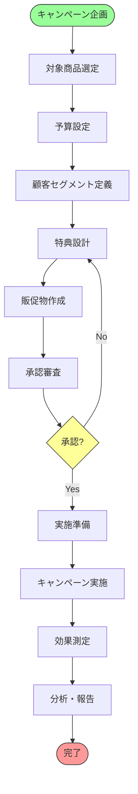

### CMMN：顧客セグメント対応ケース

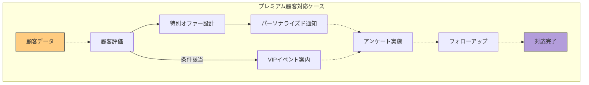

### DMN：顧客分類と特典設定

#### 顧客分類の決定テーブル

| 年間購入額 | 購入頻度 | 直近購入 | 会員ランク | 顧客分類 |
|-----------|---------|---------|-----------|----------|
| >=100,000 | >=月1回 | 1ヶ月以内 | ゴールド | プレミアム |
| >=50,000 | >=月1回 | 3ヶ月以内 | - | ロイヤル |
| >=30,000 | >=2ヶ月1回 | 6ヶ月以内 | - | アクティブ |
| <30,000 | <2ヶ月1回 | 6ヶ月以内 | - | カジュアル |
| 任意 | 任意 | >12ヶ月 | - | 休眠 |

#### 特典設定の決定テーブル

| 顧客分類 | キャンペーンタイプ | 特典内容 | 特典送付方法 |
|----------|-----------------|----------|--------------|
| プレミアム | シーズンセール | 30%オフ+先行案内 | メール+DM+SMS |
| ロイヤル | シーズンセール | 20%オフ+先行案内 | メール+DM |
| アクティブ | シーズンセール | 15%オフ | メール |
| カジュアル | シーズンセール | 10%オフ | メール |
| 休眠 | シーズンセール | 20%オフ+復帰特典 | メール+DM |
| プレミアム | 新商品導入 | 先行購入権+ギフト | メール+DM+イベント |
| ロイヤル | 新商品導入 | 先行案内 | メール+DM |

### 3つのモデルの連携

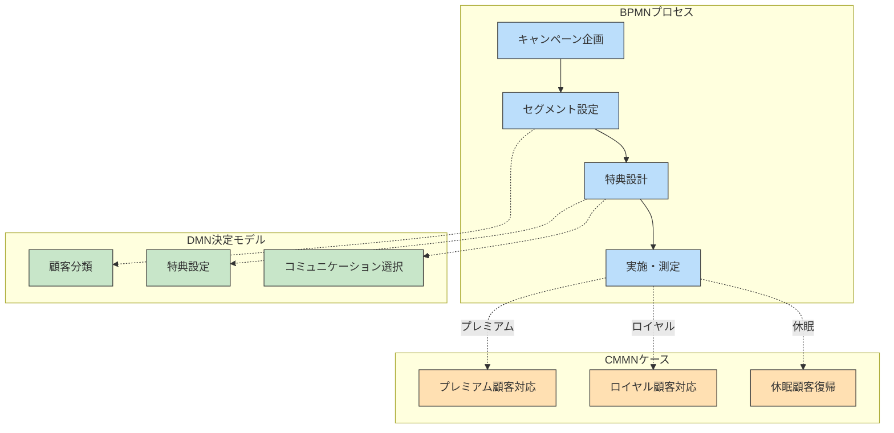

### 実装による効果
- キャンペーンROIの向上（25%改善）
- 顧客体験の個別化
- 販促予算の最適配分
- PDCAサイクルの高速化
- マーケティング施策の一貫性確保

## 業種横断的モデリングのポイント 📌

様々な業種での適用例を見てきましたが、ここでは業種を問わず適用できるモデリングのポイントをまとめます。

### 1. 適切なモデル選択のガイドライン

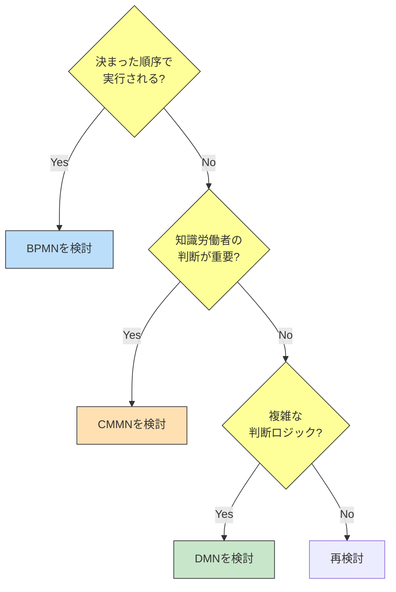

### 2. 段階的モデリングアプローチ

1. **業務の大枠を把握**（インタビュー、現状分析）
2. **コアプロセスをBPMNでモデル化**（骨格となる流れ）
3. **柔軟な部分をCMMNで表現**（知識労働者の判断領域）
4. **判断基準をDMNで詳細化**（ルールの明確化）
5. **モデル間の連携ポイントを定義**（相互作用）
6. **レビューと最適化**（ステークホルダーとの確認）

### 3. 共通の落とし穴と対策

| 落とし穴 | 対策 |
|---------|-----|
| モデルの過剰複雑化 | 適切な抽象度を保ち、詳細はサブモデルへ |
| 現実とモデルの乖離 | 現場担当者の積極的な参加を促す |
| 例外処理の見落とし | 「Happy Path」だけでなく例外シナリオも検討 |
| モデル間の不整合 | 共通の用語定義と相互参照の明確化 |
| 実装の難しさ | 段階的な実装と優先順位づけ |

## モデリングワークショップの実施方法 🧩

モデリングを実際に進めるためのワークショップの進め方を紹介します。

### 準備段階
1. **目的と範囲の明確化**：何のためにモデル化するか？どこまでをカバーするか？
2. **参加者の選定**：業務担当者、システム担当者、意思決定者など
3. **基礎情報の収集**：既存の業務マニュアル、システム仕様、関連ドキュメント

### ワークショップの流れ

#### 1日目：現状把握とスコープ設定
- 業務の概要説明
- 主要な課題の特定
- モデル化の範囲合意

#### 2日目：BPMNによるプロセスモデリング
- 主要アクティビティの特定
- プロセスフローの作成
- ゲートウェイと条件の定義

#### 3日目：CMMN/DMNによる補完
- 非構造化部分のケースモデリング
- 判断ロジックの決定テーブル作成
- モデル間の連携ポイント定義

#### 4日目：レビューと検証
- モデル全体の整合性確認
- エンドツーエンドのシナリオ検証
- 実装に向けた課題抽出

### ファシリテーションのコツ

- **付箋と模造紙から始める**：ツールに頼る前に、アナログで大枠を捉える
- **具体的なシナリオで検証**：「〜の場合はどうなる？」と例を使ってモデルを確認
- **「正解」を求めすぎない**：完璧を目指すより、継続的改善の基盤を作る
- **専門用語を避ける**：参加者全員が理解できる言葉で議論を進める
- **小さな成功体験を積み重ねる**：全体を一度に完成させず、部分的に価値を示す

:::message
モデリングは「完璧な図を作ること」が目的ではなく、「ビジネスの理解と改善のための対話を促進すること」が真の目的です。その観点でワークショップを設計すると、より実りある成果が得られます。
:::

## 成功のための実装戦略 🚀

モデルを作っただけでは価値は生まれません。実際のシステムやオペレーションに実装してこそ効果を発揮します。

### 実装アプローチの選択

| アプローチ | 特徴 | 適したケース |
|-----------|------|-------------|
| **完全自動化** | モデルを直接実行可能なシステムで実装 | 高頻度・標準化されたプロセス |
| **部分自動化** | コアプロセスのみ自動化、例外は手動 | 中頻度・半構造化プロセス |
| **ガイダンス型** | モデルを参照ガイドとして活用 | 低頻度・高度に知識集約的な業務 |
| **ハイブリッド** | 上記の組み合わせ | 複雑かつ多様なプロセス |

### 段階的実装の例

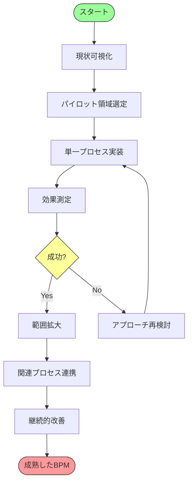

### 実装の成功要因

1. **経営層の支援**：単なるIT施策ではなく、業務改革として位置づける
2. **現場の参画**：設計から検証まで現場担当者を巻き込む
3. **段階的アプローチ**：小さく始めて成功体験を積み重ねる
4. **適切なツール選択**：組織の成熟度に合ったツールを選ぶ
5. **継続的改善の文化**：完成形を目指すのではなく、改善サイクルを回す

## モデリングの進化と将来展望 🔮

ビジネスプロセスモデリングは技術の進化とともに発展を続けています。今後期待される展開を紹介します。

### AIとの融合

- **自動モデル生成**：ログデータからのプロセス自動発見
- **意思決定の高度化**：機械学習とDMNの連携
- **予測的プロセス管理**：将来の問題を予測して対応

### デジタルツインとの連携

- **リアルタイムシミュレーション**：プロセス変更の影響をリアルタイムで予測
- **オペレーションの可視化**：実行中のプロセスの状態をモデル上に表示
- **プロセス最適化**：デジタルツインでの実験に基づく改善

### ローコード/ノーコードプラットフォームとの統合

- **市民開発者によるモデリング**：技術者でなくても可能なモデル作成と実装
- **ビジネスと技術の融合**：ビジネスルールをダイレクトに実装
- **アジャイルなプロセス改善**：変化に迅速に対応できる柔軟な仕組み

## まとめ：実践から学ぶポイント 💡

この章でご紹介した実践例から学べる重要なポイントをまとめます：

1. **目的を明確に**：モデリングは手段であり目的ではない
2. **業務理解が最優先**：ツールやテクニックより業務の本質理解を重視
3. **適材適所のモデル選択**：BPMN、CMMN、DMNの特性を活かした使い分け
4. **シンプルに始める**：完璧を求めず、価値ある部分から取り組む
5. **現場との協働**：モデリングは対話のツールとして活用する
6. **継続的改善**：一度作って終わりではなく、PDCAを回し続ける

次の章では、これらのモデルを実装する際に役立つツールやプラットフォームについて詳しく見ていきます。モデルを「絵」で終わらせず、実際の業務改善やシステム実装につなげるための方法を探っていきましょう！

:::details 参考資料
- [Bruce Silver: BPMN Method and Style](https://methodandstyle.com/)
- [Camunda: Real-World BPMN](https://camunda.com/bpmn/examples/)
- [OMG: Case Management Success Stories](https://www.omg.org/cmmn/)
- [The Decision Management Community](https://www.decisionmanagementsolutions.com/case-studies)
- [Object Management Group: BPM Success Stories](https://www.omg.org/bpm-success-stories/)
:::
