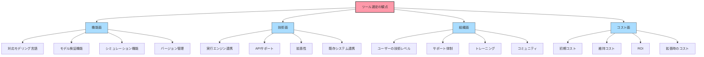
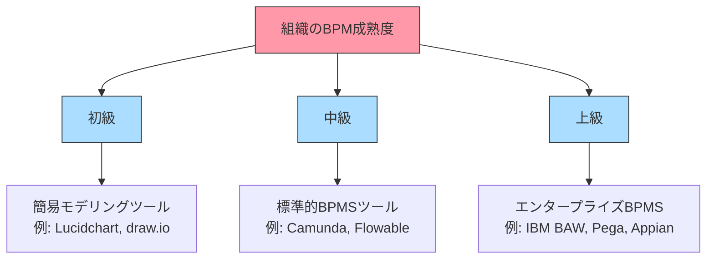
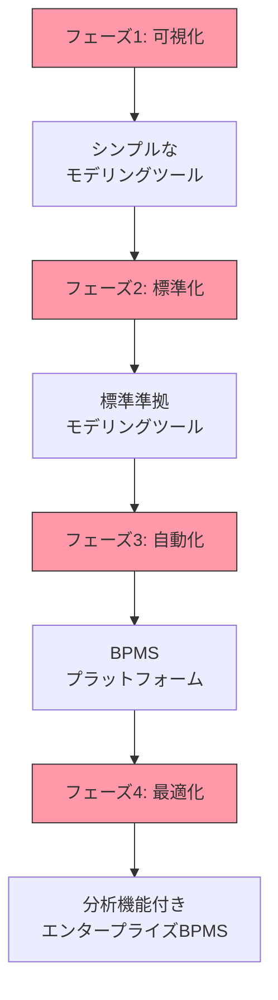
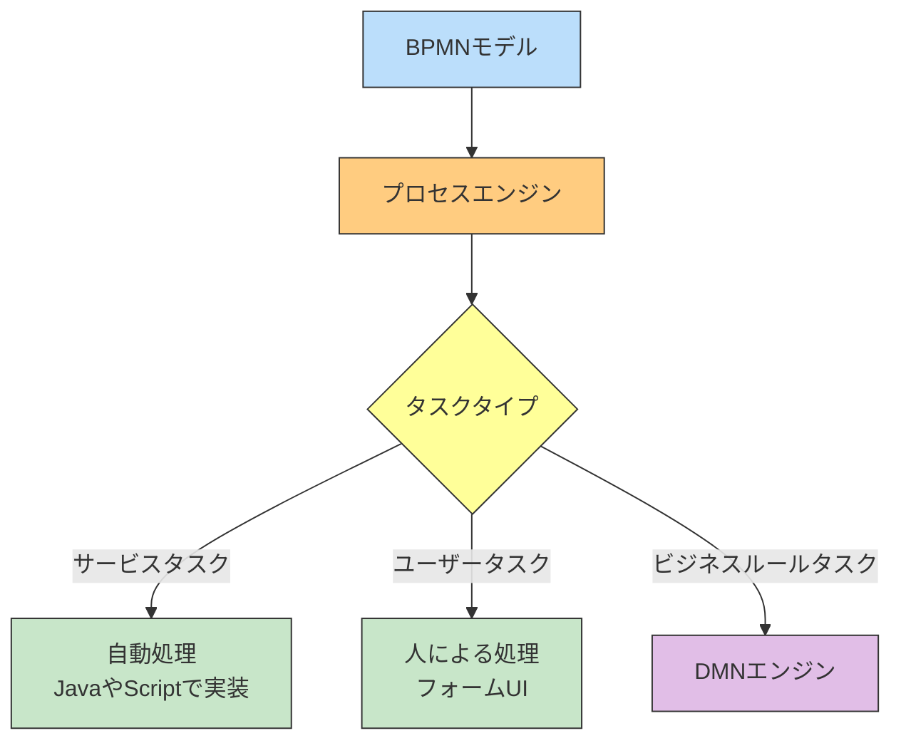
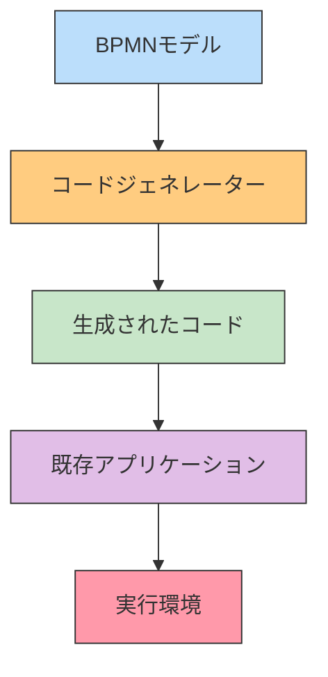
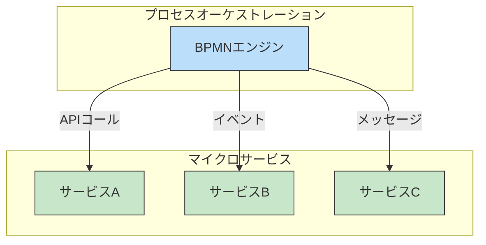
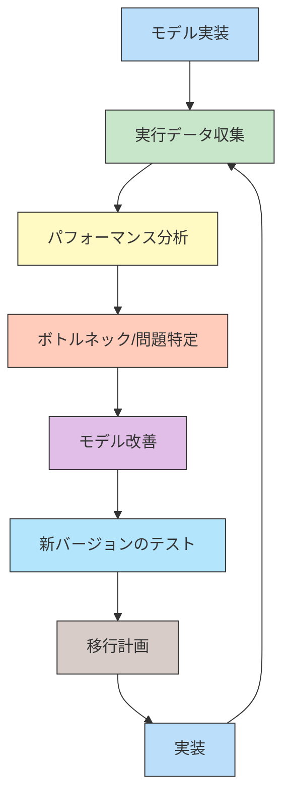
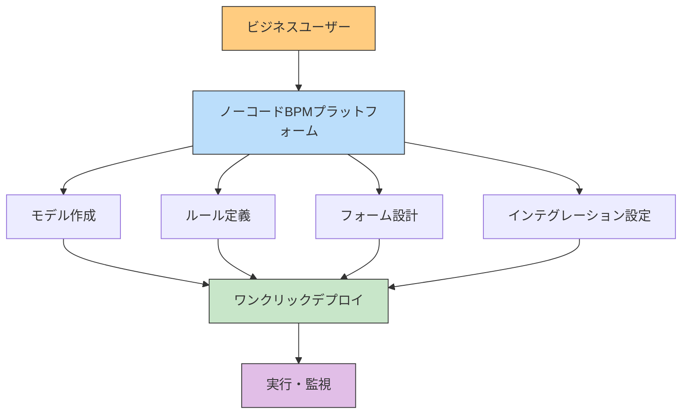

:::message
This chapter is generated by Claude.
:::

## モデルを「絵」で終わらせないために 🎯

これまでの章では、BPMN、CMMN、DMNという3つのモデリング言語の概念と活用法について学んできました。しかし、いくら優れたモデルを作成しても、それを「絵」で終わらせてしまっては本当の価値は生まれません。

この章では、モデルを実際のシステムや業務で活用するためのツールや実装手法について詳しく解説します。「描く」から「動かす」へのステップを踏むために必要な知識を身につけましょう。

## モデリングツールの選び方 🔍

適切なツール選択は成功の鍵です。組織のニーズや能力に合ったツールを選ぶためのポイントを見ていきましょう。

### ツール選定の重要な観点



### ツールの種類とカテゴリ

ビジネスプロセスモデリングツールは、大きく以下のカテゴリに分類できます：

#### 1. モデリング専用ツール
モデルの作成・編集に特化したツールです。

**特徴**：
- 使いやすいモデリングインターフェース
- 標準に忠実な表現
- 比較的低コスト

**向いている組織**：
- モデリングを主に「コミュニケーション」や「ドキュメント化」に使用する組織
- 実行は別のシステムで行う予定の組織

#### 2. BPMSプラットフォーム
モデリングから実行、監視までをカバーする統合プラットフォームです。

**特徴**：
- モデルの直接実行が可能
- ビジネスルールエンジンとの統合
- 包括的な監視・分析機能

**向いている組織**：
- プロセス自動化を本格的に推進したい組織
- IT部門とビジネス部門の協働を強化したい組織

#### 3. 統合モデリングスイート
複数のモデリング言語をサポートする総合的なツールスイートです。

**特徴**：
- BPMN、CMMN、DMNなど複数の標準をサポート
- モデル間の連携機能
- 高度な分析・シミュレーション機能

**向いている組織**：
- 複雑なビジネスロジックを表現したい組織
- 複数の標準を連携させて使いたい組織

#### 4. オープンソースツール
コミュニティサポートによる無料または低コストのツールです。

**特徴**：
- 低コストでの導入が可能
- カスタマイズの自由度
- コミュニティによる改善・拡張

**向いている組織**：
- 予算制約のある組織
- 独自のカスタマイズを行いたい技術力のある組織

## 主要ツールの比較と特徴 📊

各カテゴリの代表的なツールについて、その特徴と適用シーンを見ていきましょう。

### オープンソースツール

| ツール名 | BPMN | CMMN | DMN | 実行機能 | 特徴 |
|---------|------|------|-----|---------|------|
| **Camunda Platform** | ✅ | ✅ | ✅ | ✅ | Java環境での完全なBPMSを提供。開発者向け。 |
| **Flowable** | ✅ | ✅ | ✅ | ✅ | 軽量かつ拡張性が高い。マイクロサービスアーキテクチャに適合。 |
| **jBPM** | ✅ | ❌ | ✅ | ✅ | Red Hat提供。KIEプラットフォームの一部として包括的なBPM機能。 |
| **Activiti** | ✅ | ❌ | ❌ | ✅ | 軽量で組み込みやすい。最小限の機能でシンプル。 |
| **BPMN.io** | ✅ | ✅ | ✅ | ❌ | Webベースのモデリングライブラリ。カスタムアプリの構築に適する。 |

### 商用ツール

| ツール名 | BPMN | CMMN | DMN | 実行機能 | 特徴 |
|---------|------|------|-----|---------|------|
| **Signavio/SAP Process Manager** | ✅ | ✅ | ✅ | ✅ | エンタープライズ向け。強力な分析・最適化機能。 |
| **IBM Business Automation Workflow** | ✅ | ✅ | ✅ | ✅ | 大規模エンタープライズ向け。AI機能との統合。 |
| **ARIS** | ✅ | ✅ | ✅ | ✅ | プロセス分析・管理に強み。ERP連携に優れる。 |
| **Pega Platform** | ✅* | ✅* | ✅* | ✅ | ローコード開発環境。AI・RPA機能が充実。 |
| **Appian** | ✅* | ✅* | ✅* | ✅ | ローコードプラットフォーム。迅速なアプリ開発に強み。 |
| **Trisotech Digital Enterprise Suite** | ✅ | ✅ | ✅ | ✅ | 3つの標準の連携に特に強み。モデル間の相互作用を重視。 |
| **Visual Paradigm** | ✅ | ✅ | ✅ | ❌ | UML、ERDなど多様なモデリングをサポート。教育用途にも。 |

*標準に完全準拠ではなく独自拡張あり

### クラウドベースモデリングツール

| ツール名 | BPMN | CMMN | DMN | 実行機能 | 特徴 |
|---------|------|------|-----|---------|------|
| **Lucidchart** | ✅ | ❌ | ❌ | ❌ | 使いやすいUI。チーム協業に優れる。BPMN以外の図も作成可能。 |
| **draw.io** | ✅ | ❌ | ❌ | ❌ | 無料で使える。汎用的な図も作成可能。Google Driveと連携。 |
| **bpmn.studio** | ✅ | ❌ | ❌ | ✅ | クラウドベースのBPMN実行環境。モバイル対応。 |
| **Cawemo** | ✅ | ❌ | ❌ | ❌ | Camunda提供のクラウドモデリングツール。Camunda Platformと連携。 |

:::message
完全な機能比較ではなく、代表的な特徴を挙げています。ツール選択の際は、必ず最新情報を公式サイトで確認し、可能であればトライアル版で検証することをお勧めします。また、ツールは進化が速いため、対応機能が追加されている可能性もあります。
:::

## ツール選定のポイント 🔑

ツール選定の際に考慮すべき重要なポイントをまとめました。

### 組織の成熟度に合わせた選定



### ユーザータイプ別のニーズ

| ユーザータイプ | 優先すべき機能 | おすすめツール例 |
|--------------|--------------|----------------|
| **ビジネスアナリスト** | 直感的なUI、検証機能、シミュレーション | Signavio, Trisotech, Visual Paradigm |
| **開発者** | API、拡張性、コード生成、技術的詳細度 | Camunda, Flowable, jBPM |
| **プロセスオーナー** | 監視ダッシュボード、分析レポート、KPI追跡 | ARIS, IBM BAW, Pega |
| **経営層** | 全体可視化、戦略マップ連携、ビジネスメトリクス | Signavio, ARIS, Trisotech |

### 導入フェーズを考慮した選定

初期段階では簡易なツールから始め、成熟度に応じて高度なツールに移行するアプローチも有効です。



## ツールのインストールと基本設定 🔧

代表的なオープンソースツールの導入手順を見ていきましょう。

### Camunda Platformの導入例

Camundaは、BPMN、CMMN、DMNの3つの標準をサポートする優れたオープンソースBPMSです。

#### 1. インストール方法

**必要環境**：
- Java 11以上
- Maven（ビルドツール）
- PostgreSQL/MySQL/Oracleなどのデータベース（オプション）

**インストール手順**：

```bash:bash
# Camunda Platform Run（スタンドアロン版）をダウンロード
wget https://downloads.camunda.cloud/release/camunda-bpm/run/7.15/camunda-bpm-run-7.15.0.tar.gz

# 解凍
tar -xzf camunda-bpm-run-7.15.0.tar.gz

# 起動
cd camunda-bpm-run-7.15.0
./start.sh
```

起動後、`http://localhost:8080` でCockpitにアクセスできます。
デフォルトの認証情報：ユーザー名 `demo`、パスワード `demo`

#### 2. Camunda Modelerのインストール

プロセスモデリングには、専用のデスクトップアプリケーション「Camunda Modeler」を使用します。

1. [Camunda Modelerのダウンロードページ](https://camunda.com/download/modeler/)から最新版をダウンロード
2. インストーラーを実行（Windows/Mac/Linux対応）
3. アプリケーションを起動してモデリング開始

#### 3. 基本的なプロジェクト構成

Spring Bootと連携したより本格的なプロジェクトを作成する場合：

```bash:bash
# Spring Boot + Camundaプロジェクトの生成
mvn archetype:generate \
  -DarchetypeGroupId=org.camunda.bpm.archetype \
  -DarchetypeArtifactId=camunda-archetype-spring-boot \
  -DarchetypeVersion=7.15.0 \
  -DgroupId=com.example \
  -DartifactId=camunda-process-app
```

### Flowable Designerの導入例

Flowableは、軽量かつ拡張性の高いBPMSで、特にマイクロサービスアーキテクチャとの親和性が高いです。

#### 1. インストール方法

**必要環境**：
- Java 8以上
- Maven
- データベース（H2, MySQL, PostgreSQL, など）

**インストール手順**：

```bash:bash
# Flowable UIアプリのクローン
git clone https://github.com/flowable/flowable-engine.git

# ビルド
cd flowable-engine
mvn clean install -DskipTests

# UI Appの起動
cd modules/flowable-ui
cd flowable-ui-app
mvn spring-boot:run
```

起動後、`http://localhost:8080/flowable-ui` でアクセスできます。
デフォルトの認証情報：ユーザー名 `admin`、パスワード `test`

#### 2. Eclipse用Flowable Designerプラグイン

Eclipse IDEを使用している場合、Flowable Designerプラグインを導入できます：

1. Eclipseを起動
2. Help > Install New Software
3. Work withに `https://flowable.org/designer/update/` を入力
4. Flowable Designerを選択してインストール

### DMN用ツール：Trisotech DMN Modelerの活用

特にDMNモデリングに注力する場合、TrisotechのクラウドベースDMNモデラーが優れています。

1. [Trisotech Digital Enterprise Suite](https://www.trisotech.com/)で無料トライアルを申し込む
2. DMN Modelerにアクセス
3. 直感的なUIで決定テーブルを作成
4. モデルをエクスポート/共有/実行

## プロセス実装の基本パターン 📝

モデルを実際のシステムに実装する方法には、いくつかの基本パターンがあります。

### 1. プロセスエンジンによる直接実行

BPMNやCMMNモデルをプロセスエンジンで直接実行する方法です。



#### Camundaでの実装例

```java:java
// Javaでのサービスタスク実装例
public class PaymentServiceTask implements JavaDelegate {
    @Override
    public void execute(DelegateExecution execution) throws Exception {
        // プロセス変数の取得
        String invoiceId = (String) execution.getVariable("invoiceId");
        Double amount = (Double) execution.getVariable("amount");
        
        // 支払い処理の実装
        boolean success = processPayment(invoiceId, amount);
        
        // 結果をプロセス変数として設定
        execution.setVariable("paymentSuccessful", success);
        
        // ログ出力
        LOGGER.info("Payment processed for invoice {}: {}", 
                    invoiceId, success ? "SUCCESS" : "FAILED");
    }
    
    private boolean processPayment(String invoiceId, Double amount) {
        // 実際の支払い処理ロジック
        // ...
        return true; // 成功時
    }
}
```

#### ユーザータスクの実装（HTML & JavaScript）

```html:html
<!-- ユーザータスク用のフォーム例 -->
<form name="approvalForm">
  <div class="form-group">
    <label for="invoiceNumber">請求書番号</label>
    <input class="form-control" 
           cam-variable-name="invoiceNumber"
           cam-variable-type="String"
           name="invoiceNumber"
           readonly />
  </div>
  
  <div class="form-group">
    <label for="amount">金額</label>
    <input class="form-control" 
           cam-variable-name="amount"
           cam-variable-type="Double"
           name="amount"
           readonly />
  </div>
  
  <div class="form-group">
    <label for="approved">承認</label>
    <input type="checkbox" 
           cam-variable-name="approved"
           cam-variable-type="Boolean"
           name="approved" />
  </div>
  
  <div class="form-group">
    <label for="comments">コメント</label>
    <textarea class="form-control"
              cam-variable-name="comments"
              cam-variable-type="String"
              name="comments"></textarea>
  </div>
</form>
```

### 2. コード生成アプローチ

モデルからコードを生成し、既存のアプリケーションに統合する方法です。



### 3. マイクロサービスとの連携

プロセスをマイクロサービスアーキテクチャで実装する方法です。



#### Spring BootとCamundaを使った実装例

```java:java
@SpringBootApplication
@EnableProcessApplication
public class ProcessApplication {
    public static void main(String[] args) {
        SpringApplication.run(ProcessApplication.class, args);
    }
    
    @Bean
    public RestTemplate restTemplate() {
        return new RestTemplate();
    }
    
    // マイクロサービスを呼び出すサービスタスク
    @Component
    public class OrderServiceTask implements JavaDelegate {
        @Autowired
        private RestTemplate restTemplate;
        
        @Override
        public void execute(DelegateExecution execution) throws Exception {
            // 注文情報の取得
            String orderId = (String) execution.getVariable("orderId");
            
            // マイクロサービスの呼び出し
            OrderResponse response = restTemplate.getForObject(
                "http://order-service/orders/" + orderId,
                OrderResponse.class
            );
            
            // 結果をプロセス変数に設定
            execution.setVariable("orderStatus", response.getStatus());
            execution.setVariable("totalAmount", response.getTotalAmount());
        }
    }
}
```

## DMNモデルの実装 📊

DMNを使った意思決定ロジックの実装方法を見ていきましょう。

### 1. DMNエンジンによる直接実行

DMNモデルをDMNエンジンで直接評価する方法です。

```java:java
// Camunda DMN Engineの利用例
public class LoanApprovalDecision {
    public LoanResult evaluateLoan(Customer customer, Loan loan) {
        // DMNエンジンの初期化
        DmnEngine dmnEngine = DmnEngineConfiguration
            .createDefaultDmnEngineConfiguration()
            .buildEngine();
        
        // DMNモデルの読み込み
        InputStream inputStream = getClass().getResourceAsStream("/loan-approval.dmn");
        DmnModelInstance modelInstance = Dmn.readModelFromStream(inputStream);
        
        // 変数マップの作成
        VariableMap variables = Variables.createVariables()
            .putValue("income", customer.getAnnualIncome())
            .putValue("creditScore", customer.getCreditScore())
            .putValue("loanAmount", loan.getAmount())
            .putValue("loanTerm", loan.getTerm());
        
        // 決定テーブルの評価
        DmnDecisionTableResult result = dmnEngine.evaluateDecisionTable(
            "loanApprovalDecision", modelInstance, variables);
        
        // 結果の取得
        String decision = result.getSingleResult().getFirstEntry();
        Double interestRate = result.getSingleResult().getEntry("interestRate");
        
        return new LoanResult(decision, interestRate);
    }
}
```

### 2. DMNとBPMNの連携

BPMNプロセス内でDMN意思決定を呼び出す例です。

```xml:xml
<!-- BPMNプロセス内のビジネスルールタスク定義 -->
<bpmn:businessRuleTask id="TaskDecideLoanApproval" name="ローン審査判断" camunda:decisionRef="loanApprovalDecision">
  <bpmn:incoming>SequenceFlow_1</bpmn:incoming>
  <bpmn:outgoing>SequenceFlow_2</bpmn:outgoing>
</bpmn:businessRuleTask>
```

### 3. DMN決定テーブルの実装例

実際のDMN決定テーブルの実装例です。

```xml:xml
<?xml version="1.0" encoding="UTF-8"?>
<definitions xmlns="https://www.omg.org/spec/DMN/20191111/MODEL/" id="Definitions" name="DRD" namespace="http://camunda.org/schema/1.0/dmn">
  <decision id="loanApprovalDecision" name="ローン審査判断">
    <decisionTable id="decisionTable">
      <input id="input1" label="年収">
        <inputExpression id="inputExpression1" typeRef="double">
          <text>income</text>
        </inputExpression>
      </input>
      <input id="input2" label="信用スコア">
        <inputExpression id="inputExpression2" typeRef="double">
          <text>creditScore</text>
        </inputExpression>
      </input>
      <input id="input3" label="ローン額">
        <inputExpression id="inputExpression3" typeRef="double">
          <text>loanAmount</text>
        </inputExpression>
      </input>
      <output id="output1" label="判定" name="decision" typeRef="string" />
      <output id="output2" label="金利" name="interestRate" typeRef="double" />
      <rule id="rule1">
        <inputEntry id="inputEntry1">
          <text>&gt;= 8000000</text>
        </inputEntry>
        <inputEntry id="inputEntry2">
          <text>&gt;= 700</text>
        </inputEntry>
        <inputEntry id="inputEntry3">
          <text>&lt;= 50000000</text>
        </inputEntry>
        <outputEntry id="outputEntry1">
          <text>"承認"</text>
        </outputEntry>
        <outputEntry id="outputEntry2">
          <text>1.5</text>
        </outputEntry>
      </rule>
      <!-- 他のルールも同様に定義 -->
    </decisionTable>
  </decision>
</definitions>
```

## CMMNモデルの実装 📁

CMMNを使ったケース管理の実装方法を見ていきましょう。

### 1. CMMNエンジンによる直接実行

Camundaを使ったCMMNケースの実装例です。

```java:java
// CMMNケースの開始
public void startInsuranceClaimCase(String claimId, Document claimDocument) {
    // プロセスエンジンの取得
    ProcessEngine processEngine = ProcessEngines.getDefaultProcessEngine();
    CaseService caseService = processEngine.getCaseService();
    
    // ケース変数の設定
    Map<String, Object> variables = new HashMap<>();
    variables.put("claimId", claimId);
    variables.put("claimDocument", claimDocument);
    variables.put("claimDate", new Date());
    
    // ケースの開始
    CaseInstance caseInstance = caseService.createCaseInstanceByKey(
        "insuranceClaimCase", claimId, variables);
    
    // 自動アクティビティの開始
    caseService.manuallyStartCaseExecution(
        caseService.createCaseExecutionQuery()
            .activityId("PI_claimRegistration")
            .caseInstanceId(caseInstance.getId())
            .singleResult()
            .getId());
}
```

### 2. ケースワーカー向けUIの実装

CMMNケースを操作するための管理UIの例です。

```html:html
<!-- ケース管理UI例 -->
<div class="case-details">
  <h3>保険金請求ケース #{{caseInstance.id}}</h3>
  
  <div class="case-data">
    <p><strong>請求ID:</strong> {{caseInstance.variables.claimId}}</p>
    <p><strong>請求日:</strong> {{caseInstance.variables.claimDate | date}}</p>
    <p><strong>状態:</strong> {{caseInstance.state}}</p>
  </div>
  
  <div class="available-tasks">
    <h4>利用可能なタスク</h4>
    <ul>
      <li ng-repeat="task in availableTasks">
        <button ng-click="startTask(task.id)">
          {{task.name}}
        </button>
      </li>
    </ul>
  </div>
  
  <div class="active-tasks">
    <h4>進行中のタスク</h4>
    <ul>
      <li ng-repeat="task in activeTasks">
        {{task.name}}
        <button ng-click="completeTask(task.id)">完了</button>
      </li>
    </ul>
  </div>
  
  <div class="milestones">
    <h4>マイルストーン</h4>
    <ul>
      <li ng-repeat="milestone in milestones" 
          ng-class="{achieved: milestone.achieved}">
        {{milestone.name}}
        <span ng-if="milestone.achieved">✓</span>
      </li>
    </ul>
  </div>
</div>
```

## 3つのモデルの統合実装 🔄

BPMN、CMMN、DMNを連携させた実装例を見ていきましょう。

### 1. Camundaでの統合アプローチ

```java:java
@Component
public class InsuranceClaimProcessHandler {
    @Autowired
    private RuntimeService runtimeService;
    
    @Autowired
    private CaseService caseService;
    
    @Autowired
    private DecisionService decisionService;
    
    // BPMNプロセスからCMMNケースを起動
    @EventListener
    public void onDetailedInvestigationNeeded(DetailedInvestigationEvent event) {
        String processInstanceId = event.getProcessInstanceId();
        String claimId = event.getClaimId();
        
        // プロセス変数の取得
        VariableMap variables = runtimeService.getVariables(processInstanceId);
        
        // ケースの起動
        CaseInstance caseInstance = caseService.createCaseInstanceByKey(
            "claimInvestigationCase",
            claimId,
            variables
        );
        
        // プロセスにケースIDを保存
        runtimeService.setVariable(
            processInstanceId,
            "investigationCaseId",
            caseInstance.getId()
        );
    }
    
    // CMMNケースからDMN決定を呼び出す
    public String evaluateClaimRisk(String claimId, Double amount, String type) {
        VariableMap variables = Variables.createVariables()
            .putValue("claimId", claimId)
            .putValue("amount", amount)
            .putValue("type", type);
        
        DmnDecisionTableResult result = decisionService.evaluateDecisionTableByKey(
            "claimRiskAssessment", variables);
        
        return result.getSingleResult().getEntry("riskLevel");
    }
    
    // ケース完了時にプロセスに戻る
    @EventListener
    public void onInvestigationCompleted(InvestigationCompletedEvent event) {
        String caseInstanceId = event.getCaseInstanceId();
        
        // ケース変数の取得
        VariableMap caseVariables = caseService.getVariables(caseInstanceId);
        
        // 関連プロセスIDの取得
        String processInstanceId = (String) caseVariables.get("parentProcessInstanceId");
        
        // プロセスへの結果返却
        runtimeService.setVariable(
            processInstanceId,
            "investigationResult",
            caseVariables.get("investigationResult")
        );
        
        // プロセスの続行（メッセージ送信）
        runtimeService.correlateMessage(
            "investigationCompleted",
            processInstanceId
        );
    }
}
```

### 2. トリソテック Digital Enterprise Suiteでの統合

トリソテックのようなエンタープライズツールでは、3つのモデル間の連携がより直感的に設定できます。

```javascript:javascript
// トリソテックでの統合アプローチ（擬似コード）
function handleLoanApplication(application) {
    // BPMNプロセスの開始
    var processInstance = startProcess("loanApplicationProcess", {
        applicantId: application.applicantId,
        loanAmount: application.amount,
        loanTerm: application.term
    });
    
    // DMN決定の実行
    if (processInstance.currentActivity === "EvaluateCreditRisk") {
        var decision = evaluateDecision("creditRiskAssessment", {
            income: application.income,
            creditScore: application.creditScore,
            loanAmount: application.amount
        });
        
        processInstance.setVariable("riskLevel", decision.riskLevel);
        processInstance.setVariable("recommendedInterest", decision.recommendedInterest);
    }
    
    // CMMNケースの起動
    if (processInstance.currentActivity === "DetailedReview") {
        var caseInstance = startCase("loanDetailedReviewCase", {
            applicantId: application.applicantId,
            loanDetails: application,
            riskLevel: processInstance.getVariable("riskLevel")
        });
        
        processInstance.setVariable("reviewCaseId", caseInstance.id);
    }
}
```

## テスト戦略とベストプラクティス 🧪

モデル実装のテスト方法とベストプラクティスを見ていきましょう。

### 1. BPMNプロセスのテスト

```java:java
@RunWith(SpringRunner.class)
@SpringBootTest
public class LoanProcessTest {
    @Autowired
    private RuntimeService runtimeService;
    
    @Autowired
    private TaskService taskService;
    
    @Rule
    public ProcessEngineRule processEngineRule = new ProcessEngineRule();
    
    @Test
    @Deployment(resources = "processes/loan-application.bpmn")
    public void testHappyPath() {
        // プロセスの開始
        ProcessInstance processInstance = runtimeService.startProcessInstanceByKey(
            "loanApplicationProcess",
            Variables.createVariables()
                .putValue("applicantName", "田中太郎")
                .putValue("loanAmount", 1000000.0)
                .putValue("creditScore", 750.0)
        );
        
        // 申請フォーム入力タスクの確認
        Task applicationFormTask = taskService.createTaskQuery()
            .processInstanceId(processInstance.getId())
            .singleResult();
        assertEquals("ローン申請フォーム入力", applicationFormTask.getName());
        
        // タスクの完了
        taskService.complete(applicationFormTask.getId());
        
        // 自動審査後のマネージャー承認タスクの確認
        Task managerApprovalTask = taskService.createTaskQuery()
            .processInstanceId(processInstance.getId())
            .singleResult();
        assertEquals("マネージャー承認", managerApprovalTask.getName());
        
        // マネージャー承認タスクを完了（承認）
        taskService.complete(managerApprovalTask.getId(),
            Variables.createVariables().putValue("approved", true));
        
        // プロセスが完了していることを確認
        assertProcessEnded(processInstance.getId());
    }
}
```

### 2. DMN決定テーブルのテスト

```java:java
@RunWith(SpringRunner.class)
@SpringBootTest
public class CreditAssessmentTest {
    @Rule
    public ProcessEngineRule processEngineRule = new ProcessEngineRule();
    
    @Test
    @Deployment(resources = "dmn/credit-assessment.dmn")
    public void testCreditAssessment() {
        // DMNエンジンの取得
        DmnDecisionTableResult result = processEngineRule.getDecisionService()
            .evaluateDecisionTableByKey("creditAssessmentDecision", 
                Variables.createVariables()
                    .putValue("income", 8000000.0)
                    .putValue("creditScore", 750.0)
                    .putValue("loanAmount", 20000000.0)
            );
        
        // 結果の検証
        assertNotNull(result);
        assertEquals(1, result.getResultList().size());
        assertEquals("低リスク", result.getSingleResult().getEntry("riskLevel"));
        assertEquals(1.5, result.getSingleResult().getEntry("recommendedInterest"));
    }
}
```

### 3. CMMNケースのテスト

```java:java
@RunWith(SpringRunner.class)
@SpringBootTest
public class ClaimInvestigationCaseTest {
    @Autowired
    private CaseService caseService;
    
    @Rule
    public ProcessEngineRule processEngineRule = new ProcessEngineRule();
    
    @Test
    @Deployment(resources = "cases/claim-investigation.cmmn")
    public void testClaimInvestigationCase() {
        // ケースの開始
        CaseInstance caseInstance = caseService.createCaseInstanceByKey(
            "claimInvestigationCase",
            Variables.createVariables()
                .putValue("claimId", "C12345")
                .putValue("claimAmount", 500000.0)
                .putValue("claimType", "車両損害")
        );
        
        // ケースが開始されたことを確認
        assertNotNull(caseInstance);
        
        // 使用可能なタスクの確認
        CaseExecution initialAssessment = caseService.createCaseExecutionQuery()
            .activityId("PI_initialAssessment")
            .caseInstanceId(caseInstance.getId())
            .singleResult();
        assertNotNull(initialAssessment);
        
        // タスクの開始
        caseService.manuallyStartCaseExecution(initialAssessment.getId());
        
        // タスクの完了
        caseService.completeCaseExecution(initialAssessment.getId());
        
        // マイルストーンが達成されたことを確認
        CaseExecution milestone = caseService.createCaseExecutionQuery()
            .activityId("MS_initialAssessmentCompleted")
            .caseInstanceId(caseInstance.getId())
            .singleResult();
        assertEquals(CaseExecutionState.COMPLETED, milestone.getState());
    }
}
```

### テストのベストプラクティス

1. **単体テスト**：各モデル（BPMN、CMMN、DMN）を個別にテスト
2. **統合テスト**：モデル間の連携をテスト
3. **モック/スタブの活用**：外部サービスはモックで置き換え
4. **カバレッジ測定**：全てのパスとルールをカバー
5. **シナリオベースのテスト**：実際のビジネスシナリオに基づくテスト
6. **CI/CDとの統合**：継続的インテグレーション環境でのテスト自動化

## 実装時の課題と対処法 ⚠️

実際の実装で遭遇しがちな課題と、その対処法を紹介します。

### 1. パフォーマンスの最適化

| 課題 | 対処法 |
|-----|-------|
| **プロセスインスタンスの増加** | ・アーカイブ戦略の策定<br>・データベースインデックスの最適化<br>・スケーラブルなアーキテクチャの採用 |
| **長期実行プロセス** | ・非同期継続ポイントの設定<br>・タイムアウト機構の実装<br>・状態の永続化戦略 |
| **並列処理の負荷** | ・スレッドプールの調整<br>・ジョブ実行の監視<br>・リソース制限の設定 |

### 2. 例外処理とエラーハンドリング

```xml:xml
<!-- BPMNでのエラーハンドリング例 -->
<bpmn:serviceTask id="Task_ProcessPayment" name="支払い処理">
  <bpmn:incoming>SequenceFlow_1</bpmn:incoming>
  <bpmn:outgoing>SequenceFlow_2</bpmn:outgoing>
  <bpmn:errorEventDefinition errorRef="Error_PaymentFailed" />
</bpmn:serviceTask>

<bpmn:boundaryEvent id="BoundaryEvent_PaymentError" attachedToRef="Task_ProcessPayment">
  <bpmn:outgoing>SequenceFlow_3</bpmn:outgoing>
  <bpmn:errorEventDefinition errorRef="Error_PaymentFailed" />
</bpmn:boundaryEvent>

<bpmn:sequenceFlow id="SequenceFlow_3" sourceRef="BoundaryEvent_PaymentError" targetRef="Task_HandlePaymentError" />

<bpmn:serviceTask id="Task_HandlePaymentError" name="支払いエラー処理">
  <bpmn:incoming>SequenceFlow_3</bpmn:incoming>
  <bpmn:outgoing>SequenceFlow_4</bpmn:outgoing>
</bpmn:serviceTask>
```

### 3. バージョン管理と移行

プロセスモデルのバージョン管理と実行中インスタンスの移行は重要な課題です。

```java:java
// プロセスバージョン間の移行例（Camunda）
public class ProcessMigrationService {
    @Autowired
    private RuntimeService runtimeService;
    
    @Autowired
    private RepositoryService repositoryService;
    
    public void migrateProcessInstances(
            String sourceProcessDefinitionKey,
            String targetProcessDefinitionKey) {
        
        // 移行元プロセス定義
        ProcessDefinition sourceDefinition = repositoryService
            .createProcessDefinitionQuery()
            .processDefinitionKey(sourceProcessDefinitionKey)
            .latestVersion()
            .singleResult();
        
        // 移行先プロセス定義
        ProcessDefinition targetDefinition = repositoryService
            .createProcessDefinitionQuery()
            .processDefinitionKey(targetProcessDefinitionKey)
            .latestVersion()
            .singleResult();
        
        // 実行中のプロセスインスタンスを検索
        List<ProcessInstance> runningInstances = runtimeService
            .createProcessInstanceQuery()
            .processDefinitionId(sourceDefinition.getId())
            .list();
        
        // 移行プランの作成
        MigrationPlan migrationPlan = runtimeService
            .createMigrationPlan(sourceDefinition.getId(), targetDefinition.getId())
            .mapEqualActivities()
            .build();
        
        // プロセスインスタンスの移行
        if (!runningInstances.isEmpty()) {
            List<String> processInstanceIds = runningInstances.stream()
                .map(ProcessInstance::getId)
                .collect(Collectors.toList());
            
            runtimeService.newMigration(migrationPlan)
                .processInstanceIds(processInstanceIds)
                .execute();
        }
    }
}
```

### 4. セキュリティ対策

BPMSプラットフォームのセキュリティ対策のポイントです。

1. **認証と認可**：
   - ロールベースアクセス制御（RBAC）の実装
   - シングルサインオン（SSO）との統合
   - 多要素認証の検討

2. **データセキュリティ**：
   - 機密データの暗号化
   - データマスキング
   - 監査証跡の保存

3. **API・連携セキュリティ**：
   - APIキー・トークン認証
   - TLS通信の強制
   - レート制限の設定

4. **セキュアコーディング**：
   - 入力検証
   - SQLインジェクション対策
   - XSS対策

## モデル実装の成功事例 🏆

実際の企業での実装成功事例を紹介します。

### 金融機関の事例：住宅ローン審査自動化

**課題**：
- 審査プロセスの長期化（平均15営業日）
- 担当者による判断のばらつき
- 規制対応のための変更の困難さ

**アプローチ**：
- BPMNによる標準プロセスの定義（申請受付〜契約）
- CMMNによる例外審査ケースの設計
- DMNによる判断ロジックの外部化

**実装技術**：
- Camunda Platform
- Spring Boot
- Angular（管理UI）
- PostgreSQL（データストア）

**成果**：
- 審査時間の60%短縮
- 承認精度の20%向上
- コンプライアンス違反の大幅減少
- ルール変更対応時間の90%削減

### 製造業の事例：製品品質管理プロセス

**課題**：
- 複雑な品質管理フローの標準化
- サプライヤーとの協働プロセスの効率化
- 品質問題の早期検出

**アプローチ**：
- BPMNによる標準検査プロセスのモデル化
- CMMNによる不適合処理ケースの設計
- DMNによる品質基準判定の定義

**実装技術**：
- Red Hat Process Automation Manager
- Microservices Architecture
- React（ユーザーインターフェース）
- MongoDB（データストア）

**成果**：
- 検査プロセスの40%効率化
- 不適合検出までの時間50%短縮
- 再作業コストの25%削減
- サプライヤーとの連携強化

## 実装後の運用とモニタリング 📈

モデル実装後の運用とモニタリングのポイントを解説します。

### 1. 運用ダッシュボードの構築

```html:html
<!-- 運用ダッシュボードの例（Angularコンポーネント） -->
<div class="process-dashboard">
  <h2>プロセスパフォーマンスダッシュボード</h2>
  
  <div class="metrics-summary">
    <div class="metric-card">
      <h3>実行中インスタンス</h3>
      <div class="metric-value">{{activeInstances}}</div>
    </div>
    <div class="metric-card">
      <h3>本日の完了インスタンス</h3>
      <div class="metric-value">{{completedToday}}</div>
    </div>
    <div class="metric-card">
      <h3>平均処理時間</h3>
      <div class="metric-value">{{avgProcessingTime}} 時間</div>
    </div>
    <div class="metric-card">
      <h3>エラー発生率</h3>
      <div class="metric-value">{{errorRate}}%</div>
    </div>
  </div>
  
  <div class="charts-row">
    <div class="chart">
      <h3>プロセス実行トレンド</h3>
      <canvas id="processExecutionTrend"></canvas>
    </div>
    <div class="chart">
      <h3>タスク種類別分布</h3>
      <canvas id="taskDistribution"></canvas>
    </div>
  </div>
  
  <div class="bottleneck-analysis">
    <h3>ボトルネック分析</h3>
    <table class="bottleneck-table">
      <thead>
        <tr>
          <th>アクティビティ</th>
          <th>平均待機時間</th>
          <th>平均処理時間</th>
          <th>インスタンス数</th>
        </tr>
      </thead>
      <tbody>
        <tr ng-repeat="bottleneck in bottlenecks">
          <td>{{bottleneck.name}}</td>
          <td>{{bottleneck.avgWaitTime}}</td>
          <td>{{bottleneck.avgProcessTime}}</td>
          <td>{{bottleneck.count}}</td>
        </tr>
      </tbody>
    </table>
  </div>
</div>
```

### 2. プロセス分析と最適化

モデルの実行データを分析し、継続的に最適化するアプローチです。

```java:java
// プロセス分析の例（Camunda）
@Service
public class ProcessAnalyticsService {
    @Autowired
    private HistoryService historyService;
    
    public Map<String, Object> analyzeProcessPerformance(String processDefinitionKey) {
        Map<String, Object> analytics = new HashMap<>();
        
        // 完了したプロセスインスタンスの平均実行時間
        Double avgDuration = historyService.createHistoricProcessInstanceQuery()
            .processDefinitionKey(processDefinitionKey)
            .finished()
            .list()
            .stream()
            .mapToLong(instance -> 
                instance.getEndTime().getTime() - instance.getStartTime().getTime())
            .average()
            .orElse(0) / (1000 * 60); // ミリ秒から分へ変換
        
        analytics.put("averageDurationMinutes", avgDuration);
        
        // アクティビティごとの平均実行時間
        Map<String, Double> activityDurations = historyService.createHistoricActivityInstanceQuery()
            .processDefinitionKey(processDefinitionKey)
            .finished()
            .list()
            .stream()
            .collect(Collectors.groupingBy(
                HistoricActivityInstance::getActivityId,
                Collectors.averagingLong(instance -> 
                    instance.getEndTime().getTime() - instance.getStartTime().getTime())
            ));
        
        analytics.put("activityDurations", activityDurations);
        
        // ボトルネックの特定（最も時間がかかっているアクティビティ）
        Optional<Map.Entry<String, Double>> bottleneck = activityDurations.entrySet()
            .stream()
            .max(Map.Entry.comparingByValue());
        
        bottleneck.ifPresent(entry -> {
            analytics.put("bottleneckActivity", entry.getKey());
            analytics.put("bottleneckDuration", entry.getValue() / (1000 * 60));
        });
        
        return analytics;
    }
}
```

### 3. 継続的改善のサイクル



## これからのトレンドと展望 🚀

ビジネスプロセスモデリングと実装の今後のトレンドを紹介します。

### 1. ローコード・ノーコードプラットフォーム

技術者でなくても、モデルの実装と実行が可能になります。



### 2. AIとの融合

AIがプロセスモデリングと実行を強化します。

- **プロセスマイニング**：実行ログからプロセスモデルを自動発見
- **予測分析**：プロセスの将来の挙動を予測
- **インテリジェント自動化**：AIを活用した意思決定の自動化
- **自然言語プロセスモデリング**：自然言語からモデルを生成

### 3. クラウドネイティブBPM

クラウドネイティブアーキテクチャがBPMの可能性を広げます。

- **マイクロサービスとしてのプロセス**：スケーラブルな実装
- **サーバーレスBPMN**：イベント駆動型の実行
- **コンテナ化されたプロセスエンジン**：柔軟なデプロイメント
- **分散BPM**：組織間をまたぐプロセス実行

### 4. IoTとの連携

IoTとBPMの融合が新たな可能性を生み出します。

- **リアルタイムプロセストリガー**：センサーからのイベントによるプロセス開始
- **デジタルツイン**：物理的プロセスとデジタルプロセスの連携
- **エッジプロセス実行**：エッジデバイスでのプロセス一部実行
- **アセット監視プロセス**：機器の状態に応じたプロセス実行

## まとめ：成功するモデル実装のために 💡

この章で学んだ重要なポイントをまとめます：

1. **目的に合ったツール選択**  
   組織の成熟度、予算、目的に合わせて最適なツールを選ぶ

2. **段階的な実装アプローチ**  
   小さく始めて成功体験を積み重ねる

3. **技術と業務の融合**  
   IT部門とビジネス部門の協働が成功の鍵

4. **標準に忠実な実装**  
   拡張に頼りすぎず、標準の枠内で解決策を探す

5. **継続的な改善サイクル**  
   実装して終わりではなく、分析と最適化を繰り返す

6. **人材育成の重視**  
   ツールだけでなく、モデリングと実装のスキルも育成する

次の章では、本書の総まとめとして、これまでの内容を振り返り、皆さんがビジネスプロセスモデリングの旅を続けるためのロードマップを提案します。

BPMトライアド（BPMN、CMMN、DMN）のモデリングと実装を習得することで、皆さんのビジネスはより効率的、透明で、柔軟なものになるでしょう。理論を実践に変える第一歩を踏み出しましょう！

:::details 参考リソース・ツール
- [Camunda Platform](https://camunda.com/) - オープンソースBPMSプラットフォーム
- [Flowable](https://www.flowable.org/) - 軽量BPMSエンジン
- [Trisotech Digital Enterprise Suite](https://www.trisotech.com/) - BPMトライアド対応ツール
- [Red Hat Process Automation Manager](https://www.redhat.com/en/technologies/jboss-middleware/process-automation-manager) - エンタープライズBPMSソリューション
- [bpmn.io](https://bpmn.io/) - ウェブベースモデリングライブラリ
- [BPMN Method & Style](https://methodandstyle.com/) - BPMNモデリング方法論
- [OMG Standards](https://www.omg.org/spec/index.htm) - BPMN/CMMN/DMN仕様書
- [Process Mining Manifesto](https://www.win.tue.nl/ieeetfpm/lib/exe/fetch.php?media=shared:pmm-english-v2.pdf) - プロセスマイニングの基本文書
:::
